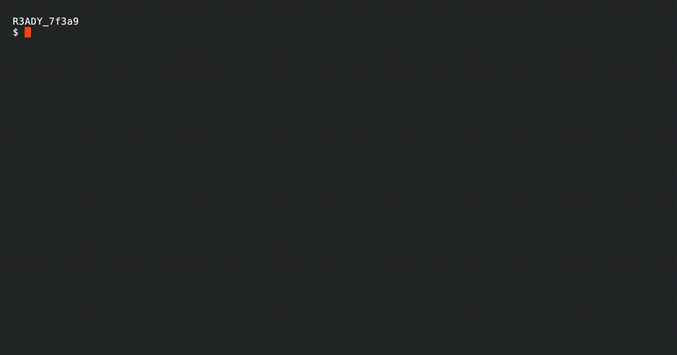

# preloop




> A failed step, a fix in another pane, and a re-run, all local, with no push required.


preloop is a local, self-hosted equivalent of GitHub Actions. The engine (`preloop serve`) accepts workflows the same way GitHub does: `${{ }}` expressions, matrix builds, reusable workflows, concurrency groups, OIDC etc. It executes them on hardware-isolated microvms that work on Windows/MacOS or Linux, and resume in 300ms. Your `.github/workflows` run unmodified, and you can run CI against your uncomitted changes(respects .gitignored/untracked ones).


It speaks the official `actions/runner` protocol, so you can use the official runner to register, poll, execute, and report against it without GitHub-hosted minutes. You can also use our Rust-equivalent runner with up to 10x smaller binary sizes and 10x lower memory RSS.
Preloop doesnt rely only on Github Webhooks to update the status of the CI. You can run your committed changes and run workflows locally and pass a `-push` or `create-pr` that would create a draft PR with the checks correctly updated. This can be useful if/when Github's webhook service is down.

## Quick start

```sh
# Install (macOS/Linux): downloads the release binary and verifies its sha256
curl -fsSL https://raw.githubusercontent.com/preloopdev/preloop/main/install.sh | sh
```

```sh
preloop serve            # engine on 127.0.0.1:9090
cd my-repo
preloop run -f .github/workflows/ci.yml --event pull_request
```
This starts the server in the foreground, but you can detach it too(add a `-d`). First run can take 1-5 minutes depending on your internet speed as we need to download the base image. Once we download the image, we create a "golden" vm that will be forked per job in 300 ms. The vm dynamically increases or decreases its memory consumption.

Regarding official-image compatibility, we build a curated base image that includes most of the systems deps you need, but it's certainly not the exact official one(it's around 90GB). We avoid including deps that are often installed by actions. You can, however, set your own images, or install the deps you need in the "golden" vm. Please see [docs/vm-images.md](docs/vm-images.md) for more detailed info. That said, direct support for using the official image is coming soon. 

You can simulate most if not all Github events locally. For some events, you might need to add a payload.
See [docs/cli_reference.md](docs/cli_reference.md) for more flags you can pass.

To continue with the setup, see GitHub App and PAT credentials, secrets, config file, and the troubleshooting guide: [docs/setup.md](docs/setup.md)

Run it as a server, service install, every runtime knob, and how to expose it (tailnet only, Tailscale Funnel, Cloudflare Tunnel, or your own
domain): [docs/self-hosting.md](docs/self-hosting.md)

## What makes it different vs others.

- The real runner protocol, not a behavior approximation: the official runner binary works against it unchanged.
- Hardware-isolated microvms for each job that spin up in 200ms, and are forked instantly.
- GitHub App and fine-grained PAT support with per-job token minting so your checks get updated.
- DAP-powered job inspection: attach at entry, inspect live GitHub/job context, pause, and continue.
- Heavily tested with property tests, differential tests, and formal verification.
- Secrets with GitHub-compatible masking and global/repo tiers.
- NDJSON event output for agents and developer tooling.

For a more detailed comparison of how we compare, please see: [docs/preloop_vs_others.md](docs/preloop_vs_others.md)

### Agent-driven debugging

When a run is submitted with the DAP debugger enabled, preloop holds the job
at entry until a debugger attaches. An agent or compatible DAP client can then
inspect the live `github`, `env`, `runner`, `job`, `steps`, and `secrets`
scopes before continuing the job. This is useful when the workflow YAML looks
right but the runtime event payload, matrix values, or generated context is
wrong.


```sh
preloop dap <run-id>
```


## Documentation on where to go to find info.

| Topic | Doc |
|---|---|
| Setup, credentials, secrets, config | [docs/setup.md](docs/setup.md) |
| CLI reference | [docs/cli_reference.md](docs/cli_reference.md) |
| Hosting it yourself: service install, knobs, exposure | [docs/self-hosting.md](docs/self-hosting.md) |
| VM images, version pins, and custom goldens | [docs/vm-images.md](docs/vm-images.md) |
| GitHub App webhooks and check runs | [docs/github-app-webhook.md](docs/github-app-webhook.md) |
| Job tokens, minting, OIDC | [docs/github-tokens.md](docs/github-tokens.md) |
| Debug sessions (pause, inspect, retry) | [docs/debug-sessions.md](docs/debug-sessions.md) |
| Architecture and crate map | [docs/architecture.md](docs/architecture.md) |
| Protocol conformance | [docs/conformance.md](docs/conformance.md) |
| Fidelity gaps and roadmap | [docs/fidelity-gap.md](docs/fidelity-gap.md) |
| Contributing and CI requirements | [CONTRIBUTING.md](CONTRIBUTING.md) |

## License

Two licenses, one project:

- **Everything except the control plane is MIT** — the CLI, the Rust runner,
  the parser/expression/protocol crates, the VM orchestrator, and the docs.
- **The control plane (`preloop serve` / `preloop-runner-server`) is
  FSL-1.1-MIT** so source-available. You may use, modify, and redistribute it
  for any non-competing purpose (internal CI, commercial products, forks),
  and it converts to MIT on the second anniversary of each release. What
  "non-competing" means: you can't offer it as a hosted CI *service* that
  competes with preloop's own offering.

Full terms: `crates/preloop-runner-server/LICENSE` (FSL-1.1-MIT) and MIT for
the rest.

## Credits

This project wouldn't especially be possible without:

- [smolvm] — the microVM runtime every job executes in
- [runner.server] — the protocol reverse-engineering this project builds on

[smolvm]: https://github.com/smol-machines/smolvm
[runner.server]: https://github.com/ChristopherHX/runner.server
