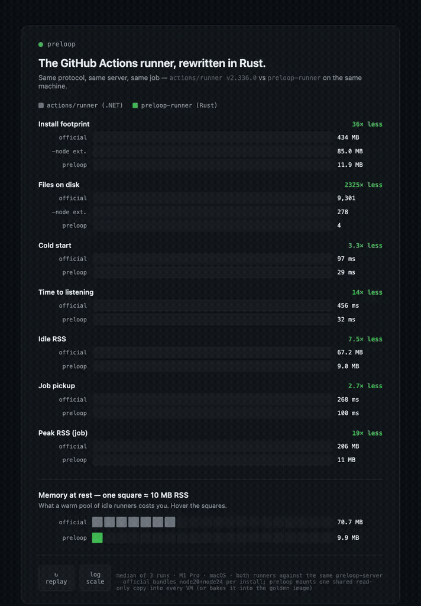

# preloop


> A failed step, a fix in another pane, and a re-run, all local, with no push required.


preloop is a local, self-hosted equivalent of GitHub Actions. The engine (`preloop serve`) accepts workflows the same way GitHub does: `${{ }}` expressions, matrix builds, reusable workflows, concurrency groups, OIDC etc. It executes them on hardware-isolated microvms that work on Windows/MacOS or Linux, and resume in 300ms. Your `.github/workflows` run unmodified, and you can run CI against your uncomitted changes(respects .gitignored/untracked ones).


It speaks the official `actions/runner` protocol, so you can use the official runner to register, poll, execute, and report against it without GitHub-hosted minutes. You can also use our Rust-equivalent runner — 36× smaller install, 19× lower peak memory (see benchmarks below).

Preloop doesnt rely only on Github Webhooks to update the status of the CI. We run a Webhook watchdog that detects drift, and reconciles your commits with received webhooks against the Gtihub API. You can run your committed changes and run workflows locally and pass a `-push` or `create-pr` that would create a draft PR with the checks correctly updated. This can be useful if/when Github's webhook service is down.

## Quick start

```sh
# Install (macOS/Linux): downloads the release binary and verifies its sha256
curl -fsSL https://raw.githubusercontent.com/preloopdev/preloop/main/install.sh | sh
```

```
preloop serve            # engine on 127.0.0.1:9090
```
```
cd my-repo
preloop run -f .github/workflows/ci.yml --event pull_request
```
This starts the server in the foreground, but you can detach it too(add a `-d`). First run can take a few minutes as we need to download a packed vm artifact of the SBOM-attested Official Github Runner OCI (image)[https://github.com/preloopdev/runner-image-blobs] and create a "golden" vm locally. This golden vm will be forked per job in 300 ms. The official Github image is around 9GB compressed, and unpacks to almost 50 GB so atleast 80GB disk is recommended. You can alternatively define your own golden vm from an OCI image. [docs/vm-images.md](docs/vm-images.md) for more detailed info. Each vm's memory is elastic so it only consumes what's actually being used in the job. The control plane idle rss is around 25MB. 


On Apple Silicon, x86_64 goldens also run through Rosetta 2 translation (enabled automatically for every VM). Performance is slightly slower than arm64 native, so prefer arm64 goldens on Apple Silicon when you can. Docker actions are not supported yet on this path: amd64 images inside the VM's Docker lack the Rosetta mount, so they fail with a cryptic `rosetta-wrapper` error. Fixing soon.

You can simulate most if not all Github events locally. For some events, you might need to add a payload.
See [docs/cli_reference.md](docs/cli_reference.md) for more flags you can pass.

To continue with the setup, see GitHub App and PAT credentials, secrets, config file, and the troubleshooting guide: [docs/setup.md](docs/setup.md)

Run it as a server, service install, every runtime knob, and how to expose it (tailnet only, Tailscale Funnel, Cloudflare Tunnel, or your own
domain): [docs/self-hosting.md](docs/self-hosting.md)

### Just the runner

`preloop-runner` is a drop-in Rust replacement for `actions/runner` — it
registers against GitHub (or a preloop server) the same way, at 36× smaller
install and 19× lower peak memory:

```sh
curl -fsSL https://raw.githubusercontent.com/preloopdev/preloop/main/install.sh | sh -s -- --runner
preloop-runner configure --url https://github.com/owner/repo --token <registration-token>
preloop-runner run
```

Or the container image: `docker run ghcr.io/preloopdev/preloop-runner:latest
configure --url … --token …`. Details: [docs/setup.md](docs/setup.md#just-the-runner).

## What makes it different vs others.

- We use the real runner protocol, not a behavior approximation: the official runner binary works against it unchanged.
- Hardware-isolated microvms for each job that spin up in 300ms, elastically scale up and down, and cross-platform.
- GitHub App and fine-grained PAT support with per-job token minting so your checks get updated.
- DAP-powered job inspection: attach at entry, inspect live GitHub/job context, pause, and continue, and allow for step-level rerties. 
- Heavily tested with property tests, differential tests, and formal verification. Conformance is table-stakes. 
- NDJSON event output for agents and developer tooling.

For a more detailed comparison of how we compare, please see: [docs/preloop_vs_others.md](docs/preloop_vs_others.md)


### Agent-driven debugging

When a run is submitted with the DAP debugger enabled, preloop holds the job at entry until a debugger attaches. An agent or compatible DAP client can then inspect the live `github`, `env`, `runner`, `job`, `steps`, and `secrets`
scopes before continuing the job. This is useful when the workflow YAML looks
right but the runtime event payload, matrix values, or generated context is
wrong.


```sh
preloop dap <run-id>
```

## Benchmarks

`preloop-runner` is a from-scratch Rust reimplementation of `actions/runner`
that speaks the same protocol — the official runner works against preloop
unchanged, and preloop-runner registers against GitHub the same way. Same
server, same job, measured on the same machine (M1 Pro, macOS, median of 3):



| Metric | actions/runner 2.336.0 | preloop-runner | |
|---|---|---|---|
| Install footprint | 434 MB · 9,301 files | 11.9 MB · 1 binary | 36× |
| Runner code only | 85 MB | 11.9 MB | 7× |
| Cold start | 97 ms | 29 ms | 3.3× |
| Time to listening | 456 ms | 32 ms | 14× |
| Idle RSS | 67 MB | 9 MB | 7.5× |
| Warm pool ×10 idle | 672 MB | 90 MB | 7.5× |
| Job pickup | 268 ms | 100 ms | 2.7× |
| Peak RSS during a job | 206 MB | 11 MB | 19× |

The official tarball bundles node20 + node24 (~350 MB) into every install;
preloop-runner ships as a single binary and mounts one shared read-only copy
of the externals into every VM (or bakes them into the golden image). A warm
pool of 10 idle runners costs ~90 MB instead of ~670 MB.


Reproduce: `scripts/bench-runner-compare.sh` (set `BENCH_RUNS=N`; needs
`target/release/preloop-runner` and the official runner in
`~/.cache/actions-runner/current`). Interactive chart:
`benchmarks/runner-compare.html`.

## Just the runner

If you only want `preloop-runner` — the drop-in Rust replacement for
`actions/runner` — every release publishes standalone binaries for Linux
(x86_64/aarch64), macOS (x86_64/arm64), and Windows (x86_64):

```sh
curl -fsSLO https://github.com/preloopdev/preloop/releases/latest/download/preloop-runner-<triple>
chmod +x preloop-runner-<triple>
./preloop-runner-<triple> configure --url https://github.com/owner/repo --token <registration-token>
./preloop-runner-<triple> run
```

Or the container image:

```sh
docker run ghcr.io/preloopdev/preloop-runner:latest \
  configure --url https://github.com/owner/repo --token <registration-token>
```

Each binary ships with a CycloneDX SBOM (`preloop-runner-<triple>.cdx.json`)
and a sha256 checksum.


## Documentation on where to go to find info.

| Topic | Doc |
|---|---|
| Setup, credentials, secrets, config | [docs/setup.md](docs/setup.md) |
| CLI reference | [docs/cli_reference.md](docs/cli_reference.md) |
| Hosting it yourself: service install, knobs, exposure | [docs/self-hosting.md](docs/self-hosting.md) |
| VM images, version pins, and custom goldens | [docs/vm-images.md](docs/vm-images.md) |
| GitHub App webhooks and check runs | [docs/github-app-webhook.md](docs/github-app-webhook.md) |
| Job tokens, minting, OIDC | [docs/github-tokens.md](docs/github-tokens.md) |
| Debug sessions (pause, inspect, retry) | [docs/debug-sessions.md](docs/debug-sessions.md) |
| Architecture and crate map | [docs/architecture.md](docs/architecture.md) |
| Protocol conformance | [docs/conformance.md](docs/conformance.md) |
| Fidelity gaps and roadmap | [docs/fidelity-gap.md](docs/fidelity-gap.md) |
| Contributing and CI requirements | [CONTRIBUTING.md](CONTRIBUTING.md) |

## License

Two licenses, one project:

- **Everything except the control plane is MIT** — the CLI, the Rust runner,
  the parser/expression/protocol crates, the VM orchestrator, and the docs.
- **The control plane (`preloop serve` / `preloop-runner-server`) is
  FSL-1.1-MIT** so source-available. You may use, modify, and redistribute it
  for any non-competing purpose (internal CI, commercial products, forks),
  and it converts to MIT on the second anniversary of each release. What
  "non-competing" means: you can't offer it as a hosted CI *service* that
  competes with preloop's own offering.

Full terms: `crates/preloop-runner-server/LICENSE` (FSL-1.1-MIT) and MIT for
the rest.

## Credits

This project wouldn't especially be possible without:

- [smolvm] — the microVM runtime every job executes in
- [runner.server] — the protocol reverse-engineering this project builds on

[smolvm]: https://github.com/smol-machines/smolvm
[runner.server]: https://github.com/ChristopherHX/runner.server
