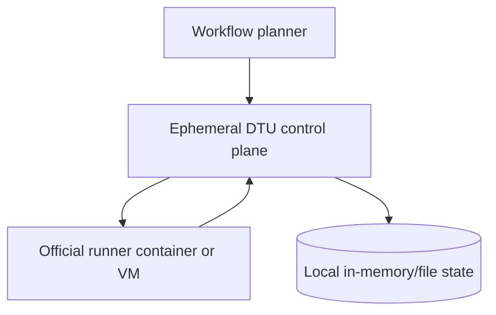
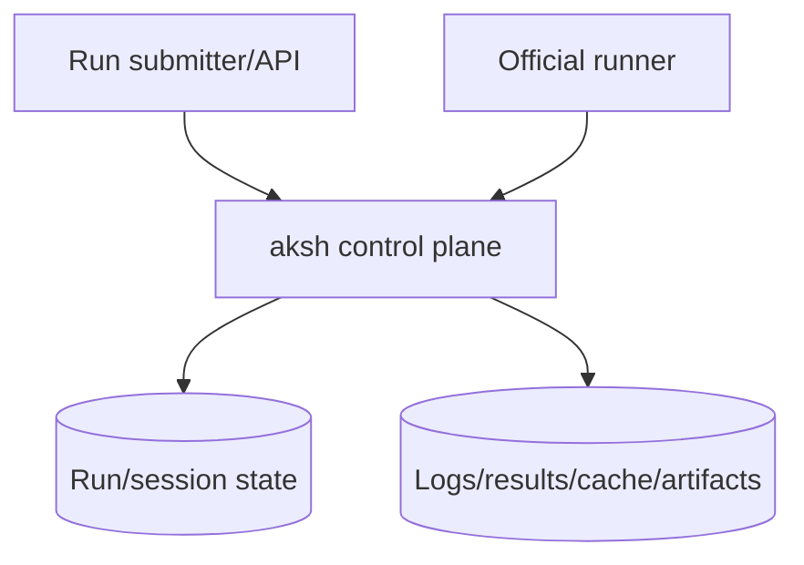
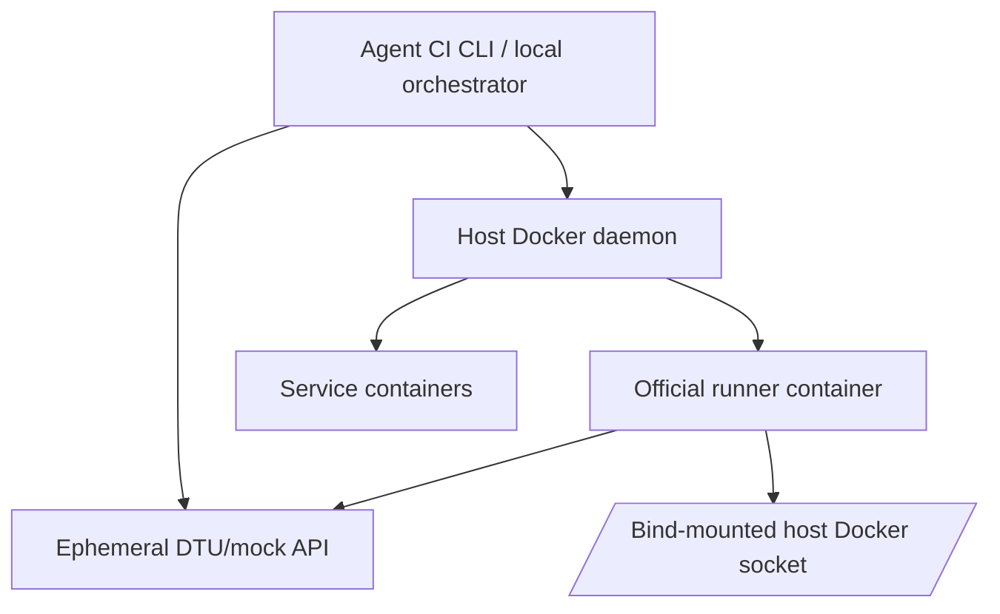
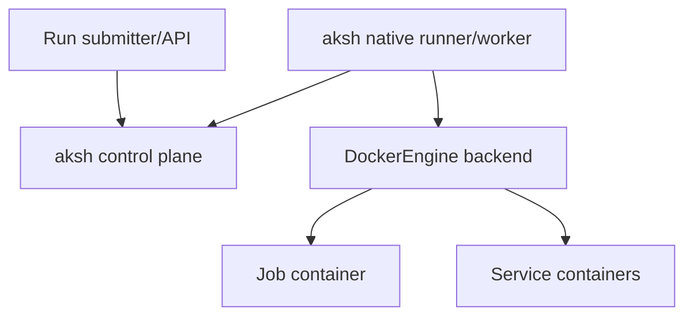
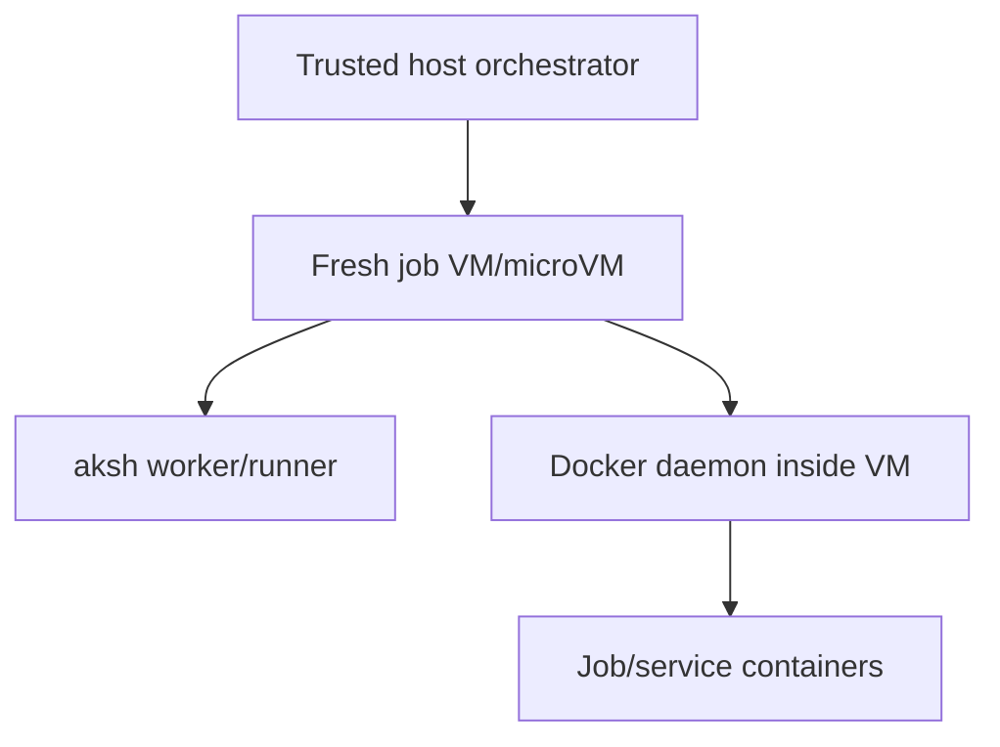

# Agent CI control plane vs aksh

This document compares **the control-plane layer specifically** in Agent CI and aksh.

This is not a comparison of the overall local CI product. Agent CI is clearly optimized for a local CI product loop, and that part maps more directly to Preloop. The question here is narrower:

> How does Agent CI's control plane differ from aksh's control plane?

## Executive summary

Agent CI's control plane is a **local, ephemeral DTU/mock API** designed to feed the official runner just enough state to execute workflows on the same machine. It is tightly coupled to Agent CI's planner, Docker/Tart runtime, cache mounts, and pause/retry workflow.

aksh's control plane is a **protocol-oriented runner service** designed to behave like the service side of GitHub Actions so official runners can connect to it. It is more reusable as a server and more aligned with a self-hostable architecture.

The sharp distinction is:

- **Agent CI control plane** = execution helper for a local orchestrator.
- **aksh control plane** = standalone runner-facing service.

Agent CI's control plane is more pragmatic and product-coupled. aksh's control plane is more protocol-centric and server-shaped.

---

## Sources reviewed

### Agent CI

- Runner API mock: <https://github.com/redwoodjs/agent-ci/blob/main/crates/agent-ci-runtime/src/dtu/runner_api.rs>
- GitHub-ish routes: <https://github.com/redwoodjs/agent-ci/blob/main/crates/agent-ci-runtime/src/dtu/github.rs>
- Top-level DTU router: <https://github.com/redwoodjs/agent-ci/blob/main/crates/agent-ci-runtime/src/dtu/routes.rs>
- Cache API: <https://github.com/redwoodjs/agent-ci/blob/main/crates/agent-ci-runtime/src/dtu/cache.rs>
- Artifact API: <https://github.com/redwoodjs/agent-ci/blob/main/crates/agent-ci-runtime/src/dtu/artifacts.rs>
- Planner/job seeding: <https://github.com/redwoodjs/agent-ci/blob/main/crates/agent-ci-runtime/src/runner/plans.rs>
- DTU client/bootstrap: <https://github.com/redwoodjs/agent-ci/blob/main/crates/agent-ci-runtime/src/dtu.rs>
- Docker socket requirement: <https://github.com/redwoodjs/agent-ci/blob/main/packages/cli/docs/docker-socket.md>
- Local runner container lifecycle: <https://github.com/redwoodjs/agent-ci/blob/main/packages/cli/src/runner/local-job.ts>
- Service container orchestration: <https://github.com/redwoodjs/agent-ci/blob/main/packages/cli/src/docker/service-containers.ts>
- Container option handling: <https://github.com/redwoodjs/agent-ci/blob/main/packages/cli/src/docker/container-config.ts>

### aksh

- Architecture: `docs/architecture.md`
- Fidelity scorecard: `docs/fidelity-gap.md`

---

## 1. Control-plane boundary

### Agent CI

Agent CI's control plane exists inside the run orchestrator.

The run loop is effectively:

The DTU server is started for a run, jobs are seeded directly into it, the runner polls it, and the entire thing is designed around one local execution environment.

The control plane is not acting as an independent service boundary. It is a local helper.

### aksh

aksh's control plane is intentionally a service boundary.

The runner should be able to connect to aksh as if aksh were the service side of GitHub Actions. That means the control plane must stand on its own, separate from any one local runner-host process.

### Difference

Agent CI's control plane is **subordinate to the local orchestrator**.

aksh's control plane is **the system of record for runner protocol behavior**.

---

## 2. State model

### Agent CI

Agent CI's DTU stores state in local in-memory maps plus local directories. The router dump endpoint exposes structures like:

- `jobs`
- `runnerJobs`
- `runnerLogs`
- `runnerTimelineDirs`
- `sessions`
- `sessionToRunner`
- `caches`
- `artifacts`

The DTU also stores a local `repo_root`, local cache dir, local artifact blobs, and local action tarballs.

This is exactly what you would expect from an ephemeral local control plane.

Important property:

> State is run-scoped and orchestrator-owned.

### aksh

aksh's current default server still uses in-memory run queue/state, but the architecture explicitly treats durable state as a future repository-backed concern:

- run queue,
- runner sessions,
- request IDs,
- logs/results,
- cache/artifacts,
- eventually durable stores behind traits.

Important property:

> State is intended to become service-owned and durable.

### Difference

Agent CI's control plane state is fundamentally **ephemeral execution state**.

aksh's control plane state is intended to become **persistent control-plane state**.

That is a major architectural distinction.

---

## 3. Job admission model

### Agent CI

Agent CI's planner fully constructs job execution plans before the runner asks for work. Then it sends a job seed to DTU:

- job name,
- workflow name,
- repo metadata,
- env,
- outputs,
- `needs` context,
- services,
- matrix context,
- fully expanded steps.

The control plane then acts mostly as a delivery/execution adapter.

Important property:

> Agent CI control plane receives already-planned jobs from the orchestrator.

### aksh

aksh also plans workflows, but the control plane owns more of the queueing and runner-facing lifecycle directly:

- job queue,
- request IDs,
- inflight requests,
- session routing,
- dependency gating,
- cancellation routing,
- broker lease lifecycle.

Important property:

> aksh control plane is closer to the place where scheduling and runner delivery meet.

### Difference

Agent CI control plane is **fed a prepared execution payload**.

aksh control plane is **closer to a real scheduler + runner protocol service**.

---

## 4. Runner registration and identity

### Agent CI

Agent CI's control plane exposes registration-like routes, but they are explicitly mock/local in character.

Examples from `github.rs` and `runner_api.rs`:

- registration-token endpoints return mock tokens like `ghr_mock_registration_token_*`
- runner-registration returns local/mock tenant info
- distributedtask agent registration returns minimal agent objects
- session creation returns a mock encryption key

The runner identity is sufficient for local execution, but the control plane does not appear to model long-lived runner identity or real registration administration as a product surface.

Important property:

> Registration is compatibility scaffolding for local execution.

### aksh

aksh treats registration as a real service behavior:

- GitHub-compatible registration route,
- session handling,
- runner public key storage,
- current-service session compatibility,
- AgentRequest lifecycle,
- self-hosted future direction.

Even where implementation is still partial, the intent is service-real, not just a mock.

Important property:

> Registration is part of the actual control-plane contract.

### Difference

Agent CI registration is **local bootstrap compatibility**.

aksh registration is **part of the long-term service model**.

---

## 5. Service discovery and `connectionData`

### Agent CI

Agent CI's `service_discovery` returns a compact control-plane map. It includes only the service definitions DTU needs for local execution:

- distributedtask root,
- pools,
- sessions,
- action download info,
- timeline feed,
- logs,
- and a small access mapping surface.

This is exactly what a local product wants: minimal and sufficient.

Important property:

> Discovery is intentionally compact and execution-driven.

### aksh

aksh currently returns a smaller-than-GitHub `connectionData`, but the architecture and fidelity work care about current runner protocol evolution and service-location correctness.

The remaining gap in aksh is not only route reachability; it is also whether the service discovery map is rich enough for current runner expectations and future self-hosted use.

Important property:

> Discovery is part of protocol fidelity and service completeness.

### Difference

Agent CI treats discovery as **just enough local runner bootstrap metadata**.

aksh treats discovery as **a control-plane compatibility surface**.

---

## 6. Session and message delivery model

### Agent CI

Agent CI's DTU session/message handling is simple and highly local:

- sessions stored in local maps,
- `sessionId -> runnerName` mapping,
- message polling draws from runner-specific queued job payloads,
- local in-process routing decides what job a session should receive.

This is adequate because Agent CI owns the runner process lifecycle and knows which runner is expected to consume which job.

Important property:

> Session/message delivery is tightly coupled to the local orchestrator's runtime model.

### aksh

aksh's control plane must manage:

- session IDs,
- inflight requests,
- session-specific delivery,
- broker job references,
- request leases,
- cancellation routing,
- same-session dispatch constraints,
- AgentRequest get/ack/patch semantics.

The state machine is more service-like and more robust against independent runner behavior.

Important property:

> Session/message delivery is treated as a first-class protocol lifecycle.

### Difference

Agent CI sessions/messages are **local run plumbing**.

aksh sessions/messages are **core protocol infrastructure**.

---

## 7. Broker and job request model

### Agent CI

Agent CI's reviewed DTU surfaces primarily expose distributedtask-style messages and jobrequests. The local planner/runtime drives most of the execution semantics. It is not centered around the same current-service fidelity story we have been pursuing in aksh with:

- current broker refs,
- broker acquire,
- broker renew,
- broker complete,
- AgentRequest compatibility against v2.335.x captures.

Agent CI is more concerned with whether the official runner will execute locally than whether every current GitHub-hosted broker nuance is mirrored.

### aksh

aksh is explicitly working against current runner service captures and current-service semantics. The recent work centered on:

- session status parity,
- AgentRequest ack parity,
- broker acquire/renew/complete parity,
- replay materialization,
- current-service message projection.

### Difference

Agent CI control plane is **execution-first**.

aksh control plane is **current-protocol-fidelity-first**.

If the question is specifically “which one is closer to a real reusable runner service control plane for current runner versions?”, aksh is.

---

## 8. Cache as control-plane responsibility

### Agent CI

Agent CI's control plane exposes cache endpoints, but the design is deeply shaped by the local product:

- bind-mounted hot caches,
- virtual cache hits,
- local tarballs,
- local file-backed blobs,
- direct runner speed as the goal.

The control plane is acting as a facilitator for local cache ergonomics.

### aksh

aksh treats cache as part of a wider protocol/storage subsystem. Even though some surfaces are still partial or deferred, the conceptual target is broader:

- protocol correctness,
- future self-host viability,
- durable stores,
- service-backed cache behavior.

### Difference

Agent CI cache control plane is **optimized for local performance**.

aksh cache control plane is **aiming at reusable protocol/storage behavior**.

---

## 9. Artifact and results surfaces

### Agent CI

Agent CI control plane implements practical local artifact surfaces with block/blob semantics because real local workflows need them.

This is less about emulating GitHub hosted infrastructure and more about giving the runner workable endpoints that behave enough like GitHub's upload/download flows.

### aksh

aksh has route/status progress and some results-service coverage, but still tracks fidelity and completeness against current runner protocol behavior and deferred surfaces such as blob/Twirp variants.

### Difference

Agent CI's artifact/results control plane is **product-pragmatic**.

aksh's artifact/results control plane is **service/protocol-incomplete but more architecture-driven**.

---

## 10. GitHub-ish API routes

### Agent CI

Agent CI's `github.rs` exposes GitHub-shaped routes only to the extent the local run needs them:

- installation lookup,
- access tokens,
- registration tokens,
- compare commits,
- tarball fetches,
- runner registration.

These are mock/local functional shims.

Important property:

> The GitHub-ish surface is subordinate to the local run product.

### aksh

aksh also has GitHub-compatible registration routes, but the runner-facing server is more explicitly treated as a long-lived service boundary.

Important property:

> GitHub-compatible routes are part of the real control-plane service surface.

### Difference

Agent CI's GitHub-ish routes are **tooling glue**.

aksh's GitHub-ish routes are **service API compatibility work**.

---

## 11. Scope of control-plane correctness

### Agent CI

The relevant control-plane correctness question is:

> Can the local runner execute the planned workflow correctly and quickly?

### aksh

The relevant control-plane correctness question is:

> Can independently configured official runners connect to a service that behaves like the GitHub Actions control plane for the supported protocol surface?

### Difference

Agent CI's control-plane correctness is **local execution correctness**.

aksh's control-plane correctness is **runner-service protocol correctness**.

---

## 12. What Agent CI’s control plane does better right now

If we isolate the control plane itself, Agent CI appears better in these specific practical local areas:

1. **Action download practicality**
   - local tarball proxy/cache is real and useful.

2. **Artifact practicality**
   - local artifact APIs and blob upload/download are implemented enough for actual local workflows.

3. **Cache practicality**
   - cache endpoints exist, but more importantly they are aligned with the local bind-mount strategy.

4. **Tight integration with retry/pause/log directories**
   - the control plane knows about local run log/timeline directories and runner naming conventions.

These are strengths if the control plane only needs to serve the local product.

---

## 13. What aksh’s control plane does better or is better positioned for

If the question is specifically about control plane quality as a reusable service, aksh is better positioned in these areas:

1. **Protocol orientation**
   - `_apis/...` is treated as source-of-truth service behavior.

2. **Current runner capture tracking**
   - fidelity work is explicitly tied to latest runner versions and current protocol changes.

3. **Current-service broker/AgentRequest lifecycle**
   - recent work focused on exactly the runner-service semantics new official runners use.

4. **Cleaner separation of concerns**
   - parser, expressions, protocol DTOs, server, cache, artifacts, conformance are split by responsibility.

5. **Self-hosted future**
   - even if not all implemented yet, the architecture is compatible with a real service boundary.

---

## 14. Strategic conclusion

If the comparison is specifically **control plane vs control plane**, then:

### Agent CI control plane

Best understood as:

> a local DTU/mock protocol layer whose job is to make the official runner execute locally under a tightly controlled orchestrator.

### aksh control plane

Best understood as:

> a reusable runner-facing service whose job is to implement the GitHub Actions control-plane contract well enough that official runners can connect to it independently.

That means Agent CI's control plane is not really a competitor design for aksh's server boundary. It is closer to a **local execution adapter**.

aksh's real comparison target, at the control-plane layer, is closer to:

- GitHub Actions service behavior,
- `runner.server`,
- the official runner protocol surface,
- and self-hostable CI servers.

---

## 15. Practical takeaway for Preloop/aksh

This suggests a clean split:

### Preloop local product layer

Steal ideas from Agent CI:

- local orchestration,
- runner container/VM lifecycle,
- pause/retry,
- hot caches,
- action tarball proxy,
- product UX.

### aksh control plane core

Keep aksh's service model:

- real runner registration,
- current-service protocol fidelity,
- durable state trajectory,
- reusable service boundary,
- external runner support.

That is the right decomposition if Preloop is the local CI product and aksh is the control plane under it.

---

## 16. If both rely on the host Docker daemon locally

Using the host Docker daemon does **not** make Agent CI and aksh the same design.

### Agent CI host-Docker model

Agent CI is a local execution product that uses Docker as the main runtime substrate:

Key runtime properties observed from the Agent CI code:

- It launches GitHub Actions runners **inside Docker containers** and bind-mounts the host Docker socket so workflow steps can call `docker build` / `docker run`.
- In `container:` mode, it pulls the user image, extracts the official runner binary from a seed runner image, bind-mounts that runner into the user container, and runs `./run.sh --once` inside the user image.
- It starts service containers itself with dockerode, creates an `agent-ci-net-<runner>` bridge network, assigns service aliases, and waits for Docker health state.
- It adds Python TCP port-forward snippets so `localhost:<port>` inside the runner container can reach service containers.
- Its `container.options` support is intentionally partial: only `--env`/`-e` and `--label`/`-l` are parsed today; other flags are ignored.

This is a pragmatic local-product design. It prioritizes local speed, cache mounts, pause/retry, and making the official runner execute under a controlled orchestrator.

### aksh host-Docker local model

aksh should treat host Docker as a **local backend for the native runner**, not as the core architecture:

The compatibility target remains the official runner's Docker path:

- `ContainerOperationProvider`
- `DockerCommandManager`
- `ContainerStepHost`
- `ContainerActionHandler`

That means aksh should reproduce official semantics directly:

- official `jobContainer` / `jobServiceContainers` wire fields,
- official Docker network naming and cleanup behavior,
- official job-container mount table (`/__w`, `/__e`, `/github/home`, etc.),
- official `docker exec` step execution from the runner into the job container,
- official service health polling and log-group strings,
- official `job.container` / `job.services` context shape,
- official container option handling, not Agent CI's reduced subset.

### Strategic difference

If both use host Docker locally:

| Dimension | Agent CI | aksh |
| --- | --- | --- |
| Primary goal | Local CI product loop | Reusable runner protocol service + native runner |
| Runner process | Official runner inside Docker container | Native Rust runner/worker |
| `container:` implementation | Runner binary injected into the user container | Runner stays outside; steps execute via Docker exec into job container |
| Service containers | Local dockerode orchestration with product-specific port forwarding | Official runner-compatible service container lifecycle |
| Control plane | Ephemeral DTU/mock API owned by local orchestrator | Standalone runner-facing protocol service |
| Docker socket | Bind-mounted into runner containers | Local backend may use host daemon; prod should avoid exposing host socket |
| Hosted/prod path | Not the control-plane focus of this doc | Fresh job VM/microVM with worker + Docker stack inside |

### Security implication

Host Docker is acceptable for local/trusted CI. It is not the hosted multi-tenant isolation model.

For aksh hosted/prod execution, the intended shape is:

The host schedules, boots, streams results, enforces timeouts, and destroys the VM. User code and Docker daemon state live inside the job VM.

### Practical takeaway

Borrow from Agent CI for local UX:

- Docker socket discovery,
- cache mount ergonomics,
- service startup progress,
- runner/container cleanup,
- pause/retry workflow ideas.

Do **not** copy Agent CI's container execution model as aksh's compatibility model. aksh should implement the official runner's Docker behavior first, then choose whether that worker runs on the host for local mode or inside a fresh VM for hosted/prod mode.

---

## Bottom line

If you compare **control plane only**, Agent CI's control plane is:

- more local,
- more mock-like,
- more orchestrator-coupled,
- more optimized for one machine and one run loop,
- less reusable as an independent server.

aksh's control plane is:

- more service-shaped,
- more protocol-focused,
- more aligned with current runner capture fidelity,
- more appropriate as the long-term standalone control plane.

So Agent CI is a strong model for the **Preloop local execution layer**, but aksh should still be the system that owns the **real runner-facing control-plane contract**.