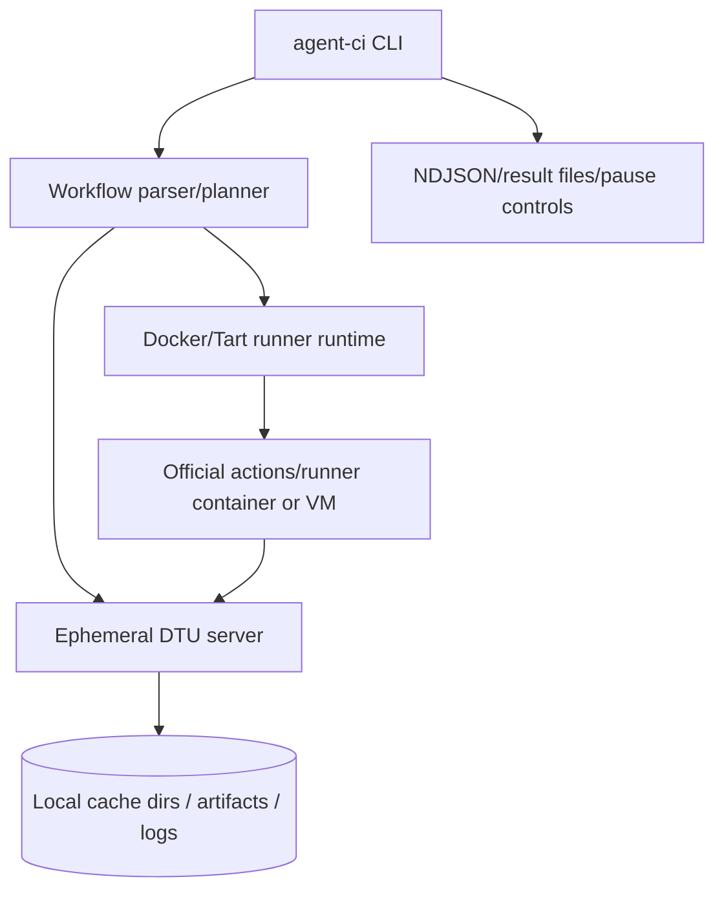
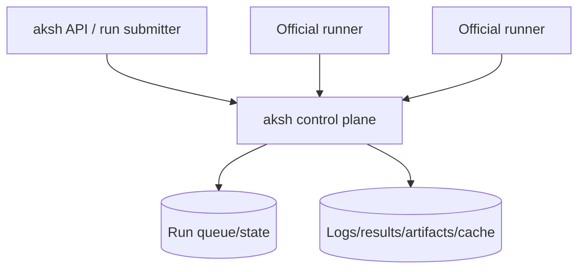

# Agent CI vs aksh — deep dive

This document compares [redwoodjs/agent-ci](https://github.com/redwoodjs/agent-ci) to aksh and explains what Agent CI does differently.

## Executive summary

Agent CI is not primarily trying to be “aksh as a self-hostable GitHub Actions control plane.” It is a **local developer/agent workflow product** that uses the official runner, but owns the whole local execution environment:

- workflow discovery,
- planning and scheduling,
- runner container or VM lifecycle,
- cache mounts,
- local DTU/mock API surface,
- pause on failure,
- retry/abort controls,
- local result/log output.

aksh is closer to:

> A reusable GitHub Actions-compatible control plane that official runners can talk to.

Agent CI is closer to:

> A local CLI tool that starts official runner containers and feeds them jobs through a purpose-built local API so developers and agents can preflight workflows quickly.

That architectural boundary drives almost every difference.

---

## Sources reviewed

- Agent CI README: <https://github.com/redwoodjs/agent-ci/blob/main/packages/cli/README.md>
- Agent CI package manifest: <https://github.com/redwoodjs/agent-ci/blob/main/package.json>
- Agent CI Rust DTU routes: <https://github.com/redwoodjs/agent-ci/blob/main/crates/agent-ci-runtime/src/dtu/routes.rs>
- Agent CI runner API mock: <https://github.com/redwoodjs/agent-ci/blob/main/crates/agent-ci-runtime/src/dtu/runner_api.rs>
- Agent CI GitHub-ish routes: <https://github.com/redwoodjs/agent-ci/blob/main/crates/agent-ci-runtime/src/dtu/github.rs>
- Agent CI cache implementation: <https://github.com/redwoodjs/agent-ci/blob/main/crates/agent-ci-runtime/src/dtu/cache.rs>
- Agent CI artifact implementation: <https://github.com/redwoodjs/agent-ci/blob/main/crates/agent-ci-runtime/src/dtu/artifacts.rs>
- Agent CI runner runtime: <https://github.com/redwoodjs/agent-ci/blob/main/crates/agent-ci-runtime/src/runner/runtime.rs>
- Agent CI Docker config: <https://github.com/redwoodjs/agent-ci/blob/main/crates/agent-ci-runtime/src/docker/config.rs>
- Agent CI workflow planner: <https://github.com/redwoodjs/agent-ci/blob/main/crates/agent-ci-core/src/plan.rs>
- Agent CI pause implementation: <https://github.com/redwoodjs/agent-ci/blob/main/crates/agent-ci-runtime/src/runner/pause.rs>
- Agent CI launcher: <https://github.com/redwoodjs/agent-ci/blob/main/packages/cli/src/launcher.ts>
- Agent CI Rust parity plan: <https://github.com/redwoodjs/agent-ci/blob/main/.docs/rust-execution-parity-plan.md>

---

## What Agent CI is optimizing for

Agent CI’s README states the product goal directly:

> Run GitHub Actions on your machine. Caching in ~0 ms. Pause on failure. Fix and retry — before you commit, before you push.

It is explicitly a **pre-flight local CI tool**, especially for AI-agent loops.

Its core promises are:

- run the official GitHub Actions runner locally,
- run against the current working tree, including uncommitted changes,
- use Docker or macOS VMs for execution,
- make caching near-instant via bind mounts,
- pause on failed steps,
- let a human/agent fix and retry only the failed step,
- avoid remote GitHub CI iteration.

This differs from aksh’s shape, where aksh is being treated as a **control plane/server** that can support both local CI and eventually self-hosted users.

Agent CI is not trying to be a durable multi-tenant CI control plane. It is primarily a **single-machine orchestration tool**.

---

## High-level architecture difference

### Agent CI

Agent CI owns the full local loop:



Its “server” is an ephemeral DTU mock/control plane started for a local run. It is tightly coupled to the CLI and runner runtime.

### aksh

aksh is aiming more like:



aksh is intended to be a protocol-compatible service runners can connect to. It can be used locally, but the architecture is more reusable as a server/control plane.

### Consequence

Agent CI can take many pragmatic local shortcuts because it controls:

- runner image,
- runner container lifecycle,
- Docker network,
- mounted workspace,
- cache directories,
- runner credentials files,
- local DTU hostnames,
- pause/retry signal files.

aksh cannot rely on those shortcuts if the goal includes “bring your own runner” or “self-host aksh.”

---

## The biggest difference: Agent CI preplans jobs itself

Agent CI parses workflows and schedules jobs before the runner asks for work.

From `agent-ci-core/src/plan.rs`, it has types like:

- `RunPlan`
- `WorkflowRunPlan`
- `PlannedJob`
- `PlannedStep`
- `PlannedService`
- `PlannedJobContainer`
- `JobRunDecision`
- `JobExecutionRoute`

It does its own:

- YAML parsing,
- matrix expansion,
- job dependency scheduling,
- `needs` propagation,
- job/step env planning,
- service/container planning,
- macOS vs Linux routing.

Then it seeds a job into DTU:

```rust
dtu.seed_job(&attempt_seed)?;
```

The job seed contains already-planned steps, env, outputs, matrix context, repo metadata, and services.

### How that differs from aksh

aksh also parses workflows and schedules jobs, but the target boundary is different:

- aksh exposes an API/control-plane queue;
- official runners poll it;
- aksh must behave like the service side of GitHub Actions;
- if external runners connect, aksh cannot assume it owns the runner container, workspace, or mounts.

Agent CI is free to say:

> I already know the workflow plan; I will start exactly the runner container I want and feed it exactly this job.

aksh has to say:

> I am a service; registered runners can come and go; I need to assign jobs to sessions safely.

---

## Agent CI starts and controls the official runner container

Agent CI uses the official runner image by default:

> `ghcr.io/actions/actions-runner:latest`

From the README:

> By default, jobs run inside `ghcr.io/actions/actions-runner:latest` — the official self-hosted runner image.

The Rust runtime has a `ContainerRuntime` trait with methods like:

- `create_network`
- `start_service`
- `wait_service_healthy`
- `start_runner`
- `stream_runner_logs`
- `wait_runner`
- `remove_runner`

This runtime creates a Docker network per run, starts services, starts the runner container, streams logs, and tears everything down unless paused.

### Important shortcut: it writes runner credentials directly

In `crates/agent-ci-runtime/src/docker/config.rs`, `build_container_cmd` writes `.runner`, `.credentials`, and `.credentials_rsaparams` directly inside the runner container before calling:

```sh
./run.sh --once
```

That is a major difference.

Agent CI does not necessarily need the runner to go through the same external registration/configuration flow a self-hosted runner would use against GitHub or aksh. It can bootstrap the runner container by writing the files the runner expects.

That is pragmatic for local CI. It is not the same product surface as:

```sh
./config.sh --url https://aksh.example.com --token ...
./run.sh
```

### How that differs from aksh

For self-hosted aksh, the real configure/register path probably still matters:

- registration token,
- runner public key,
- runner identity,
- runner removal/replacement,
- durable runner record,
- externally reachable service URL.

Direct credentials can be a local optimization for aksh local mode, but not the only path if self-hosted use is a goal.

---

## Agent CI’s DTU server is a local mock API, not a full durable control plane

Agent CI’s Rust DTU server starts on a random local port and exposes both:

- `url: http://127.0.0.1:{port}`
- `container_url: http://{host}:{port}` where host defaults to `host.docker.internal`

It has internal routes like:

- `/_dtu/start-runner`
- `/_dtu/seed`
- `/_dtu/action-tarball/...`
- `/_dtu/dump`

Then it routes runner-facing APIs for:

- GitHub-ish routes,
- distributedtask/runner routes,
- cache,
- artifacts.

This is excellent for a local orchestrator. It is not a multi-user service boundary.

### How that differs from aksh

aksh’s shape is more like:

- public/private service URL,
- auth,
- durable state,
- registered runners,
- external runner sessions,
- possibly multiple hosts/runners/pools.

Agent CI’s DTU is intentionally ephemeral and local.

---

## Agent CI focuses heavily on execution UX: pause/retry

This is one of Agent CI’s most distinct product features.

The README emphasizes:

> Pause on failure — container stays alive; fix the issue and retry just the failed step.

The Rust pause implementation wraps each shell step in a loop. On failure, it writes a signal file under `/tmp/agent-ci-signals` and waits for:

- `retry`,
- `abort`,
- `from-step`,
- restart signals.

The TypeScript launcher has a detached-worker mode and exits `77` when the run pauses so a non-TTY caller/agent can regain control while the runner container stays alive.

### How that differs from aksh

aksh currently thinks in CI protocol terms:

- queued jobs,
- runner messages,
- timeline,
- logs,
- completion,
- cancellation.

Agent CI adds a debugger-like developer loop:

```text
run → fail → keep container alive → edit host files → retry failed step
```

That is not standard GitHub Actions behavior. It is a local-product feature layered on top of the official runner.

For aksh, a similar feature likely belongs in a higher-level local CI product layer rather than the core control plane.

---

## Agent CI’s cache strategy is much more local-performance-focused

Agent CI’s README claims:

> ~0 ms caching via bind-mounts.

It mounts host directories into the runner container for:

- pnpm store,
- npm cache,
- yarn cache,
- bun cache,
- Playwright cache,
- Cypress cache,
- tool cache,
- working directory.

It also implements a cache REST API under:

- `/_apis/artifactcache/caches`
- `/_apis/artifactcache/cache`
- `/_apis/artifactcache/artifacts/{id}`

A particularly interesting feature is **virtual cache patterns**. Agent CI can treat certain cache keys as local virtual hits backed by an empty tarball because the real speedup comes from bind-mounted directories rather than upload/download archives.

### How that differs from aksh

aksh currently thinks more like “implement the GitHub cache protocol.”

Agent CI asks a more product-specific question:

> How do I make local workflows fast?

That leads to:

- bind mounts,
- virtual cache hits,
- prewarming,
- local tool cache,
- avoiding tar/unpack paths.

For aksh local CI, this is a strong design signal, but it should stay separated from self-hosted semantics:

- local mode: bind mounts and virtual caches are great;
- self-hosted mode: cache APIs need real durable backend behavior.

---

## Agent CI has artifact support that is product-useful today

Agent CI implements both Twirp-ish artifact APIs and older REST artifact APIs.

Its artifact routes include:

- `ArtifactService/CreateArtifact`
- `ArtifactService/FinalizeArtifact`
- `ArtifactService/ListArtifacts`
- `ArtifactService/GetSignedArtifactURL`
- `/_apis/artifactblob/{container_id}/upload`
- `/_apis/artifactblob/{container_id}/download`
- `/_apis/artifacts`
- `/_apis/artifactfiles/{id}`

It also implements Azure Block Blob-style upload behavior:

- `comp=block`
- `blockid`
- `comp=blocklist`
- XML block list parsing via `<Latest>...</Latest>`

This is directly relevant to the local-vs-self-hosted question: you do not need Azure, but if the runner/action expects Azure-like signed upload behavior, you need equivalent HTTP semantics.

Agent CI implements enough local blob semantics to make artifact actions work.

### How that differs from aksh

In current aksh docs, artifacts/cache remain partial, and cache v2/blob-Twirp is deferred.

Agent CI appears ahead on **local artifact/cache product behavior**, especially for workflows developers actually run locally.

aksh is more focused on **current runner control-plane protocol fidelity** and server architecture.

---

## Agent CI action download strategy

Agent CI implements `ActionDownloadInfo`.

It returns local tarball URLs like:

```text
/_dtu/action-tarball/{owner}/{repo}/{reference}
```

Then the DTU server downloads from:

```text
https://api.github.com/repos/{owner}/{repo}/tarball/{reference}
```

using `curl`, caches the tarball locally, and serves it back to the runner.

### How that differs from aksh

aksh currently has ActionDownloadInfo as a stub/partial surface.

Agent CI has a pragmatic local implementation:

```text
runner asks for action download info
→ DTU returns local tarball URL
→ DTU downloads/caches tarball from GitHub
→ runner downloads from DTU
```

This is a strong model for local CI and also a plausible design for aksh’s future action mirror/proxy path.

---

## Agent CI does not primarily target self-hosted runners as a service

Agent CI’s own docs emphasize:

- `npx @redwoodjs/agent-ci run`,
- Docker/OrbStack/Docker Desktop,
- macOS jobs via Tart,
- local `.env.agent-ci`,
- dirty working tree,
- pause on failure,
- retry,
- bind-mounted caches,
- local runner images.

This is a local CLI product.

It does not appear designed around:

- external users registering persistent runners,
- long-lived service deployment,
- multi-tenant auth,
- durable DB-backed queues,
- org/repo runner administration,
- public URL config as the primary deployment mode,
- self-hosted runner fleet management.

It uses the official runner, but in a controlled local environment.

aksh’s self-hosted ambition is different.

---

## Protocol model: Agent CI is more pragmatic than faithful

Agent CI’s DTU runner API is intentionally compact.

For example, `service_discovery` returns a small `connectionData`-like payload with only the services it needs:

- distributedtask,
- pools,
- sessions,
- action download info,
- timeline feed,
- logs.

Session creation returns a mock encryption key. Agent registration and registration-token routes return mock tokens. The local GitHub-ish routes also use mock tokens and URLs.

That is acceptable because Agent CI controls the runner image, runner credentials, and local hostnames. It only needs enough API behavior for local execution.

### How that differs from aksh

aksh is trying to be a truer service-side implementation of the runner protocol. That means aksh cares more about:

- runner registration behavior,
- session lifecycle,
- encrypted message queue,
- broker lifecycle,
- AgentRequest semantics,
- current v2.335.x captures,
- future self-hosted service shape.

Agent CI gets to say:

> Mock enough to make the local runner work.

aksh wants to say:

> Implement the control plane enough that arbitrary official runners can connect.

---

## Rust vs TypeScript state

Agent CI is a mixed TypeScript/Rust repo.

The README says the published npm package keeps `npx @redwoodjs/agent-ci` on the TypeScript execution path, while the Rust runner exists for parity testing.

The Rust parity plan shows that large parts of the Rust implementation exist and have strong parity coverage, but the TypeScript CLI remains the default until parity/removal gates complete.

So:

- user-facing published package: TypeScript default,
- repository: significant Rust parity implementation,
- native packaging: still part of rollout work.

aksh is already Rust-first.

---

## What Agent CI does better than aksh right now

Based on the reviewed docs/source, Agent CI appears stronger in these areas.

### 1. Local product UX

Agent CI has:

- `npx` install/run UX,
- `run --workflow`,
- `run --all`,
- `retry`,
- `abort`,
- pause-on-failure,
- detached launcher mode,
- NDJSON event stream,
- run result files,
- quiet/agent mode.

aksh currently has lower-level protocol/control-plane pieces and runner-watch/conformance tooling, but not the same polished local CI loop.

### 2. Runner container orchestration

Agent CI owns:

- Docker network per run,
- official runner container lifecycle,
- service containers,
- runner image customization,
- Docker socket handling,
- host gateway handling,
- macOS Tart VM fallback/skip behavior.

aksh intentionally separates runner-host concerns. That is cleaner architecturally for self-hosting, but means Agent CI is more immediately usable as a local workflow runner.

### 3. Pause/retry

This is Agent CI’s big differentiator.

aksh does not currently have equivalent “pause failed step, edit, retry same container” semantics.

### 4. Local cache performance

Agent CI’s bind-mount and virtual-cache design is highly practical.

aksh’s cache work is more protocol-focused and currently incomplete around v2/blob paths.

### 5. Artifacts and action downloads

Agent CI has concrete local implementations for:

- artifact Twirp and REST flows,
- Azure block-like upload,
- signed artifact URL equivalents,
- action tarball proxy/cache.

aksh has some of these as stubs/partials or deferred.

---

## What aksh does better or differently

aksh is stronger or more focused in these areas.

### 1. Control-plane architecture

aksh is structured as a control-plane service:

- workflow parser,
- expression engine,
- scheduler,
- protocol DTOs,
- server routes,
- runner client,
- conformance/replay tooling.

It is a better foundation for:

- self-hosted aksh,
- external runners,
- durable service operation,
- protocol fidelity work.

### 2. Current runner protocol research

The runner-watch work tracks current `actions/runner` releases and protocol diffs explicitly:

- v2.335.1 MITM capture,
- current-service broker flow,
- AgentRequest ack,
- Twirp results endpoints,
- background timeline DTO fields,
- GitHub minimum runner version context.

Agent CI may support current runners operationally, but the repo reads as less interested in exact current GitHub service evolution and more interested in local execution working.

### 3. Self-hosted potential

aksh’s design is closer to a self-hostable server that external runners can register against.

Agent CI is not primarily shaped for that.

---

## Important subtlety: Agent CI “replaces the cloud API” but not in the same way aksh wants to

Agent CI’s README says:

> It doesn’t wrap or shim the runner: it replaces the cloud API that the official GitHub Actions Runner talks to.

That is true from the runner’s perspective.

But architecturally, it replaces the API **inside a local harness it controls**.

It:

- starts the runner,
- writes runner credentials,
- controls Docker network,
- controls env vars like `ACTIONS_CACHE_URL` and `ACTIONS_RESULTS_URL`,
- seeds planned jobs,
- tears down or pauses resources.

aksh’s “replace the cloud API” target is stricter:

- arbitrary runners can connect,
- service remains alive,
- runner registration is real,
- jobs are submitted independently of runner process lifecycle,
- URLs must work from external hosts,
- state needs durability.

The same phrase hides two different ambitions.

---

## What aksh should steal from Agent CI

A lot of the local CI product layer is worth borrowing conceptually.

### 1. Local CI product layer

aksh should likely separate core control plane from a local orchestration layer:

```text
aksh core control plane
+
local runner orchestrator
```

Agent CI demonstrates that the local CLI should own:

- Docker runner lifecycle,
- service containers,
- cache mounts,
- workspace sync,
- pause/retry,
- action tarball cache,
- local result files,
- NDJSON agent output.

This should probably not all live in `aksh-runner-server`.

### 2. Bind-mounted cache fast path

For local CI, protocol-pure cache upload/download is the slow path.

aksh local mode should consider:

- local npm/pnpm/yarn/bun cache mounts,
- Playwright/Cypress/toolcache mounts,
- optional virtual cache hits,
- prewarm step.

But only in local CI mode, not as the self-hosted cache story.

### 3. Action tarball proxy/cache

Agent CI’s action tarball proxy is a strong pragmatic design:

```text
ActionDownloadInfo returns aksh URL
→ aksh downloads/caches tarball
→ runner downloads from aksh
```

For self-hosting, this becomes an action mirror/cache feature.

### 4. Artifact block blob semantics

Agent CI’s artifact implementation is directly relevant. aksh should compare it against current artifact/Twirp gaps and decide whether to support the same minimum:

- `CreateArtifact`
- `FinalizeArtifact`
- `ListArtifacts`
- `GetSignedArtifactURL`
- block upload,
- block list commit,
- download.

### 5. Pause/retry as a product feature

Pause/retry likely belongs in a product layer above core aksh protocol handling. But it is compelling for local agent workflows and a strong blueprint for Preloop-like behavior.

---

## What aksh should not copy blindly

### 1. Direct credential file writing as the only path

Agent CI writes `.runner` and `.credentials` directly. That is practical but not enough for self-hosted aksh.

For aksh, direct credentials can be a local optimization, but a real registration/config flow still matters.

### 2. Mock tokens everywhere

Agent CI’s mock tokens are fine for local mode. For self-hosted aksh, tokens must be scoped, expiring, and revocable.

### 3. Ephemeral-only state

Agent CI’s DTU is per-run ephemeral. aksh needs durable state for self-hosted users.

### 4. Treating local runner orchestration as the core control plane

Agent CI’s tight coupling is a strength for local UX. For aksh, keeping the core protocol server independent remains better.

---

## Direct comparison table

| Area | Agent CI | aksh current direction | Meaning |
| --- | --- | --- | --- |
| Primary goal | Local preflight CI for humans/agents | GitHub Actions-compatible control plane, local and self-hostable | Different product center |
| Runner binary | Official runner | Official runner | Same important choice |
| Runner lifecycle | CLI starts Docker/Tart runner | External or local runners connect to server | Agent CI owns more |
| Registration | Often bootstrapped/mocked/direct credentials | Should be real protocol route | aksh needs stronger self-host story |
| Workflow planning | CLI parses/plans/schedules before seeding DTU | Server parses/schedules after run submission | Similar logic, different boundary |
| Protocol server | Ephemeral local DTU | Long-lived server/control plane | aksh more self-hostable |
| Cache | Bind mounts + REST cache API + virtual hits | Partial protocol cache; v2 deferred | Agent CI ahead for local speed |
| Artifacts | Twirp/REST/block blob local implementation | Partial/stub/deferred areas | Agent CI ahead for local workflows |
| Action downloads | Local tarball proxy/cache | Stub/partial | Agent CI ahead |
| Pause/retry | Core product feature | Not core yet | Agent CI ahead for agent workflows |
| Self-hosted runners | Not primary | Important target | aksh stronger direction |
| GitHub body parity | Pragmatic minimal emulation | More conformance-aware | aksh more protocol-research focused |
| Packaging | `npx`, TypeScript default, Rust parity in repo | Rust workspace | Agent CI more productized |

---

## Strategic read

Agent CI has built the thing discussed under **Local CI mode** very aggressively and pragmatically.

It proves a few important points:

1. **Exact GitHub response parity is not required for local CI.**
   It uses mock tokens, compact service discovery, local URLs, bind mounts, and local blob endpoints.

2. **The official runner can be driven successfully if you own the environment.**
   By controlling runner container, credentials, env vars, and DTU, Agent CI avoids many harder self-hosted protocol problems.

3. **The local UX matters more than protocol purity.**
   Pause/retry and hot caches are the product.

4. **Artifacts/cache/action downloads are where “it runs real workflows” becomes real.**
   Agent CI invested in those practical surfaces.

5. **Self-hosted aksh is a different, harder problem.**
   Agent CI does not appear to solve durable multi-runner registration/auth/public URL concerns as a service.

---

## What this means for the aksh roadmap

Given the local-CI-vs-self-hosted distinction, Agent CI validates splitting the work into two tracks.

### Track A: Local CI / Preloop-like product mode

Borrow from Agent CI:

- official runner container/VM orchestration,
- local cache bind mounts,
- action tarball proxy/cache,
- artifact block upload/download,
- pause/retry,
- NDJSON agent output,
- working-tree execution,
- prewarm step.

Success metric:

> A developer can run real workflows locally with latest official runner, hot caches, logs/artifacts, and retry failed steps.

### Track B: aksh self-hosted control plane

Keep aksh’s server architecture:

- real runner registration,
- public URL config,
- durable state,
- scoped tokens,
- broker/session/AgentRequest correctness,
- multi-runner pools/labels,
- logs/results/artifact/cache storage,
- external runner support.

Success metric:

> A user can point their own official runner at aksh and run workflows reliably across machines.

Agent CI is excellent evidence for Track A. It is not a full substitute for Track B.

---

## Bottom line

Agent CI differs from aksh mainly in **product boundary**.

They built:

> a local CLI/runtime that controls the official runner and emulates just enough GitHub API to run workflows fast, with hot caches and pause/retry.

aksh is being built as:

> a protocol-compatible GitHub Actions control plane that can support official runners, local CI, and eventually self-hosted deployments.

Agent CI is ahead on **local execution product completeness**:

- Docker runner orchestration,
- cache mounts,
- pause/retry,
- artifact/cache/action practicality.

aksh is better positioned for **self-hosted control-plane correctness**:

- protocol fidelity,
- runner server architecture,
- current runner release tracking,
- multi-runner service semantics.

The pragmatic move is not to copy Agent CI wholesale. It is to use it as a blueprint for the **local CI product layer** on top of aksh, while keeping aksh’s core server clean enough to support self-hosted runners.
