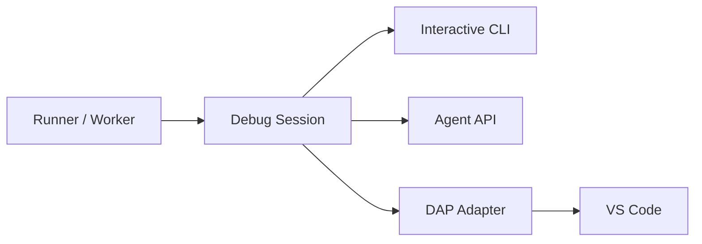

# Debug Sessions

**Status:** implemented (minimum lovable slice); core agent control API is shipped; `:verify` and VM/source agent operations remain outstanding
**Scope:** `aksh-runner`, `aksh-dap`, `aksh-runner-server`, `preloop-orchestrator`, `preloop-cli`

A failed job becomes a live debugging session. You diagnose and repair it inside
the same microVM, then re-run only what is necessary. The expensive setup —
checkout, toolchain, dependency install, compiler caches, prior successful steps
— is still there and stays there.

---

## 1. Mental model

The VM is a **workbench, not a snapshot**. It has one state and that state only
moves forward. There is no fork, no branch, no pair of alternatives to choose
between.

```
T0  VM boots                      golden image
T1  checkout                      workspace populated
T2  install toolchain             ~/.cargo populated
T3  cargo build                   target/ populated
T4  cargo test           ✗ FAIL   VM pauses here
T5  :sync                         2 source files replaced; target/ untouched
T6  cargo test           ✓ PASS   build system rebuilds 1 crate, reuses the rest
T7  remaining steps
```

`T6` is `T4` plus your edits plus whatever the build system redid. That dirt is
the *point* — it is why you skip `T1`–`T3`.

It is also why a pass at `T6` is **evidence, not proof**. Two distinct loops
follow from this, and conflating them is the primary design hazard:

| Loop | Where | Speed | Answers |
|---|---|---|---|
| **Repair** | the existing warm VM | seconds | "is my fix right?" |
| **Verification** | fresh VM from golden | minutes | "does this pass from clean?" |

> Iterate dirty. Confirm clean.

A repaired run is never reported as an ordinary pass. See §7.

### How a run opts in

One flag on the wire — `preserve_on_failure` → `preloop_preserve_on_failure` —
carries both "hold the VM" and "pause for a controller". They are the same
request seen from two distances, so a second flag meaning nearly the same thing
would only create states where they disagree.

What differs is whether anyone can answer:

| Invocation | Behavior on failure |
|---|---|
| `preloop run` at a terminal | pauses; attach with `preloop debug` |
| `preloop run --no-debug` | tears down immediately |
| `preloop run --detach`, or piped / CI | no pause — nobody could answer it |
| `preloop run --detach --preserve-on-failure` | no pause, but the VM is held for a later `preloop shell` |

A pause blocks the job until a controller decides, so pausing a detached or
piped run would hang something with no way to respond. `--preserve-on-failure`
is the explicit opt-in for that case: keep the machine, skip the prompt.

---

## 2. Session state machine

One engine, several clients. The CLI, the agent API, and DAP are all adapters
over the same state machine — none of them *is* the state machine.



States:

```
running
  → paused_failure        step failed, worker alive, VM held
  → attached              a controller holds the lease
  → repairing             controller is mutating VM or repair workspace
  → retrying              an attempt is executing
      → paused_failure    attempt failed again
      → resumed           attempt passed; job continues
  → completed_repaired
  → verifying
  → verified
```

Terminal: `aborted`, `cancelled`, `expired_while_detached`, `worker_crashed`.

**Single controller.** Exactly one client may mutate and resume. Others attach
as read-only observers. Control transfer pauses the outgoing controller first.
Two clients issuing `sync` and `retry` concurrently is not a supported state.

---

## 3. Retry ladder

`:retry` cannot mean "rewind and execute as if the step never ran." The failed
attempt may have already written files, mutated `$GITHUB_ENV`, started
processes, or called an external API. The contract is stated plainly:

> **Run the failed step again, in place, in the same microVM, after reverting
> the revertible workspace changes the failed attempt made. Non-workspace and
> external side effects remain.**

| Command | Behavior |
|---|---|
| `:retry` | repeat the failed step in the current VM |
| `:retry --sync` | pull host source changes first, then repeat |
| `:retry --from <step>` | sync, then re-execute from an earlier step |
| `:verify` | fresh microVM, whole job, repaired source + persisted setup |

`--from` exists because the failed step may consume an earlier step's output.
Step 3 compiles a binary, step 4 executes it: changing source and retrying only
step 4 runs the stale binary. Preloop cannot infer producer/consumer edges
across arbitrary shell, so it advises (§5) and the controller decides.

**Attempt journaling.** Each attempt is a first-class record.

```
test
├─ 1 checkout        ✓  attempt 1
├─ 2 cargo test      ✗  attempt 1   source: original
│                    ✓  attempt 2   source: repair-1
└─ 3 …               ✓
```

Before each attempt, snapshot and on retry restore the runner-managed logical
state: step outcome/conclusion, `$GITHUB_ENV`, `$GITHUB_PATH`, `$GITHUB_OUTPUT`,
expression contexts, action state. This prevents a failed attempt's file-command
effects from being applied twice. It does not rewind the guest filesystem.

---

## 4. What is *not* attempted

Stated up front so the contract stays honest:

- No rewind of external side effects. A fired API call stays fired.
- No rewind of mutations outside the workspace (`/usr/local`, a running
  postgres). Detected where possible, reported, never silently "fixed."
- No adoption of workflow-definition changes into a live job (§9).
- No automatic retry of steps whose idempotency cannot be established.

---

## 5. Change detection and revert

The naive approach — mtime stat-walk of the workspace before and after every
step — is rejected. It costs O(tree size) per step on every run including runs
that never fail, and it is lossy for writes that preserve mtime (`cp -p`, tar
extraction, ccache).

**The pristine workspace snapshot is already a complete undo log for everything
worth undoing.** `create_workspace_snapshot` in `runs.rs` produces a git-backed
immutable snapshot with a known `commit_sha`, and `redirect_primary_checkout`
points the job's checkout at it. So the pristine tree is a known ref.

Split the filesystem by category:

| Category | Detect | Undo |
|---|---|---|
| Tracked source | `git status` vs. snapshot | restore from snapshot — free |
| Untracked junk | `git status` | delete — free |
| Ignored cache (`target/`, `node_modules/`) | — | **never** — build system owns it |
| Outside workspace | fanotify or nothing | cannot — report only |

Consequences:

- **No file content is ever stored.** Tracked files come from the snapshot;
  untracked files are deleted; cache is deliberately preserved.
- **Zero cost on runs that do not fail.** Detection runs on `:retry`, not per
  step. This is what lets pause-on-failure be the default.
- **More correct than mtime for tracked files** — git content-hashes when stat
  data is ambiguous.
- The expensive directory to walk (`target/`) is exactly the one that must not
  be reverted, so skipping it costs nothing.

```
rust:default$ :retry

  The failed attempt changed:
    M  crates/parser/src/generated.rs     (tracked — revertible)
    +  build/                             (untracked — 12 files)
       target/                            (cache — left alone)

  → Revert those two, then retry
    Retry as-is
```

A blanket `git clean` is wrong in both directions: with `-x` it destroys the
warm cache, without `-x` it misses gitignored junk. Revert the enumerated set.

**Committed generated files.** A step that legitimately regenerates tracked
files (codegen checked into the repo) is indistinguishable, by inspection, from
a step that corrupted them. Preloop does not guess. When the revert set contains
tracked files, it enumerates them and asks:

```
  Revert tracked files changed by the failed attempt?

    M  crates/parser/src/generated.rs
    M  crates/proto/src/wire.pb.rs

  If a step regenerates these, reverting is harmless — it will rewrite them.
  If you edited them by hand since the run started, reverting discards that.

  → Revert all       Keep all       Choose per file
```

The answer is remembered for the session, not persisted as policy. A per-path
config rule was considered and rejected: it would be set once, drift, and then
silently discard work.

**Stale-artifact advice.** For `--from` guidance, classify step commands by
shape (`cargo build`, `npm run build`, `make`, `go build` are producers). Zero
runtime cost, advisory, cheap to be wrong about — the penalty is re-running one
step too early. Exact per-step attribution via fanotify is deferred; it needs a
guest daemon and has a silent `FAN_Q_OVERFLOW` failure mode under heavy builds.

---

## 6. Source sync contract

No bind mount. The workspace contains source *and* build output, and build
output is not portable — host is macOS/arm64, guest is Linux/arm64. Mounting the
whole tree collides the two `target/` directories; mounting a source subtree
reinvents sync with worse failure modes. A live mount also lets an editor save
mutate source mid-step, which is nondeterministic.

`:sync` transfers the host's working-tree changes as **whole files in one tar**,
not as a patch:

1. `git diff --name-only HEAD` plus `git ls-files --others --exclude-standard`
   — gitignored paths never appear, so build output is excluded by
   construction and a warm `target/` is never walked.
2. `tar` the changed files; `smolvm machine cp` the archive into the VM;
   extract in the guest workspace. Deletions go in one `rm`.
3. Record a new source revision (`repair-N`) on the session.

Three VM calls regardless of file count. `tar` carries mode bits, so a synced
`check.sh` keeps its `+x` — losing that would fail the retry for a reason
unrelated to the fix.

### Why not a diff against the snapshot

The original design called for a delta against the job's snapshot commit. It
does not work, and repairing it would cost more than it saves:

- **The commit is not in the host repository.** The server builds it in its own
  bare repo under `state/snapshots/<run_id>` and serves it over git smart HTTP;
  `git diff <snapshot>` on the host fails with `bad object`.
- **Fetching it is the expensive direction.** Pulling that object graph into a
  large host repo is a full smart-HTTP negotiation — more work than copying the
  single file that changed.
- **Bytes are not the scarce resource.** This transfer never leaves the machine.
  Round trips are what cost, and a tar collapses them to a constant.

Cost therefore scales with the size of the *change*, not the size of the
repository. The one case that remains suboptimal is a one-line edit to a very
large file, which sends the whole file; locally that is milliseconds. If it ever
matters, the fix is a snapshot fetch, and the only real work is plumbing a
job-scoped token (`authorize_snapshot_token` requires `sub: aksh-job-<uuid>`
with `Actions.Results:<plan>:<job>` scope) out to the CLI.

```
rust:default$ :sync

  Source changes since run started:
    M crates/parser/src/lib.rs
    A crates/parser/src/recovery.rs

  Preserving guest-only state: target/, .preloop/

  ✓ synchronized · session source revision repair-2
```

### VM-side source edits

`:export` (or `preloop debug --export`) diffs the guest workspace, writes the
patch to the host, and applies it. Without it a fix typed into the guest works,
turns the job green, and then evaporates with the machine — leaving the user to
retype it against a workspace that no longer exists. `--patch-only` writes
without applying; a patch that fails to apply is kept rather than deleted,
since losing it recreates the exact problem the command exists to prevent.

**Both-sides conflicts are refused, not merged.** `tar -x` is last-writer-wins,
so syncing a file that was also edited inside the VM would destroy the guest
copy silently. Sync checks `git status` in the guest first and aborts, naming
the paths; `--force` overrides.

The division of labour: environment mutations belong to the VM, source
mutations must reach source control. Editing project source in the VM is
supported but is not the intended path — the host has your editor, your LSP,
and your git history.

**Isolated repair workspaces.** Human sessions may operate on the current
working tree when explicitly chosen. Autonomous agent sessions default to an
isolated repair workspace seeded from that job's exact source snapshot, so five
failing matrix jobs cannot concurrently mutate one tree. A successful repair
produces a reviewable patch.

---

## 7. Provenance and verification

A repaired run gets a distinct outcome. This is non-negotiable — silently
promoting a mutated run to green destroys the signal, and it matters more once
agents are performing repairs unattended.

```
Passed
Passed after repair     ← source and/or environment differed from run start
Failed
Aborted
Expired
```

Verification forks from golden. "Clean" is not "cold":

**Default is warm**, where warm means precisely *the standard cache layer any
VM in the pool receives* — cargo registry, docker layers, npm cache. Nothing
from the repaired VM. This is the honest definition: verification reproduces
what a normal fresh run would get, no more and no less.

- **Dirty state** — leftover `build/`, half-written artifacts, hand-installed
  packages, anything the failed attempt or the repair touched — is never
  inherited. A repaired VM's caches are dirty state, not warm cache.
- **Standard pool cache** is content-addressed and verifiable, exactly what
  `actions/cache` does upstream. Inheriting it does not weaken the result.

`--cold` skips the standard cache layer for the rare case where cache
corruption is itself the suspect.

**Ordering constraint.** If the repair was environmental, the fix must be
persisted into project setup *before* verification runs, or verification fails
for the original reason and the user has no idea why:

```
persist env change → fork golden → apply project setup → run
```

The persistence prompt therefore precedes verification; it is not an end-of-run
afterthought.

**Verification scope** is derived from the job DAG: the repaired job plus its
transitive dependents. Unrelated and upstream jobs are not re-run.

---

## 8. Multi-job behavior

`needs:` already contains the blast radius. Pausing job 3 extends a wait that
downstream jobs were already in; unrelated jobs continue and finish; upstream
jobs are done with outputs recorded.

```
  run 21bb9d8e

  ✓ lint           42s
  ✓ build          2m10s
  ⏸ test           paused · step 2/6 · attached
  ⋯ integration    waiting on test
  ✓ docs           1m03s
```

A repaired job finishes **in its own warm VM**, which unblocks its dependents
normally. The fresh VM appears only at verification.

### Matrix siblings

When several matrix legs fail with the same diagnostic, repairing each
independently is pure repetition. After a repair succeeds on one leg, offer to
apply it to the others:

```
  ✓ test (rust: stable) repaired and passing

  3 paused siblings failed with the same diagnostic:
    test (rust: beta)     test (rust: nightly)     test (rust: 1.90)

  → Apply this repair to all 3
    Choose which
    Leave them paused
```

"Same diagnostic" is matched on the structured problem-matcher output, not on
raw log text. Applying a repair to a sibling replays the same source delta and
the same recorded environment operations against that sibling's own paused VM,
then retries its failed step there. It never copies VM state between machines.

Each sibling reports its own outcome. A repair that fixes three legs and fails
on the fourth leaves the fourth paused with its own session, not a partial
success.

---

## 9. Workflow-definition changes

If the repair edits `.github/workflows/*.yml` or a local `action.yml`, the
compiled job graph no longer describes the workflow on disk. Steps, matrices,
expressions, permissions, and services may all have moved. The live job cannot
adopt those changes.

Detect and stop:

```
  Workflow definition changed: .github/workflows/ci.yml
  The current job cannot adopt structural changes.

  → Start a new run with the edited workflow
    Continue debugging the existing compiled job
```

---

## 10. Lease and timeout

Four independent clocks can kill a paused job. They are not the same mechanism.

| Clock | Where | While paused | Handling |
|---|---|---|---|
| Lease (`renewjob` → `lockedUntil`) | `broker_renew_job`, `broker.rs` | worker is alive and keeps renewing | reaper skips a paused request outright |
| Server job timeout | `bootstrap.rs` — `elapsed >= job_timeout` | wall clock from `started_at` | paused seconds are subtracted |
| Runner job timeout | `job_runner.rs` — job-timeout timer | wall clock from job start | timer ticks and skips paused seconds |
| Step timeout | `steps_runner.rs` | wraps execution only | none needed |

The defaults hide all of this: both job timeouts fall back to 360 minutes, so
casual testing never trips them. `timeout-minutes: 10` on a job is routine, and
under it an unhandled clock cancels a debug session ten minutes in, through a
path no client can see.

Both job timeouts must be handled, and **both must agree**. Suspending only the
server's leaves the runner cancelling a job the server is deliberately holding
open; suspending only the runner's leaves the reaper doing the same from the
other side. Neither failure names a cause in any log the user reads.

- **Server side.** `DebugSessionRegistry` accumulates paused duration per
  session. `reap_once` subtracts `paused_for_request(...)` before comparing
  against `job_timeout`. The pause interval closes when the worker *collects* a
  verdict, not when a controller issues one — the job resumes executing at
  collection, so that is when the clock restarts.
- **Runner side.** `DebugPauseClient` raises a shared `AtomicBool` for the whole
  wait, including reconnect backoff. The job-timeout timer ticks once a second
  and only accrues while the flag is clear.

**This is why `paused` cannot be purely client-side.** Job *status* stays a
presentation concern — no new state on the `/_apis/…` surface, no wire
divergence. Timeout suspension is a separate concern and reaches the server via
the native `/api/v1/…` surface, which is aksh's own API and not bound by
runner-protocol fidelity.

### Session lifetime

Three bounds, all server-side, all enforced by `reap_once`:

| Bound | Value | Effect |
|---|---|---|
| Worker liveness | `WORKER_LIVENESS_WINDOW`, 90s since the last poll | session dropped; a crashed worker stops suspending anything |
| Job liveness | request no longer active | session dropped; a cancelled or completed job keeps nothing open |
| Pause credit | `MAX_PAUSE_CREDIT`, 4h per job request | suspension stops; the ordinary timeout resumes and cancels the job |

The credit ceiling is not idle detection in disguise — an attached controller is
never timed out for thinking. It is an explicit cap, and it is mandatory rather
than optional: without it a worker that keeps polling opts its job out of
`timeout-minutes` entirely and holds its microVM indefinitely. Past the ceiling
nothing special happens; the job simply stops being exempt and times out through
the normal path.

Retries are bounded too. `MAX_DEBUG_ATTEMPTS` (25) caps re-execution of a single
step: the attempt journal is cloned into every pause and retained server-side,
so an unbounded loop grows both sides without converging. Past the cap the step
fails and the session ends.

```
attached:  Session attached · no idle timeout · 3h41m of pause credit left
detached:  preloop debug 21bb9d8e --job test
```

---

## 11. Persistence

Users should not have to know what a golden image is. The user model is "jobs
run in fresh microVMs."

**Never snapshot the repaired VM wholesale.** It contains source changes, shell
history, tokens, temp files, test databases, and arbitrary unrelated mutations.

Detect package-manager operations and offer a *declarative* change:

```
  The repair installed VM software:
    build-essential  pkg-config  libssl-dev

  Use this setup for future runs of:
  → This project
    All local Preloop projects
    This session only
```

This lands in reviewable project configuration; the golden rebuild and re-fork
happen invisibly underneath. When a mutation cannot be expressed declaratively,
say so and offer a provisioning script for review rather than persisting opaque
disk state.

This closes the loop that motivated the feature: the `build-essential` gap in
`BASE_PACKAGES` should have been offered as a persisted project setup change
instead of requiring a source edit to `preloop-orchestrator`.

---

## 12. Failure entry

The banner answers five questions immediately: what failed, what the diagnostic
was, where, what is still alive, what to do next.

Diagnostics come from the runner's existing problem matchers first (structured
`file:line:message`), the failed assertion or compiler diagnostic second, a
short stderr excerpt only as fallback. Never an arbitrary trailing-20-lines when
the real error scrolled past.

```
╭────────────────────────────────────────────────────────────────────╮
│ Cargo test failed · attempt 1                                      │
├────────────────────────────────────────────────────────────────────┤
│ command   cargo test --workspace                                   │
│ exit      101      elapsed 18.4s                                   │
│ cwd       /work/rust-runner-server                                 │
│                                                                    │
│ crates/parser/src/lib.rs:42                                        │
│ assertion `left == right` failed                                   │
│   left: Pending    right: Completed                                │
│                                                                    │
│ Job and microVM paused. Services and build caches remain.          │
├────────────────────────────────────────────────────────────────────┤
│ :log :errors :changes :sync :retry :retry --from :verify :abort    │
│ Ctrl-D  detach — VM stays paused                                   │
╰────────────────────────────────────────────────────────────────────╯
```

Preloop verbs are `:`-prefixed so they never collide with shell commands.
`Ctrl-D` detaches without destroying, and says so.

---

## 13. Agent API

Agents will use this at least as much as humans, and they operate on **both
sides of the VM boundary** — environment fixes land in the VM, source fixes land
in a repair workspace on the host. The API is typed operations with
deterministic results, not a PTY.

The core control surface is implemented under
`/api/v1/agent/debug/sessions/:session_id`: acquire/release a single controller
lease, poll resumable structured events, issue versioned retry/retry-from/abort
operations, and read the retained audit trail. The human CLI and this agent
surface both drive the same debug-session state machine.

**Events** carry structured diagnostics and a log reference, not a wall of
terminal output and not the full environment:

```json
{
  "event": "step_failed",
  "session_id": "dbg_21bb9d8e_test",
  "session_version": 4,
  "job": { "id": "test", "matrix": { "rust": "stable" } },
  "step": { "index": 2, "attempt": 1, "command": "cargo test --workspace",
            "cwd": "/work/rust-runner-server", "exit_code": 101 },
  "diagnostics": [ { "level": "error", "file": "crates/parser/src/lib.rs",
                     "line": 42, "message": "expected `Completed`, found `Pending`" } ],
  "log_reference": "preloop://runs/21bb9d8e/jobs/test/steps/2/attempts/1",
  "source": { "original_revision": "sha256:…", "repair_revision": "sha256:…" },
  "capabilities": ["step.retry", "job.retry_from", "job.abort"]
}
```

**Implemented operations:** `step.retry`, `job.retry_from`, and `job.abort`.
Every mutation carries a client-supplied request ID and expected session
version; duplicate request IDs return the original result without executing
again.

**Planned operations:** `vm.exec`, `vm.read`, `vm.changes`, `source.changes`,
`source.sync`, `job.resume`, `session.detach`, `repair.propose_persistence`,
and `verification.start`.

Responses return `{prev_version, new_version, status, session}`. A reconnecting
agent replaying a request must not execute the same retry or abort twice.

**Outcomes:** `fixed`, `verified`, `environment_change_proposed`,
`approval_required`, `blocked`, `attempt_limit_reached`, `aborted`.

### Security

The feature grants remote execution inside a credential-bearing CI environment,
and the agent reads attacker-influenced material — repository files, test
fixtures, dependency error text, logs.

**Authorization.** The worker-facing routes (`POST /api/v1/debug/sessions`,
`GET …/verdict`, `POST …/close`) require a *debug-worker token*, and authorize
against the job it names rather than against its validity. The token is minted
per job as `sub: aksh-debug-worker-{agent_job_id}` with a matching
`scp: DebugWorker:{plan}:{job}`, so it identifies exactly one caller:

- a job may only open a session for itself;
- a session may only be polled or closed by the job that owns it;
- a mismatch is reported as `404`, not `403`, so session ids are not probeable.

This is load-bearing, not defence in depth. Collecting a verdict *consumes* it:
an unauthorized poll would not merely read another job's session, it would
drain the verdict its worker is waiting for, and that worker would then sit out
the liveness window and be swept — a hang with no attributable cause. A runner
*listen* token is not accepted here; it names a machine, not a job.

The job *runtime* token is not accepted either: the runner exports it to steps
as `ACTIONS_RUNTIME_TOKEN`, and it stands in for `GITHUB_TOKEN` when no GitHub
App is configured, so accepting it would let a `run:` step drive its own debug
session.

**Acquisition.** The debug-worker token is not delivered on the job message. It
used to arrive as a secret variable, `system.preloop.debug_worker_token`, which
was safe only under the Rust runner — `contexts.rs` drops every `system.*` key
from the `secrets` context. Official runner v2.336.0 has no such filter: it
copies every `isSecret` variable except `system.github.token` into `secrets`,
so the credential was readable from the workflow being debugged as
`${{ secrets['system.preloop.debug_worker_token'] }}`. The server does not
choose which runner claims a job, so the variable had to go.

The worker now acquires it during job setup, before the first step runs:

```
POST /api/v1/debug/worker-token      Authorization: Bearer <job runtime token>
{ "agent_job_id": "<uuid>" }      →  { "token": "<debug-worker token>" }
```

The runtime token is the only job-scoped credential the worker already holds,
so it authenticates the exchange — and the exchange is built to be worth
nothing to a step that later replays it:

- the token must name a single job (`sub`/`scp` must agree), and that job must
  be the one named in the body — `403` otherwise;
- the job must have a live, uncompleted request — `404` otherwise;
- its run must have set `preserve_on_failure`; a run that never asked to pause
  has no debug credential at all — `403` otherwise;
- issuance is one-shot per job request — `409` otherwise. The worker spends it
  before any step runs, so a step that finds `ACTIONS_RUNTIME_TOKEN` in its
  environment finds the exchange already consumed.

Controller-facing routes (`GET /api/v1/debug/sessions`, `POST …/verdict`) and
the whole `/api/v1/agent/debug/…` surface use native authentication, which is
the operator's credential.

**Untrusted fields.** Everything in `OpenSessionRequest` is worker-supplied.
`workspace` reaches a controller's shell as a `cd` target, so it is validated at
the door — absolute, no shell-active characters — and rejected rather than
sanitized downstream. Guest paths are single-quoted at every `sh -lc`
interpolation in the CLI.

Launch requirements, with current status:

1. Capability-scoped sessions; diagnose / source-edit / vm-exec / network /
   persistence / secret-access are separate grants. *(partial: lease
   capabilities cover `step.retry`, `job.retry_from`, `job.abort`)*
2. Redacted structured context — never the full environment by default.
   *(log excerpts are taken from the masked log file, after `mask_secrets`)*
3. Full audit trail of commands, edits, syncs, retries, approvals. *(done, per
   session, bounded at `MAX_SESSION_AUDIT`)*
4. Single-controller lease; no concurrent mutators. *(done)*
5. Idempotent request IDs. *(done, bounded at `MAX_COMPLETED_OPS`)*
6. Attempt limits — an unbounded session lifetime is not an unbounded retry
   loop. *(done: `MAX_DEBUG_ATTEMPTS`, and `MAX_PAUSE_CREDIT` for lifetime)*
7. Approval gates for persistence, secret exposure, and non-idempotent commands.
   Retry safety cannot be inferred; `cargo clippy` and `terraform apply` are
   indistinguishable to a scheduler. Default deny. *(not implemented)*
8. Logs and repo contents are evidence, never instructions that widen authority.
9. Network policy independent of the original job's. *(not implemented)*
10. The resulting patch is attributable to the session that produced it.

**Revert containment.** `revert_paths` rejects absolute paths and `..`
lexically, and additionally canonicalizes each target's parent to confirm it
still resolves inside the workspace. The lexical check alone is insufficient: a
failed step can leave `link -> /etc` behind, after which `link/passwd` passes it
and the unlink happens outside the workspace with the runner's rights. The leaf
itself is deliberately not resolved — a symlink is removed as a link.

Human takeover must be available at any point, and must pause the agent before
transferring the lease.

---

## 14. Integration points

| Concern | Location |
|---|---|
| Pause hook (before step) | `on_step_starting`, `steps_runner.rs` ~435 |
| **New:** pause hook (on failure) | same loop, post-execution branch |
| DAP trait | `Debugger` in `aksh-dap/src/debugger.rs` ~134 |
| Step verdict / retry loop | step loop in `steps_runner.rs` |
| Workspace snapshot | `create_workspace_snapshot`, `redirect_primary_checkout` in `runs.rs` |
| Wire flag | `preserve_on_failure` → `preloop_preserve_on_failure`, `azdo/job.rs` ~170 |
| Session registry / HTTP surface | `debug_sessions.rs`, `aksh-runner-server` |
| Worker authorization | `require_worker_bearer` + `WorkerJob`, `auth.rs`; `job_uuid_from_debug_token`, `state.rs` |
| Credential acquisition | `issue_worker_token`, `debug_sessions.rs`; `require_job_runtime_bearer`, `auth.rs`; `DebugPauseClient::acquire`, `debug_pause.rs` |
| Timeout suspension (server) | `reap_once`, `bootstrap.rs` |
| Timeout suspension (runner) | job-timeout timer + `DebugPauseClient::with_pause_flag`, `job_runner.rs` |
| VM hold (post-mortem, no attach) | `hold_for_debugging`, `DEBUG_IDLE_TIMEOUT`, `preloop-orchestrator/src/lib.rs` |
| Attach CLI | `Debug` command, `preloop-cli/src/debug_session.rs` |
| Post-mortem shell | `Shell` command, `preloop-cli/src/main.rs` |
| Base packages | `BASE_PACKAGES`, `preloop-orchestrator/src/lib.rs` |

The existing debug marker is 9 bytes (`"preserved"`). It carries no run ID, job
name, failed step, exit code, or workspace path, which is why the current
`preloop shell` flow cannot orient the user. It is replaced by a JSON session
descriptor.

`next` / `stepIn` / `stepOut` are currently aliased to `continue` in the DAP
debugger. Failure-pause and retry are the two missing primitives — "break on
exception" and "set next statement" respectively.

Non-debug runs must stay byte-identical on the wire. Step reporting is deferred
only while a session is attached.

---

## 15. Phasing

**Minimum lovable** — shipped and verified end to end against a live engine:

1. ✅ Pause on failure — worker blocks in the step loop; the VM stays up because
   the worker process does, so no orchestrator involvement is needed for
   machine lifetime
2. ✅ Job-timeout suspension (server reaper **and** runner timer)
3. ✅ `preloop debug` — banner, `:retry`, `:continue`, `:abort`, `:changes`,
   `:steps`, guest shell passthrough, safe detach
4. ✅ Change detection and revert via git-vs-snapshot
5. ✅ Attempt journaling and runner-context restore
6. ⬜ `:retry --sync` — revision-aware host→VM delta (detection landed; the
   sync-then-retry path has not)

Verified scenario: a three-step job fails at step 2, pauses with the VM live,
is fixed inside that VM, and is retried through `preloop debug --verdict retry`.
Step 1 does not re-run; step 3 runs; the job finishes `Succeeded`.

### Implementation notes worth keeping

Four defects made the feature silently inert end to end while every unit test
passed. All four lived at seams a mock would have hidden:

- `akshDebugRunId` was populated only for DAP runs, so the pause client never
  constructed and execution fell through to the old post-mortem path.
- The client used a bare `reqwest::Client` instead of the crate's `HttpClient`,
  bypassing the Unix-socket control transport a guest requires.
- The `SystemVssConnection` endpoint carries a path prefix
  (`http://host:9090/broker/4`); the native surface is origin-rooted.
- The worker identifies its job by AzDO GUID while the server indexes by
  workflow job id. Sessions are now keyed on `agent_job_id`, which also
  disambiguates matrix legs.

None were diagnosable until guest stdout was forwarded to tracing — it was
previously consumed only to sniff for the runner-busy sentinel and discarded,
leaving every worker-side decision invisible from the host.

**Second** — what makes it more than a nicer shell:

7. Agent API over the same state machine, with capability policy
8. `:verify` and the `passed after repair` outcome
9. Declarative persistence
10. Isolated repair workspaces
11. Workflow-change detection

**Later:**

12. VS Code DAP client
13. fanotify per-step attribution
14. Pre-step CoW checkpoints (see below)
15. `:continue` after failure — deliberately deferred; the step already ran, so
    the honest verb is "accept this failure and continue," which is closer to
    runtime `continue-on-error` and can mask broken downstream state

**`:abort` vs `:kill`.** `abort` keeps the step's failure and lets the job
unwind normally, so `post`/`always()` cleanup still runs — checkout credential
cleanup, cache post-steps, container teardown, service shutdown, secret removal.
The job therefore concludes `Failed`, not `Cancelled`: the step really did fail
and the user declined to repair it, and reporting a cancellation would hide
that. What abort adds beyond an ordinary failure is a promise not to ask again —
a later `always()` step failing must not re-trap a user who already walked away.
`kill` terminates the VM immediately and is an emergency operation. Agents do
not get `kill` by default.

---

## 16. Deferred: pre-step CoW checkpoints

A disk snapshot before each step would make retry genuinely clean rather than
in-place. Deferred, for reasons worth recording:

- Rolling back a block device under a **live** guest leaves the kernel page
  cache inconsistent with the disk. It requires either a guest reboot (losing
  warm process state and running services) or putting the workspace on a
  separate volume that can be unmounted and remounted.
- Scoping to a separate workspace volume gives up the `/usr`-and-databases
  coverage that justified the approach, landing on the same scope as
  git-vs-snapshot at much higher cost.
- CoW taxes every subsequent write and holds pre-image blocks; a 10-step job
  with a multi-GB build can retain tens of GB of overlay across 8 concurrent
  VMs.
- It does not help with external side effects, and does nothing for provenance.

`overlayfs` with a per-step upper layer is rejected outright: copy-up costs,
hardlink breakage, and `d_ino` inconsistencies mean enabling debug would change
filesystem semantics for the job under test. A debugger that alters the
behavior of the program being debugged is worse than no debugger.

The verb survives the upgrade. If `:retry` means "re-run in place" now and
"restore + re-run" later, the contract strengthens with no UX churn.

---

## 17. Resolved decisions

| Question | Decision |
|---|---|
| Reverting tracked files vs. committed codegen | **Detect and ask.** Enumerate the tracked files in the revert set, explain both directions, offer all / none / per-file. Session-scoped, never persisted as policy (§5). |
| `:verify` cache posture | **Warm by default**, defined as the standard pool cache layer any VM receives — never the repaired VM's state. `--cold` available (§7). |
| Matrix siblings failing identically | **Offer to apply the repair across siblings**, matched on structured diagnostics. Replays the source delta and environment operations per sibling VM; never copies VM state. Each reports independently (§8). |
| `paused` as a server status | **Client-side presentation.** No new status on `/_apis/…`. But timeout suspension is a distinct concern and must reach the server over the native `/api/v1/…` surface, or the reaper kills the session (§10). |

Governing principle throughout: **when Preloop cannot distinguish two cases, it
asks and shows its evidence.** It does not infer, and it does not pick a default
that can silently discard work.

## 18. Open questions

- Session descriptor discovery is local-filesystem only. Cross-machine remote
  debug sessions need a registry; deferred with remote debugging itself.
- Does suspending the runner-side timeout require restructuring the spawned
  timer in `job_runner.rs`, or can it be replaced with a deadline recomputed
  against accumulated pause duration?
