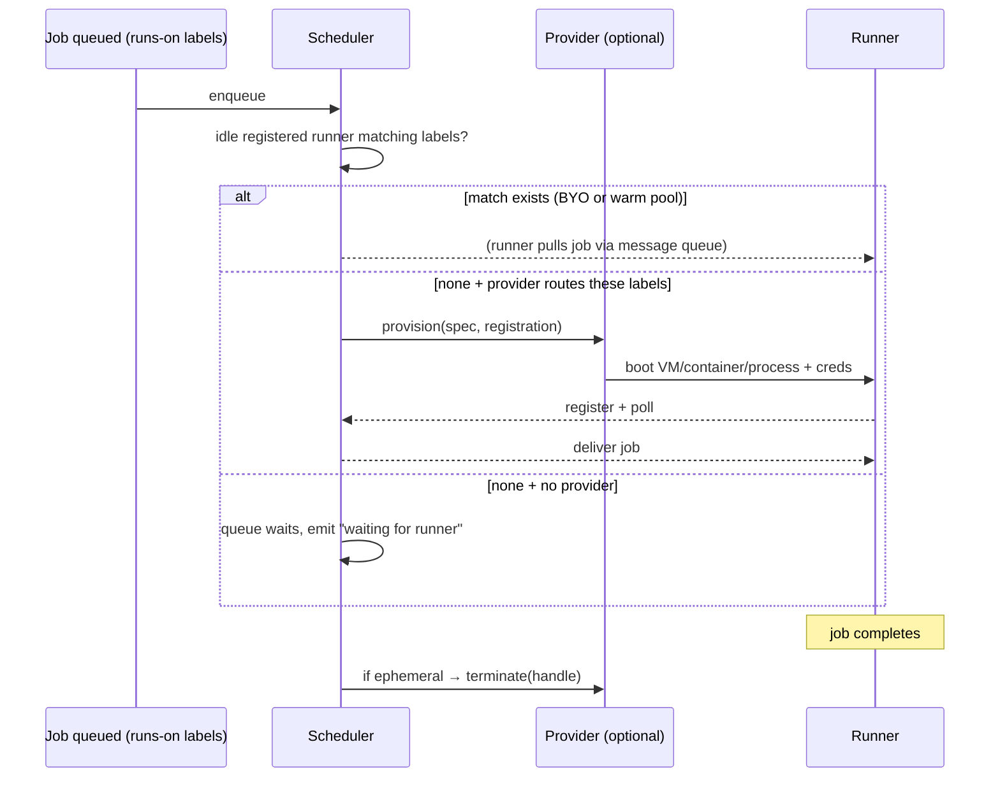

# aksh — GitHub Actions Control Plane Fidelity Gap &amp; Roadmap

**aksh** is a faithful Rust reimplementation of the GitHub Actions control plane

(`ChristopherHX/runner.server`) — a host-side service that the **official `actions/runner`**

**(`Runner.Listener`)** can register against, poll for jobs, execute, and report results to,

without GitHub-hosted minutes.

**aksh is not tied to any specific runner host.** It speaks the runner protocol and accepts

incoming runner connections; the runner itself handles execution. This means aksh works

equally well with:

- libkrun microVMs (what **Preloop** — the local CI product — uses)
- Docker / Podman containers
- Virtual machines (cloud or local)
- Bare processes on the same machine
- Remote runners on other servers

**Preloop** is the *product* that combines aksh (control plane) + a libkrun-based

ephemeral runner host for local CI. aksh is its control plane. But aksh is independently

usable: anyone can `cargo install aksh` and point their own runners at it.

Runner *provisioning* integrations live in separate repos/crates. The Rust runner

protocol client (`aksh-runner`) lives in this workspace alongside the control plane.

Upstream reference: `actions/runner` v2.335.1 (commit `7d737449ef346f6524f75688d0c9c95fa10ba10a`)

runner.server reference: `ChristopherHX/runner.server` v3.14.0 (commit `069646146c90d649c74dfd7a34569c9420195838`)

(overridable via `AKSH_UPSTREAM_RUNNER_SERVER_REF`).

---

## 0. Naming


| Term                | Meaning                                                                        |
| ------------------- | ------------------------------------------------------------------------------ |
| **aksh**            | This repo: the GitHub Actions control plane service (protocol, scheduler, API) |
| **Preloop**         | Local CI product: aksh + libkrun runner host for ephemeral microVMs            |
| **Runner.Provider** | Pluggable trait: creates/destroys runners (any substrate)                      |
| **Runner.Listener** | The unmodified official `actions/runner` binary                                |

## 0a. Product parity target

The target is **not** byte-for-byte hosted GitHub/Azure implementation parity.
aksh should be faithful where the unmodified official runner, user workflows, or
GitHub PR/check UX depend on it, and intentionally local everywhere else.

The product target is:

> Users can keep their existing, unmodified `.github/workflows/*.yml` files.
> Preloop/aksh evaluates those workflows, schedules jobs on local/self-hosted
> runner capacity, and reports status/log/artifact links back to the existing
> GitHub PR/checks UI.

That means three compatibility bars:

1. **Runner protocol compatibility** — the official `actions/runner` can register,
   create sessions, poll for work, acquire/renew/complete broker jobs, upload logs,
   consume actions/cache/artifact URLs, and settle runs without knowing it is not
   talking to GitHub-hosted Actions.
2. **Workflow semantic compatibility** — existing GitHub Actions YAML behaves the
   same from the developer's perspective: triggers, contexts, expressions, matrix,
   `needs`, outputs, secrets/vars, cancellation, cache, artifacts, and common
   `uses:` actions work without editing the workflow file.
3. **GitHub integration compatibility** — for the self-hosted control-plane mode,
   a GitHub App receives webhooks, fetches workflow files and refs, supplies a
   scoped `GITHUB_TOKEN`/installation token, and updates Checks/commit statuses so
   pull requests still show normal pass/fail feedback in GitHub's UI.

Local equivalents are acceptable, and preferred, for implementation details the
runner/user cannot observe directly:

- local result/log storage instead of GitHub's result service backend;
- local filesystem/S3/MinIO cache and artifact stores instead of Azure Blob;
- local JWTs or installation tokens instead of GitHub's internal token service;
- local service URLs instead of GitHub/Azure signed URLs, as long as the runner
  and actions can use them successfully;
- Preloop's own run/details UI linked from GitHub Checks, rather than reproducing
  every internal GitHub Actions page.

Conformance should therefore assert **semantic equivalence** with explicit
normalizers for volatile/local fields. It should not require exact hosted-service
hostnames, token bytes, Azure blob URL shapes, billing metadata, or internal
location-service topology unless the official runner or common actions require
those details.


---

## 1. Current fidelity scorecard

**Evidence basis (latest):** fresh official `actions/runner` v2.335.1 MITM capture for
`01-register-and-idle`, recorded 2026-06-29 from GitHub's real service and replayed against
aksh via runner-watch.

**Evidence basis (live E2E, 2026-07-10):** official `actions/runner` v2.335.1 run against both
GitHub Actions and aksh server in independent smolVMs. 12 conformance scenarios tested.
Job-level match: 11/12 (92%). Full match (job + step): 6/12 (50%).
See `benchmarks/real-world/results/server-compare/COMPARISON-REPORT.md` for details.

- Raw official capture: `../mitm-proxy/experiments/mitm/captures/official/01-register-and-idle/latest/summary.json`
  - `status = ok`
  - `runner_version = 2.335.1`
  - `flows_count = 68`
- Filtered/mapped control-plane replay: `.runner-watch/conformance/v2.335.1/01-register-and-idle.md`
  - official baseline: 56 replayed flows
  - aksh capture: 56 responses captured
  - result: **failed comparison**

The old v2.322.0 local-runner lifecycle still demonstrates that aksh can run jobs in the
legacy/local flow. It is no longer enough to claim current-runner fidelity: v2.335.1 uses
additional broker, OAuth, registration, and results-service surfaces.

Rough completeness against "100% faithful control plane (v2.335.1)": **~80–85%**.
Live E2E comparison (2026-07-10): 11/12 scenarios match at job-conclusion level (92%).
6/12 achieve full step-level match. The remaining gap is step-result reporting fidelity,
expression evaluator edge cases (nested bracket access), and shell wrapper behavior.
Protocol-level: runner-watch replay proves route coverage and status-code parity for
all comparable requests. TemplateToken wire format fixes (jobOutputs, step inputs)
validated end-to-end.

| Layer | Current evidence | Faithful? |
| --- | --- | --- |
| Workflow YAML parse + typed model | present, IndexMap preserves order | ✅ good |
| Matrix expansion | IndexMap order, GitHub name format | ✅ good |
| Expression engine | wired into job builder, status functions from context | ✅ good |
| Trigger matching | branches/tags/paths/types/schedule/dispatch | ✅ good |
| `needs` DAG scheduling | dependency-gated scheduler, outputs propagation | ✅ good |
| `if` / contexts / outputs propagation | evaluated, needs outputs threaded | ✅ good |
| Secrets policy / masking on the wire | `SecretString` + mask hints in wire messages | ✅ good |
| Runner session handshake (legacy AzDO path) | AES key exchange now RSA-wraps the session key with the runner's registered public key; plaintext is retained only as a no-key fallback | ✅ good |
| Encrypted message queue (`TaskAgentMessage`) | older direct-message path remains AES-CBC encrypted; current v2.335.x broker-ref path is covered by a current-runner E2E test | ✅ good |
| `AgentJobRequestMessage` | full DTO with plan, request, context, steps; reused by current broker acquire responses and covered by current-runner registration→broker E2E | ✅ good |
| `connectionData` / location services | v2.335.1 replay returns `200`; aksh now includes current runner broker/OAuth/pipelines resource locations and query-aware fresh-cache responses | ⚠️ runner-compatible, not full hosted-service parity |
| GitHub runner registration endpoint | route exists and replays as `200`; response now returns JWT-shaped local `OAuthAccessToken` plus aksh service URL instead of echoing GitHub repo URL | ⚠️ local token, runner-compatible |
| OAuth token endpoint | route exists and replays as `200`; response now uses `token_type = JWT`, `expires_in = 2999`, and local signed JWT-shaped tokens | ⚠️ local token, runner-compatible |
| DistributedTask pool/agent replay | runner-watch mapping is fixed and the latest replay returns `200` for pool discovery / agent lookup / agent registration | ✅ good |
| DistributedTask session/message replay | mapped requests now reach aksh; session status matches `201`; incomplete Busy long-polls are filtered as non-comparable capture artifacts | ⚠️ partial |
| AgentRequest acknowledgement | endpoint exists and now returns `200` like official v2.335.1 | ✅ good |
| Broker acquire/renew/complete | queue-backed routes pass targeted E2E; runner-watch now materializes replay state and rewrites captured broker IDs so acquire/renew/complete statuses match official | ✅ good for status/protocol flow |
| Results-service Twirp logs/update | 5 Twirp routes registered outside `require_bearer` (runner job token uses different signing key); handlers return real data with signed blob URLs | ✅ good |
| Timeline / logs / web-console feed | AzDO timeline/log routes exist; current service path now includes Twirp results surfaces, but the response payloads are not yet faithful | ⚠️ partial |
| Job/step completion events + annotations | AgentRequest PATCH and broker complete paths exist; annotation/body fidelity remains partial | ⚠️ partial |
| Action download info | server endpoint returns empty stub; runner-side `actions_download.rs` has full batch `runnerresolve/actions` + bearer token for codeload — common remote actions work end-to-end; subpath keys are normalized before resolution | ⚠️ server stub, runner path good |
| Cache v1 / Artifact v1 shapes | in-memory stubs | ⚠️ partial |
| Cache v2 / Artifact v2 / blob/Twirp | local server implementation remains absent; runner-side `actions/cache@v4` v2 save/restore against GitHub is verified with separate ephemeral runners | ⚠️ server missing, runner verified |
| Background steps | `TimelineRecord` DTO now accepts background-step fields; control-flow behavior remains unexercised by the idle replay | ⚠️ partial |
| DAP debugger integration | fully implemented: 4,527 LOC, 67 tests, WebSocket DAP server with breakpoints/stepping/variable inspection | ✅ good |
| Runner config refresh | not exercised in this replay; support remains incomplete/untested | ⚠️ unknown/partial |
| Server-enforced runner settings | not implemented | ❌ missing |
| Node 20→24 migration/deprecation warnings | not implemented/surfaced | ❌ missing |

---

## 1a. v2.335.1 conformance findings from the real-service replay

### 1a.1 What the 56-flow replay proves

runner-watch successfully replayed the filtered control-plane portion of the fresh official
v2.335.1 capture: **56 official requests were sent to aksh and 56 aksh responses were
captured**. The replay transport worked; the comparison failed because aksh responses differ
from official responses.

The 56-flow baseline is intentionally filtered/mapped from the 68-flow raw capture:

- dropped: repeated readiness/health probes (`token.actions.githubusercontent.com /ready`,
  `broker.actions.githubusercontent.com /health`, `run.actions.githubusercontent.com /health`)
- kept: registration, connectionData, distributedtask, OAuth, AgentRequest ack, broker job
  lifecycle, and results-service Twirp flows

Artifacts:

- official filtered baseline: `.runner-watch/conformance/v2.335.1/01-register-and-idle/official-filtered/flows.jsonl`
- aksh replay capture: `.runner-watch/conformance/v2.335.1/01-register-and-idle/aksh/flows.jsonl`
- report: `.runner-watch/conformance/v2.335.1/01-register-and-idle.md`

### 1a.2 Failures that are replay-mapping issues first

These rows were replay-mapping issues first and were fixed in runner-watch. The latest replay
now reaches aksh's compat routes and returns `200` for the pool/agent surfaces.

| Flow | Official status | Latest aksh status | Current interpretation |
| --- | ---: | ---: | --- |
| `GET /_apis/distributedtask/pools?poolType=Automation` | 200 | 200 | replay mapping fixed; row no longer blocks aksh evaluation |
| `GET /_apis/distributedtask/pools/{pool}/agents?agentName=...` | 200 | 200 | replay mapping fixed; route exercised successfully |
| `POST /_apis/distributedtask/pools/{pool}/agents` | 200 | 200 | replay mapping + compat parser fixed |

### 1a.3 Mapped requests with wrong aksh behavior

These requests are either already mapped or target an aksh route, but the status/body differs
from official.

| Priority | Flow | Official | aksh | What is wrong | Next action |
| --- | --- | ---: | ---: | --- | --- |
| P1 | `POST /api/v3/actions/runner-registration` | 200 | 200 | response token/url values are local placeholders, not official service values. | Tighten response shape only if strict fidelity is required. |
| P1 | `POST /_apis/v1/oauth2/token` | 200 | 200 | response token type/expiry/value differ from official (`JWT`, `2999`). | Tighten response body if strict fidelity is required. |
| P1 | `POST /_apis/distributedtask/pools/{pool}/sessions` | 201 | 201 | mapped session creation works and status matches; body still differs from official volatile/encryption fields. | Tighten body only if strict fidelity is required. |
| P0 | `GET /_apis/distributedtask/pools/{pool}/messages?...` | 200 / long-poll | 200 | mapped message poll now emits local `RunnerJobRequest` refs for replay-materialized jobs; Busy no-response long-polls are filtered because no official HTTP response was captured. | Treat filtered Busy long-polls as harness timing unless strict long-poll parity is required. |
| P2 | `POST /_apis/v1/AgentRequest/{pool}/{request}` | 200 | 200 | endpoint is implemented and status now matches official. | Tighten body only if strict fidelity is required. |
| P2 | `GET /_apis/connectionData?...` | 200 | 200 | aksh response is much smaller than official and lacks current broker/results location metadata. | Add current service locations only where the runner uses them; keep volatile fields normalized in tests. |

### 1a.4 Missing aksh surfaces proven by the replay

These endpoint families were the remaining high-priority gaps from the replay. Broker routes
now exist in aksh, and runner-watch materializes matching queued state plus captured-ID rewrites
so broker status codes match official. Twirp results-service routes are registered outside
`require_bearer` and return real data with signed blob URLs.

| Priority | Flow | Official | aksh | Required surface |
| --- | --- | ---: | ---: | --- |
| P0 | `POST /broker/{runner}/acquirejob` | 200 | 200 in replay | Queue-backed production route exists and replay state materialization now maps captured official IDs to local queued requests. |
| P0 | `POST /broker/{runner}/renewjob` | 200 | 200 in replay | Queue-backed production route exists and replay state materialization now maps captured official IDs to local queued requests. |
| P0 | `POST /broker/{runner}/completejob` | 204 | 204 in replay | Queue-backed production route exists and replay state materialization now maps captured official IDs to local queued requests. |
| P1 | `POST /twirp/.../WorkflowStepsUpdate` | 200 | 200 | Routes outside `require_bearer`; handlers return real data. |
| P1 | `POST /twirp/.../GetJobLogsSignedBlobURL` | 200 | 200 | Returns local signed upload URLs. |
| P1 | `POST /twirp/.../GetStepLogsSignedBlobURL` | 200 | 200 | Returns local signed upload URLs/limits. |

### 1a.5 Source-diff-only gaps not exercised by `01-register-and-idle`

The latest replay is an idle/control-plane scenario. It does not exercise every source-diff
finding. Keep these tracked, but do not confuse them with observed replay failures:

| Priority | Change | Upstream Version | aksh Status |
| --- | --- | --- | --- |
| P0 | Background step fields in `TimelineRecord` (`isBackground`, `backgroundControlType`, `backgroundControlStepIds`, `parallelGroupId`) | v2.335.0 | ⚠️ DTO implemented; control-flow behavior unexercised by idle replay |
| P0 | Thread-safe `StepsContext` lock changes | v2.335.0 | N/A runner-side |
| P1 | `auth_url_v2`, `BrokerUrl`, `UseRunnerAdminFlow` capability/location fidelity | v2.329.0 | ⚠️ partial; broker endpoints now pass replay by status, location/capability bodies remain local |
| P1 | `RunnerVersionDeprecated` feature flag response | v2.321.0 | ❌ missing |
| P2 | DAP debugger endpoint/WebSocket support | v2.335.0 | ✅ fully implemented (4,527 LOC, 67 tests, WebSocket DAP server) |
| P2 | `SendJobLevelAnnotations` in timeline | v2.323.0 | ❌ missing/untested in idle replay |
| P2 | `BatchActionResolution` for action downloads | v2.328.0 | ✅ implemented (client-side in `actions_download.rs`); server stub returns empty, runner falls back to GitHub API; passes scenarios 10, 83, 94 |
| P2 | `UseBearerTokenForCodeload` for action tarballs | v2.328.0 | ✅ implemented (client-side in `manager.rs`); bearer auth on codeload.github.com downloads |
| P3 | Node 20 deprecation warning annotation | v2.328.0 | ❌ missing/untested in idle replay |
| P3 | `DisableStdoutMultilineLogPrefixing` env var | v2.335.0 | ❌ missing/runner-side unless aksh injects env |
| P3 | Server-enforced runner settings | v2.323.0 | ❌ missing |

---

## 2. Upstream surface we must emulate

The 23 controllers in `runner.server/src/Runner.Server/Controllers/` define the contract.

Grouped by the role they play for the official runner:

### 2.1 Runner lifecycle (mandatory for any job to run)

- `ConnectionDataController` — `GET _apis/connectionData`: AzDO `ConnectionData` +

  `LocationServiceData` GUID→location map. **First call the runner makes.**
- `RunnerRegistrationController` / `AgentController` — agent (runner) registration; the

  runner sends an **RSA public key**, server stores it for session-key wrapping.
- `AgentPoolsController` — pool discovery.
- `AgentSessionController` — `POST .../sessions`: returns `TaskAgentSession` with an

  **AES `encryptionKey`, RSA-wrapped** with the runner's pubkey. All later message bodies

  are AES-encrypted with this key.
- `MessageController` — `GET .../messages?sessionId&lastMessageId` long-poll returning

  `TaskAgentMessage{ messageId, messageType, iV, body }`; `DELETE .../messages/{id}` ack.

  **This is the 6,839-line heart**: it also runs the whole evaluation (triggers,

  expressions, matrix, needs, contexts) and builds the job. Upstream leans on GitHub's

  real `DistributedTask.ObjectTemplating`, `Expressions2`, and `Pipelines.ContextData`

  SDKs — that is the semantic bar.
- `AgentRequestController` — job request lease/renew/lock semantics.
- `AuthController` / `OidcController` — OAuth client-credentials token issuance; the

  runner attaches a bearer token to every subsequent call. `OidcController` mints job

  OIDC tokens (`id-token: write`).

### 2.2 Job reporting (mandatory for status/logs/annotations)

- `TimelineController` — `PATCH .../timelines/{id}/records`: per-job and per-step

  `TimelineRecord`s (state, result, start/finish, `**issues[]` = annotations**).
- `LogfilesController` — create/append log files per timeline record.
- `TimeLineWebConsoleLogController` — live console `feed` lines.
- `FinishJobController` — `JobCompleted` event with **job outputs** + final result.

  This is where `needs.<job>.outputs` originate.

### 2.3 Asset services

- `ActionDownloadInfoController` — resolves `uses:` → tarball download URLs (+ auth).

  Without it the runner cannot fetch actions.
- `CacheController` (v1 `_apis/artifactcache`) + `CacheControllerV2` (blob/twirp).
- `ArtifactController` (v1 pipelines) + `ArtifactControllerV2` (blob).
- `ArtifactCacheManagementController` — cache listing/eviction.

### 2.4 Support

- `VssControllerBase` / `ApiResponder` — AzDO envelope conventions (error shapes,

  `Content-Type`, API-version negotiation headers).
- `GitHubAppIntegrationBase`, `PipelineContext`, `CounterFunction`, `TaskController`.

---

## 3. What exists today (and where it diverges)

Paths are in this repo. Updated 2026-06-29 after the v2.335.1 56-flow runner-watch replay.

- `aksh-gha-parser/src/lib.rs`
  - ✅ Typed `Workflow`/`Job`/`Step`/`Trigger`/`RunsOn`/`Needs`/`Strategy`/`Matrix`.
  - ✅ `Trigger::matches_with_context` — `branches`/`tags`/`paths`/`types`/`schedule`/`workflow_dispatch`.
  - ✅ `expand_matrix` uses `IndexMap` preserving declaration order; GitHub `name (v1, v2)` format.
  - ✅ `can_merge_include` compares only original dimensions.
  - ✅ Expression evaluation wired into job builder via `eval` module.
- `aksh-gha-expressions/src/lib.rs`
  - ✅ Pratt parser + evaluator; `contains/startsWith/endsWith/format/join/fromJSON/toJSON`.
  - ✅ **Wired** into job builder — expressions resolved in env, with, run fields.
  - ✅ `success()/failure()/cancelled()` use context state (not hardcoded).
  - ⚠️ No index/bracket access (`matrix['os']`), no `*` object-filter (`steps.*.outputs`),
  
    no `format` `{{`/`}}` escaping.
  - ⚠️ Empty object/array is falsey; GitHub treats non-null object/array as truthy.
- `aksh-runner-server/src/lib.rs`
  - ✅ axum router with GHES org-prefix routing, graceful shutdown, NDJSON broadcast.
  - ⚠️ Legacy/local AzDO lifecycle routes exist for `connectionData`, `AgentPools`, `Agent`,

    `AgentSession`, `Message`, `AgentRequest`, `Timeline`, `Logfiles`, `FinishJob`, and
    `ActionDownloadInfo`, but the v2.335.1 replay shows current-service auth/path semantics
    are not fully faithful.
  - ⚠️ GitHub-compatible registration route exists (`/api/v3/actions/runner-registration`) and
    now replays as `200`, but the returned token/url values are local placeholders rather than
    the official service values.
  - ⚠️ OAuth token route exists and now replays as `200`, but the returned token type/expiry/value
    are still not official-fidelity.
  - ⚠️ Mapped DistributedTask `sessions`/`messages` now replay with matching `201`/`200`
    statuses for comparable captured responses; incomplete Busy long-polls are filtered.
  - ✅ AgentRequest acknowledgement exists and returns `200` like official v2.335.1.
  - ✅ Broker acquire/renew/complete endpoints pass targeted E2E and now match official replay
    statuses after runner-watch materializes queued jobs and rewrites captured broker IDs.
  - ⚠️ Results-service Twirp log/update endpoints exist in replay, but a live Rust-runner smoke
    currently gets `401` from `/twirp/...`; accepted response bodies remain placeholder/local.
  - ✅ AES session key exchange (unencrypted mode — RSA wrapping TODO).
  - ✅ Encrypted `TaskAgentMessage` delivery with `messageId` and `DELETE` ack.
  - ✅ `AgentJobRequestMessage` with `plan`, `requestId`, `system` context, full steps.
  - ✅ `AgentRequest` PATCH handler with `lockedUntil` for job renewal.
  - ✅ `needs` DAG scheduling with dependency-gated dispatch and outputs propagation.
  - ✅ `fail-fast` / `max-parallel` matrix strategy support.
  - ⚠️ Timeline/log endpoints exist but worker reports job as "Failed" (fidelity gap).
  - ⚠️ Cache/artifact handlers use in-memory maps; file-backed stores not wired.
- `aksh-gha-protocol/src/lib.rs`
  - ✅ `SecretString` redaction-safe; AzDO wire DTOs in `azdo` module.
  - ✅ `AgentJobRequestMessage` with `PlanReference`, `request_id`, `EndpointAuthorization`.
  - ✅ `ServiceEndpoint.authorization` is `EndpointAuthorization` directly (not nested map).
  - ✅ `TaskResources.repositories` is `Vec` (not `BTreeMap`).
  - ✅ RSA/AES crypto module in `crypto` module.
- `aksh-conformance/src/main.rs`
  - ⚠️ Only parses/counts fixtures + diffs two commands' stdout.
- `runner-watch`
  - ✅ Records/diffs upstream runner releases and emits `.runner-watch/delta.json`.
  - ✅ Generates protocol-sync specs under `.runner-watch/specs/v{version}/`.
  - ✅ Replays fresh official v2.335.1 MITM captures into aksh and writes comparison reports.
  - ⚠️ Replay mapper still needs better service-location/path mapping for DistributedTask
    pool discovery and agent registration before those rows can be judged as aksh gaps.

### 3a. Concurrency & cancellation audit (2026-07-13)

Findings from a source audit of aksh vs official runner v2.335.1 sources (local mirror:
`~/mitm-proxy/experiments/mitm/.cache/runner.server/src`, upstream paths cited as
`src/Runner.Listener/...`). Implementation plan: `docs/concurrency-plan.md`.

- ❌ **GitHub `concurrency:` unsupported end-to-end.** Not parsed (`Workflow` at
  `aksh-gha-parser/src/lib.rs:86-160` and `Job` at `:465-511` have no field; the key is
  silently dropped), no protocol DTO, no server-side group enforcement. GitHub semantics to
  implement: case-insensitive group names; expressions (`github`/`inputs`/`vars`, plus
  `needs`/`strategy`/`matrix` at job level); at most one running holder per group;
  `queue: single` (default, new pending cancels prior pending) / `queue: max` (up to 100
  pending, overflow cancelled; invalid combined with `cancel-in-progress: true`);
  `cancel-in-progress` as bool or expression; FIFO by wait-start time. Reusable workflows
  carry both the caller's `concurrency:` on the `uses:` job and the callee's workflow-level
  `concurrency:` (`EmbeddedConcurrency`), both enforced.
- ❌ **`JobCancellation` wire shape breaks cancellation for the unmodified official runner.**
  aksh sends `{"runId": "...", "jobId": "<workflow job-id string>"}`
  (`aksh-runner-server/src/lib.rs:2021-2024` broker path, `:3199-3202` AzDO path), where
  `jobId` is the `JobId(pub String)` workflow id. Official wire type is
  `JobCancelMessage { JobId: Guid, Timeout: TimeSpan }`
  (`src/Sdk/DTWebApi/WebApi/JobCancelMessage.cs:18-36`); the runner deserializes it at
  `src/Runner.Listener/Runner.cs:732-735` and matches `JobId` against the
  `AgentJobRequestMessage.jobId` GUID key in `_jobInfos`
  (`src/Runner.Listener/JobDispatcher.cs:141-159`). aksh's job messages do send a GUID there
  (`aksh-gha-protocol/src/azdo.rs:219-220`), so the official runner cannot match the string
  id → cancellation is silently ignored. The `timeout` field is also missing (GitHub sends
  e.g. `00:05:00`).
- ⚠️ **aksh-runner cancel handling diverges from `JobDispatcher`.** On `JobCancellation` the
  listener hardcodes a 300 s grace and `await`s worker exit inline, blocking the poll loop
  (`aksh-runner/src/listener/broker_listener.rs:295-321`). Official behavior:
  `JobDispatcher.Cancel` is fire-and-forget — cancel token fires immediately, timeout is
  clamped to ≥60 s, hard-kill token is scheduled at `timeout − 15 s`
  (`src/Runner.Listener/JobDispatcher.cs:1282-1305`), and the listener keeps polling
  (`src/Runner.Listener/Runner.cs:496-511`). aksh also ignores the message body entirely
  (no jobId match, no timeout).
- ⚠️ **Busy-runner new-job handling diverges.** aksh ignores a job message that arrives while
  a job is active (`broker_listener.rs:264-267`, `:284-287`). Official
  `EnsureDispatchFinished` (`src/Runner.Listener/JobDispatcher.cs:239-318`) queries the
  server-side request status: if the previous request already has a result, it cancels the
  zombie worker, waits ≤45 s, and dispatches the new job; otherwise it treats the situation
  as a fatal server error.
- ⚠️ **Step/timeline updates flush only at job end.** aksh queues cumulative
  `WorkflowStepsUpdate` bodies but flushes once at job completion
  (`aksh-runner/src/worker/job_runner.rs:458`); official runner drains timeline updates every
  500 ms and results uploads every 1000 ms in background dequeue tasks
  (`src/Runner.Common/JobServerQueue.cs:31-36`, `:173-184`), so mid-job step status is live.
  (Live console lines already match: 250 ms aggressive → 500 ms.)

---
## 4. Pluggable backends &amp; deployment modes

The official runner protocol already decouples execution from the control plane: the runner

*connects in* and pulls work; aksh never reaches *out* to execute anything. So there is

exactly **one plug point**: how a runner instance is created, given credentials, and torn

down. Everything else — sessions, messages, timeline, logs, cancel, rerun — is identical

regardless of where the runner lives.

### 4.1 The `RunnerProvider` trait

```rust
use async_trait::async_trait;

/// How aksh creates and destroys runner instances.
pub trait RunnerProvider: Send + Sync {
    /// Labels this provider can satisfy (for `runs-on` routing).
    fn labels(&self) -> &LabelMatcher;

    /// Start a runner that will phone home and self-register via the normal protocol.
    /// aksh only handles birth; the protocol does the rest.
    async fn provision(
        &self,
        spec: &RunnerSpec,
        registration: RunnerRegistration,
    ) -> Result<RunnerHandle, ProviderError>;

    /// Tear down (ephemeral cleanup / scale-down).
    async fn terminate(
        &self,
        handle: &RunnerHandle,
    ) -> Result<(), ProviderError>;

    /// Optional: current capacity for backpressure.
    async fn capacity(&self) -> Capacity {
        Capacity::unbounded()
    }
}
```

- `RunnerRegistration` = what the runner needs to call back: **aksh's URL** (reachable

  from *its* network namespace — the **provider's** responsibility), a **single-use scoped**

  **registration token**, labels, `ephemeral` flag, unique name.
- `RunnerSpec` = derived from the job: required labels + resource hints (`runs-on` can be

  an object for size/image).
- `RunnerHandle` = opaque provider id (pid / container id / vm id), correlated to the

  registered agent via the injected name+token.
- `LabelMatcher` = set-intersection matching: `runner.labels ⊇ job.labels`.

Each backend is an impl: `provision` = boot a container (`docker run`), a microVM

(libkrun), a cloud VM, a k8s pod, a `std::process::Command`, etc. **None of them touch**

**the protocol.**

### 4.2 The base case is BYO (no provider needed)

This is the critical design decision for generality:

**Make aksh fully work with zero providers.** Self-hosted runners just register and poll.

So aksh is usable without any provider crate at all — just point runners at it.



Label routing mirrors GitHub: a job's `runs-on` set must be ⊆ runner labels. No new

matching semantics.

### 4.3 Three more pluggable seams

All three are traits; default impls cover local use.

`**RunStore**` — run/job state persistence.


| Implementation              | Use case                                          |
| --------------------------- | ------------------------------------------------- |
| `InMemory` (default)        | Local: instant, no deps, state lost on restart    |
| `sqlx` (SQLite or Postgres) | Server: durable, idempotent restart, multi-tenant |


`**AuthProvider` / tenancy** — who can talk to aksh.


| Mode                              | Use case                                              |
| --------------------------------- | ----------------------------------------------------- |
| Loopback / dev token              | Local: single implicit tenant, no crypto              |
| OAuth + mTLS + per-tenant scoping | Server: namespaced tenants, per-tenant queues/secrets |


`**SecretStore**` — where secret values come from.


| Mode                         | Use case                                                   |
| ---------------------------- | ---------------------------------------------------------- |
| Submission payload (default) | Local: secrets come with the workflow JSON                 |
| Environment / vault          | Server: secrets pulled from AWS SM / HashiCorp Vault / env |


### 4.4 Local vs server = profiles, not two codebases

One binary. One control plane. Different trait impls selected by `aksh serve --profile`.


| Concern       | `--profile local` (default)                                     | `--profile server`                                    |
| ------------- | --------------------------------------------------------------- | ----------------------------------------------------- |
| Runner host   | in-process: process/container/libkrun, ephemeral, scale-to-zero | remote: k8s/Firecracker/cloud pools, **or** BYO fleet |
| Persistence   | `InMemory` `RunStore`                                           | `sqlx` `RunStore`                                     |
| Auth/tenancy  | loopback / dev token, single tenant                             | OAuth + mTLS, namespaced tenants                      |
| Networking    | `127.0.0.1`                                                     | routable base URL, token-scoped callbacks             |
| Lifecycle     | JIT ephemeral                                                   | pools + autoscale + fairness                          |
| Secret source | payload                                                         | vault / env / SM                                      |


### 4.5 Suggested crate layout

```
aksh/                              ← this repo (the control plane)
├── crates/
│   ├── aksh-server            # axum service; protocol-only; provider-agnostic
│   ├── aksh-orchestrator      # RunnerProvider/RunnerSpec traits + scheduler
│   ├── aksh-gha-protocol      # AzDO wire DTOs, SecretString, NDJSON, crypto
│   ├── aksh-gha-parser        # Workflow YAML parse + expression eval + matrix
│   ├── aksh-cache             # Cache store trait + file-backed impl
│   ├── aksh-artifacts         # Artifact store trait + file-backed impl
│   └── aksh-conformance       # Differential tests vs upstream runner.server

preloop-providers/              ← separate repo (runner hosts)
├── aksh-provider-process      # spawn (fastest, least isolation)
├── aksh-provider-container    # docker / podman
├── aksh-provider-libkrun      # microVM (Preloop's default)
└── aksh-provider-remote       # k8s / cloud VM / Firecracker / SSH

preloop/                        ← the product that ties it together
├── preloop-cli                # CLI that wraps aksh-server + a provider
└── preloop-vm-image           # libkrun runner VM image builder
```

Control plane depends only on **traits**, never on a concrete provider. Adding "huge VMs"

or a new cloud backend later = a new crate, zero control-plane edits. BYO mode =

`providers = []`.

### 4.6 Two gotchas to design in now

1. **Callback reachability.** The URL the runner uses to call back must resolve from inside

   its sandbox. Host-gateway IP for containers, guest-network IP for libkrun, service DNS /

   public URL for remote runners. This is why `control_plane_url` lives in

   `RunnerRegistration` and is the **provider's** job to fill — aksh never hardcodes an

   address for the runner to use.
2. **Scaling path.** For large deployments you'll eventually split into stateless aksh

   replicas behind an LB + separate orchestrator(s) + a durable `RunStore`. The trait

   boundaries make that a deployment change, not a rewrite. Design the seams now even though

   the first implementation is single-process.

---

## 5. Design principle: upstream truth + aksh projections

Keep faithfulness and your added advantages **without forking semantics**:

- Model the **AzDO/runner protocol as the source of truth** in `aksh-gha-protocol`.
- Layer aksh extras as **read-model projections / sidecars**, never as replacements:
  - **NDJSON agent feed** = a projection *derived from* timeline records, not a parallel
  
    status path.
  - `**SecretString` redaction** = how `variables`/`maskHints` render in logs and any API.
  - **Native `/api/v1` REST** = an *additional* ergonomic surface for agents/tools, served
  
    **alongside** the runner-compatible `_apis/...` surface, both reading the same state.
- This keeps it general (anyone's official runner works) while retaining the local-first

  ergonomics already built.

---

## 6. Implementation plan (phased, each phase independently testable)

Ordering is by dependency: the runner cannot reach phase N+1 until phase N answers

correctly. Make **small commits per step** with the tradeoff notes called out.

### Phase A — AzDO wire DTOs + envelope conventions

**Goal:** typed, versioned, golden-tested wire models; no behavior yet.

Steps:

1. Add `aksh-gha-protocol::azdo` module: `ConnectionData`, `LocationServiceData`,

   `TaskAgentSession`, `TaskAgent`, `TaskAgentMessage`, `AgentJobRequestMessage`,

   `TaskOrchestrationPlanReference`, `TimelineReference`, `TimelineRecord`, `Issue`,

   `VariableValue { value, is_secret }`, `MaskHint`, `ServiceEndpoint`,

   `PipelineContextData` (the AzDO context-data union: string/array/dict/bool/number).
2. Exact field names/casing (`camelCase`, GUIDs lowercased) to match upstream JSON.
3. `serde` round-trip + `#[serde(deny_unknown_fields)]` off (runner sends extras), but keep

   golden fixtures strict.

**Validate compatibility (Phase A):**

- Capture real wire JSON: run upstream `runner.server` + a runner once, record every

  request/response under `fixtures/wire/` (a `--record` flag on the conformance tool).
- Golden test: every captured upstream body deserializes into our DTO and **re-serializes**

  **byte-identically** (modulo documented field-order normalization).
- Property test: arbitrary DTO → serialize → deserialize is identity.

### Phase B — `connectionData`, location services, OAuth/auth

**Goal:** the runner gets past discovery + authenticates.

Steps:

1. Implement `GET _apis/connectionData` returning the full service-GUID location map

   (copy GUIDs from the captured fixture; they are stable).
2. `AuthController` equivalent: OAuth2 client-credentials `POST .../oauth2/token` → bearer.

   Issue/verify a local signing key; accept the runner's `.credentials` client auth.
3. Bearer middleware (tower layer) gating all `_apis/...` routes; map missing/invalid →

   AzDO 401 envelope.
4. `OidcController`: mint a local OIDC JWT for `id-token: write` jobs (configurable issuer).

**Validate (Phase B):**

- Point the **real `Runner.Listener config`** at aksh; it must register and store

  credentials without error (`./config.sh --url http://localhost:PORT --token X`).
- Golden: our `connectionData` response contains the same service-location set as the

  fixture (assert superset of the GUIDs the runner indexes).
- Negative: unauthenticated `_apis/...` → 401 with the AzDO error shape.

### Phase C — Registration + session key exchange (RSA/AES)

**Goal:** an encrypted session the runner trusts.

Steps:

1. `POST .../pools/{id}/agents`: parse runner RSA public key (XML/JWK form upstream uses),

   persist per-agent.
2. `POST .../pools/{id}/sessions`: generate a random AES key, **RSA-OAEP wrap** it with the

   runner's pubkey, return `TaskAgentSession { encryptionKey: { value: <wrapped>, ... } }`.
3. Keep the AES key server-side keyed by `sessionId`.
4. **Crypto isolation:** all RSA/AES lives in one reviewed module (`protocol::crypto`);

   `unsafe` stays forbidden; use `rsa`/`aes-gcm`/`cbc` crates. Document algorithm choices.
5. **Known FIPS gap:** upstream `actions/runner` uses RSA-OAEP-SHA1 by default but switches to

   RSA-OAEP-SHA256 when `UseFipsEncryption` is enabled. aksh currently implements the default

   SHA-1 OAEP path only; FIPS-mode runners require an explicit algorithm switch before they can

   decrypt `TaskAgentSession.encryptionKey`.


**Validate (Phase C):**

- The real runner's `Runner.Listener run` reaches the message-poll loop (it only does so

  after it can decrypt the session key) — assert via runner logs / a test harness.
- Unit: round-trip wrap/unwrap with a known test keypair vs an OpenSSL-generated reference

  (golden ciphertext is non-deterministic, so test *decrypt of upstream-captured* wrapped

  key with a fixed test private key).

### Phase D — Wire the evaluator: build a real `AgentJobRequestMessage`

**Goal:** one job, fully resolved, ready for the runner. (Still no `needs` graph yet —

single job.)

Steps:

1. Create `aksh-gha-parser::eval` that **consumes `aksh-gha-expressions`** and produces

   resolved job material:
  - interpolate `${{ }}` in `env`, `with`, `run`, `runs-on`, matrix values;
  - build `contextData`: `github`, `env`, `vars`, `matrix`, `strategy`, `inputs`, `needs`
  
    (empty for single job), `secrets`;
  - compile `if` to a condition the runner evaluates (emit the **expression string** in the
  
    step/job `condition` field — the runner has its own evaluator; do **not** pre-collapse).
2. Materialize `variables`: env + system vars as `VariableValue`, secrets as

   `{ value, isSecret: true }`, and add `maskHints` for every secret value.
3. Replace `RunnerJobMessage` payload with `AgentJobRequestMessage`

   (`messageType = "PipelineAgentJobRequest"`); AES-encrypt the body, set `iV`, wrap in

   `TaskAgentMessage`.
4. `MessageController` queue: long-poll (await on a per-session channel up to ~50s),

   monotonically increasing `messageId`, redeliver until `DELETE` ack, `JobCancellation`

   message on cancel.

**Validate (Phase D):**

- The real runner **accepts and starts** the job: timeline records begin arriving (proves

  the message decrypted and parsed).
- Golden: for each `fixtures/upstream-workflows/*`, our `AgentJobRequestMessage` matches the

  upstream-emitted one field-by-field (normalize volatile ids/timestamps). This is the core

  conformance assertion.
- Property test (`proptest`): expression eval vs a table of GitHub-documented cases

  (truthiness, `==` case-insensitivity, numeric coercion, `format`, `fromJSON`).

### Phase E — Timeline, logs, web-console, completion, annotations

**Goal:** status, logs, and annotations flow back; `JobCompleted` carries outputs.

Steps:

1. `TimelineController PATCH records`: upsert `TimelineRecord`s; map state/result; collect

   `issue` entries → annotations. Project each change into an NDJSON event.
2. `LogfilesController` + `TimeLineWebConsoleLogController`: store logs, stream live feed;

   redact via `SecretString` masking using the job's `maskHints`.
3. `FinishJobController`: ingest `JobCompletedEvent` → final result + **job outputs**; persist.
4. NDJSON feed becomes a pure projection of timeline + completion state.

**Validate (Phase E):**

- End of a real-runner job: our run record shows correct per-step results, captured logs,

  and any `::error::`/`::warning::` annotations the runner emitted.
- Golden: timeline record sequence for a known workflow matches upstream's (state

  transitions + final results), volatile fields normalized.
- Masking test: a job with a secret in `env` never appears un-redacted in stored logs/feed.

### Phase F — `needs` DAG, outputs propagation, contexts across jobs

**Goal:** multi-job workflows behave like GitHub.

Steps:

1. Replace FIFO with a **dependency-gated scheduler**: a job becomes dispatchable only when

   all `needs` complete; compute its `if` against real job-status functions

   (`success()/failure()/cancelled()/always()`), which now reflect dependency results.
2. Thread `needs.<job>.outputs` + `needs.<job>.result` into the dependent job's `contextData`.
3. `fail-fast` / `max-parallel` honoring; skipped vs failed vs cancelled propagation per

   GitHub's `NeedsTaskResult` rules (see upstream `MessageController` enum).

**Validate (Phase F):**

- Real runner over a diamond `needs` graph + matrix: dispatch order and skip/fail

  propagation match upstream run.
- Golden: expanded job set + per-job `contextData.needs` matches upstream for

  `fixtures/.../case_insensitive_needs`, `node16_complex_reusable_workflows`, etc.
- Property test: random DAGs never dispatch a job before its dependencies; no cycles accepted.

### Phase G — Triggers, matrix fidelity, reusable workflows

**Goal:** front-end parsing matches GitHub exactly.

Steps:

1. Trigger matching: `branches`/`branches-ignore`/`tags`/`paths`/`paths-ignore` (globset),

   `types:` activity types, `workflow_dispatch` inputs, `schedule`.
2. Matrix: preserve declaration order (carry `IndexMap` end-to-end), GitHub job-name format

   `name (v1, v2)`, correct `include` (append vs merge on original dimensions only) and

   `exclude` precedence.
3. Reusable workflows: `secrets: inherit`, required secrets, `with:` inputs typing, output

   mapping; nested depth limit (upstream `MaxWorkflowDepth`).

**Validate (Phase G):**

- Golden expansion diff vs upstream for every in-scope fixture (this is what

  `aksh-conformance compare` should actually assert, not stdout-diff two arbitrary cmds).
- Fuzz (`cargo-fuzz`): `parse_workflow` never panics on arbitrary YAML; malformed triggers

  produce typed errors.

### Phase H — Action download, cache v2, artifact v2

**Goal:** the runner can fetch actions and use cache/artifacts end-to-end.

Steps:

1. `ActionDownloadInfoController`: resolve `uses: owner/repo@ref` and `./local` →

   download URLs (proxy to GitHub or serve local tarballs for vendored actions).
2. Cache v2 (`CacheControllerV2`) + Artifact v2 (`ArtifactControllerV2`) blob protocols;

   back them with `aksh-cache`/`aksh-artifacts` (retire the in-memory duplicates).
3. Wire the file-backed stores; remove `#[allow(dead_code)]`.

**Validate (Phase H):**

- Real `actions/checkout` + `actions/cache` + `actions/upload-artifact` run green against

  aksh.
- Golden: cache reserve/commit/lookup and artifact create/upload/list responses match

  upstream shapes.

---

## 7. Conformance harness (the spec's headline deliverable)

Build `aksh-conformance` into a real differential tester:

- `record` — drive upstream `runner.server` (+ optionally a runner) over each fixture,

  capturing wire traffic and final state to `fixtures/wire/<case>/`.
- `expand` — our parser/evaluator over each fixture → expanded jobs + `contextData`.
- `compare` — assert our expansion/messages/timeline/cache/artifact responses match the

  recorded upstream, with a documented **normalizer** for volatile fields (GUIDs,

  timestamps, ports, tokens).
- `replay` — feed recorded upstream `AgentJobRequestMessage`s to our DTOs and back.
- Test taxonomy required by the spec:
  - **Golden tests** — expansion, contexts, message bodies, timeline sequences.
  - **Property tests** — expression eval + matrix expansion invariants.
  - **Protocol-compat tests** — DTO round-trips vs captured wire JSON.
  - **Fuzz tests** — `parse_workflow` + expression lexer/parser (`cargo-fuzz`).
  - **Integration** — real `Runner.Listener` against aksh (later: inside a provider host).

Normalization policy must be explicit and reviewed, so "match" is meaningful, not lax.

---

## 8. End-to-end acceptance (definition of done)

A run is faithful when, with the **unmodified official `actions/runner`**:

1. `config.sh` registers the runner against aksh (Phases B–C).
2. A submitted workflow is parsed, triggered, matrix-expanded, and `needs`-scheduled

   matching upstream (Phases F–G).
3. The runner long-polls, receives an **encrypted `TaskAgentMessage`**, decrypts it, and

   starts the job (Phases C–D).
4. Steps run; timeline records, logs, live console, and annotations stream back; secrets are

   masked (Phase E).
5. `JobCompleted` delivers outputs; downstream `needs` jobs see `needs.<job>.outputs` and

   evaluate their `if` correctly (Phases E–F).
6. `actions/checkout`/`cache`/`upload-artifact` work via action-download + cache/artifact

   services (Phase H).
7. Cancellation mid-job delivers a `JobCancellation` message and the run/jobs settle to

   `cancelled`; rerun re-queues from a clean state.
8. `aksh-conformance compare` is **green** across all in-scope fixtures, with golden,

   property, protocol, and fuzz suites passing.
9. The NDJSON agent feed is a faithful projection of the same timeline/completion state —

   aksh's added value, layered on a faithful core.

### Product acceptance for Preloop/local and self-hosted control-plane modes

Once 1–9 hold against a local `Runner.Listener`:

10. Repeat 1–9 with the listener running inside a provider host (container, libkrun, etc.)

    to close the integration loop. The `RunnerProvider` trait is validated by running the

    same golden fixtures through a real provider and confirming identical timeline/results.

11. In GitHub App/self-hosted control-plane mode, a repository can keep its existing
    `.github/workflows/*.yml` files unchanged. A push or pull-request webhook causes aksh
    to fetch the workflow at the target ref, evaluate the same trigger semantics GitHub
    Actions would use, run the selected jobs on local/self-hosted capacity, and update the
    existing GitHub PR/checks UI with queued/in-progress/success/failure/cancelled states.

12. GitHub Checks created by aksh link to Preloop/aksh-hosted logs, artifacts, and run
    details. The storage and URLs may be local equivalents; the user-visible contract is
    that developers can review CI status from the same GitHub PR interface while execution
    and data storage are controlled by aksh/Preloop.

---

## 9. Sequencing summary

```
A (DTOs) → B (connectionData/auth) → C (session crypto) → D (job message + evaluator wiring)
     → E (timeline/logs/completion) → F (needs DAG/outputs) → G (triggers/matrix/reusable)
     → H (action download/cache v2/artifact v2)
conformance harness grows alongside, asserting each phase against recorded upstream traffic.
```

Phases A–E are the critical path to "a real runner runs one job." F–H reach

"a real runner runs *any* in-scope workflow with GitHub Actions-compatible
semantics." Provider integration and GitHub App/checks integration (steps 10–12)
close the loop for Preloop and self-hosted control-plane use.

<!-- runner-watch-sync -->
## runner-watch generated scorecard for v2.335.1

This section is generated from the latest runner-watch artifacts and hand-normalized from the
fresh v2.335.1 `01-register-and-idle` replay. It replaces older broad missing/not-missing
claims with the more precise current state.

### Confirmed by 56-flow replay

| Priority | Endpoint / surface | Observed official | Observed aksh | Status | Spec / follow-up |
| --- | --- | ---: | ---: | --- | --- |
| P1 | `/api/v3/actions/runner-registration` | 200 | 200 | route works now, but token/url values are placeholder/local | add/update registration spec |
| P1 | `/_apis/v1/oauth2/token` | 200 | 200 | route works now, but token type/expiry/value differ from official | add/update OAuth spec |
| P0 | DistributedTask sessions/messages | 201 / 200 | 201 / 200 | mapped route family exists and status matches for comparable captured responses; incomplete Busy long-polls are filtered | add auth/session replay spec |
| P0 | `/broker/{runner}/acquirejob` | 200 | 200 in replay | route exists; replay materializes queued state and maps captured broker IDs | `.runner-watch/specs/v2.335.1/v2-admin-broker-connection.toml` |
| P0 | `/broker/{runner}/renewjob` | 200 | 200 in replay | route exists; replay materializes queued state and maps captured broker IDs | `.runner-watch/specs/v2.335.1/v2-admin-broker-connection.toml` |
| P0 | `/broker/{runner}/completejob` | 204 | 204 in replay | route exists; replay materializes queued state and maps captured broker IDs | `.runner-watch/specs/v2.335.1/v2-admin-broker-connection.toml` |
| P1 | `WorkflowStepUpdateService/WorkflowStepsUpdate` | 200 | 200 | implemented with placeholder response; still not official-fidelity | add results-service spec |
| P1 | `GetJobLogsSignedBlobURL` | 200 | 200 | implemented with local placeholder URL; still not official-fidelity | add results-service spec |
| P1 | `GetStepLogsSignedBlobURL` | 200 | 200 | implemented with local placeholder URL; still not official-fidelity | add results-service spec |
| P2 | `POST /_apis/v1/AgentRequest/{pool}/{request}` | 200 | 204 | implemented, status differs; no longer missing | `.runner-watch/specs/v2.335.1/request-ack.toml` |
| P2 | `/_apis/connectionData` | 200 | 200 | route works; body/location map is incomplete for broker/results service | `.runner-watch/specs/v2.335.1/v2-admin-broker-connection.toml` |

### Replay mapper work before judging aksh

| Flow | Current issue |
| --- | --- |
| `GET /_apis/distributedtask/pools?poolType=Automation` | runner-watch still replays the raw root path; should map to `/runner/server/_apis/distributedtask/pools...`. |
| `GET /_apis/distributedtask/pools/{pool}/agents?...` | same mapping issue. |
| `POST /_apis/distributedtask/pools/{pool}/agents` | same mapping issue. |

### Source-diff specs not exercised by idle replay

| Change | Category | Spec |
|---|---|---|
| background-step-timeline-fields | blocker | `.runner-watch/specs/v2.335.1/background-step-timeline-fields.toml` |
| batch-action-resolution | feature | `.runner-watch/specs/v2.335.1/batch-action-resolution.toml` |
| dap-debugger-endpoint | feature | `.runner-watch/specs/v2.335.1/dap-debugger-endpoint.toml` |
| disable-stdout-multiline-log-prefixing | nit | `.runner-watch/specs/v2.335.1/disable-stdout-multiline-log-prefixing.toml` |
| node20-deprecation-warning | nit | `.runner-watch/specs/v2.335.1/node20-deprecation-warning.toml` |
| runner-version-deprecated | concern | `.runner-watch/specs/v2.335.1/runner-version-deprecated.toml` |
| send-job-level-annotations | feature | `.runner-watch/specs/v2.335.1/send-job-level-annotations.toml` |
| server-enforced-runner-settings | nit | `.runner-watch/specs/v2.335.1/server-enforced-runner-settings.toml` |
| use-bearer-token-for-codeload | feature | `.runner-watch/specs/v2.335.1/use-bearer-token-for-codeload.toml` |
| use-runner-admin-flow | concern | `.runner-watch/specs/v2.335.1/use-runner-admin-flow.toml` |

