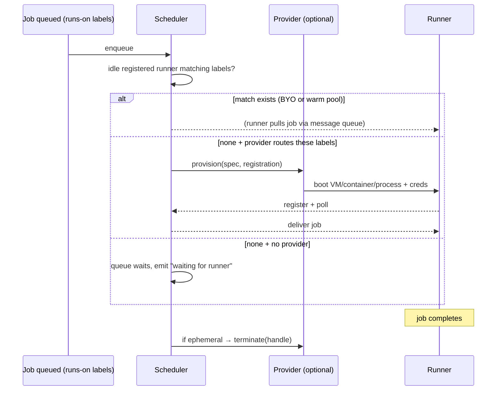

# Fidelity Gap &amp; Roadmap

**preloop** is a faithful Rust reimplementation of the GitHub Actions control plane, a host-side service that the **official** `actions/runner`**(**`Runner.Listener`**)**  or our rust-equivalent can register against, poll for jobs, execute, and report results to, without GitHub-hosted minutes. This doc is a tracker of any fidelity gaps between preloop and the official runner/server.

**preloop is not tied to any specific runner host.** It speaks the runner protocol and accepts

incoming runner connections; the runner itself handles execution. This means preloop works

equally well with:

- libkrun/fircracker/CH/Qemu microVMs (preloop by default uses libkrun)
- Docker / Podman containers
- Virtual machines (cloud or local)
- Bare processes on the same machine
- Remote runners on other servers

**Preloop** is the *product* that combines preloop (control plane) + a libkrun-based

ephemeral runner host for local CI. preloop is its control plane. But preloop is independently

usable: anyone can `cargo install preloop` and point their own runners at it.

Runner *provisioning* integrations live in separate repos/crates. The Rust runner

protocol client (`preloop-runner`) lives in this workspace alongside the control plane.

Upstream reference: `actions/runner` v2.336.0 (commit `98aabcd429c4e8402406c56ce2d26387fed3b9ce`)

Previous baseline: `actions/runner` v2.335.1 (commit `7d737449ef346f6524f75688d0c9c95fa10ba10a`)

runner.server reference: `ChristopherHX/runner.server` v3.14.0 (commit `069646146c90d649c74dfd7a34569c9420195838`)

(overridable via `PRELOOP_UPSTREAM_RUNNER_SERVER_REF`). 

---

## 0b. v2.336.0 delta (2026-07-20)

v2.336.0 was released 2026-07-20. This section tracks changes from v2.335.1 → v2.336.0
and their impact on preloop.

### Protocol / behavioral changes requiring preloop work


| Priority | PR                                                                                                        | Change                                                     | Impact                                                                                                                                                                                                                                                                                                | preloop Status                 |
| -------- | --------------------------------------------------------------------------------------------------------- | ---------------------------------------------------------- | ----------------------------------------------------------------------------------------------------------------------------------------------------------------------------------------------------------------------------------------------------------------------------------------------------- | --------------------------- |
| P1       | [#4482](https://github.com/actions/runner/pull/4482)                                                      | **Canceled background steps should not impact job result** | Wire `background` from job message; `Cancelled` on `is_background` steps does not set job Cancelled (job cancel still via `cancel_rx`). Full `BackgroundStepCoordinator` + cancel-control steps still missing.                                                                                        | ⚠️ partial                  |
| P1       | [#4527](https://github.com/actions/runner/pull/4527)                                                      | `**$GITHUB_ARTIFACTS` / `$GITHUB_ARTIFACTS_LIST`**         | Matches `CreateArtifactsFileCommand` / `ArtifactsListFileCommand`: env always exposed; process gated by `actions_runner_allow_artifacts_file`; `ref@sha{256,384,512}:hex` / `oci://` / `file://` / path; conflict+cap throw; list JSON v1 sorted. Job-local only (no wire upload — same as official). | ✅ good                      |
| P1       | [#4457](https://github.com/actions/runner/pull/4457)                                                      | `**$/` self-repository action reference**                  | Gated by `actions_self_repository`; depth 0 → workflow repo/sha; composite nested → parent `_actions/{owner}/{repo}/{sha}` root.                                                                                                                                                                      | ✅ good                      |
| P1       | [#4540](https://github.com/actions/runner/pull/4540)                                                      | **Ephemeral exit on ack job-not-found**                    | `AcknowledgeJobNotFound` → exit only when `settings.ephemeral` (not `--once`).                                                                                                                                                                                                                        | ✅ good                      |
| P1       | [#4556](https://github.com/actions/runner/pull/4556)                                                      | `**RunnerSessionInvalid**`                                 | `errorKind: RunnerSessionInvalid` → session recreate; bare 400 is **not** treated as expired (matches `BrokerHttpClient`).                                                                                                                                                                            | ✅ good                      |
| P2       | [#4538](https://github.com/actions/runner/pull/4538)                                                      | `**ACTIONS_CACHE_MODE**`                                   | `actions_cache_mode` variable → env; logged at job start.                                                                                                                                                                                                                                             | ✅ good                      |
| P2       | [#4553](https://github.com/actions/runner/pull/4553)                                                      | **Wait for worker during cancel**                          | Existing `job.wait()` cancel path.                                                                                                                                                                                                                                                                    | ⚠️ partial                  |
| P2       | [#4546](https://github.com/actions/runner/pull/4546)/[#4550](https://github.com/actions/runner/pull/4550) | **Locked deps log**                                        | "Using locked actions versions from the workflow's lockfile" when `actionsDependencies` non-empty.                                                                                                                                                                                                    | ✅ good                      |
| P2       | [#4557](https://github.com/actions/runner/pull/4557)                                                      | **Migrated-settings session-conflict retry cap**           | N/A — preloop has no `.runner_migrated` path. Session 409 already retriable (~4 min) in message listener.                                                                                                                                                                                                | ✅ N/A                       |
| P2       | [#4551](https://github.com/actions/runner/pull/4551)                                                      | **Session file cleanup**                                   | N/A — in-memory sessions.                                                                                                                                                                                                                                                                             | ✅ N/A                       |
| P3       | [#4509](https://github.com/actions/runner/pull/4509)/[#4536](https://github.com/actions/runner/pull/4536) | **Action download logs**                                   | Archive size + resolve timing at info (not full telemetry payloads).                                                                                                                                                                                                                                  | ⚠️ partial (log-level only) |


### v2.336.0 summary

Runner-side deltas for v2.336.0 are implemented where they map cleanly onto preloop.
Remaining gaps: full `BackgroundStepCoordinator` / cancel-control steps (#4482),
worker-wait parity (#4553), and structured download telemetry vs info logs.
The committed conformance corpus is recorded from the official v2.336.0 runner.

---

## 0. Naming


| Term                | Meaning                                                                        |
| ------------------- | ------------------------------------------------------------------------------ |
| **preloop**            | This repo: the GitHub Actions control plane service (protocol, scheduler, API) |
| **Preloop**         | Local CI product: preloop + libkrun runner host for ephemeral microVMs            |
| **Runner.Provider** | Pluggable trait: creates/destroys runners (any substrate)                      |
| **Runner.Listener** | The unmodified official `actions/runner` binary                                |


## 0a. Product parity target

The target is **not** byte-for-byte hosted GitHub/Azure implementation parity.
preloop should be faithful where the unmodified official runner, user workflows, or
GitHub PR/check UX depend on it, and intentionally local everywhere else.

The product target is:

> Users can keep their existing, unmodified `.github/workflows/*.yml` files.
> Preloop/preloop evaluates those workflows, schedules jobs on local/self-hosted
> runner capacity, and reports status/log/artifact links back to the existing
> GitHub PR/checks UI.

That means three compatibility bars:

1. **Runner protocol compatibility** — the official `actions/runner` can register,
 create sessions, poll for work, acquire/renew/complete broker jobs, upload logs,
 consume actions/cache/artifact URLs, and settle runs without knowing it is not
 talking to GitHub-hosted Actions.
2. **Workflow semantic compatibility** — existing GitHub Actions YAML behaves the
 same from the developer's perspective: triggers, contexts, expressions, matrix,
 `needs`, outputs, secrets/vars, cancellation, cache, artifacts, and common
 `uses:` actions work without editing the workflow file.
3. **GitHub integration compatibility** — for the self-hosted control-plane mode,
 a GitHub App receives webhooks, fetches workflow files and refs, supplies a
 scoped `GITHUB_TOKEN`/installation token, and updates Checks/commit statuses so
 pull requests still show normal pass/fail feedback in GitHub's UI.

Local equivalents are acceptable, and preferred, for implementation details the
runner/user cannot observe directly:

- local result/log storage instead of GitHub's result service backend;
- local filesystem/S3/MinIO cache and artifact stores instead of Azure Blob;
- local JWTs or installation tokens instead of GitHub's internal token service;
- local service URLs instead of GitHub/Azure signed URLs, as long as the runner
and actions can use them successfully;
- Preloop's own run/details UI linked from GitHub Checks, rather than reproducing
every internal GitHub Actions page.

Conformance should therefore assert **semantic equivalence** with explicit
normalizers for volatile/local fields. It should not require exact hosted-service
hostnames, token bytes, Azure blob URL shapes, billing metadata, or internal
location-service topology unless the official runner or common actions require
those details.

---

## 1. Current fidelity scorecard

**Evidence basis (latest, 2026-07-28):** runner-watch conformance replay of all 24
official-runner v2.336.0 golden scenarios against preloop. All 24 pass: status codes,
request body schemas, and acquirejob response schemas match on every
conformance-checked endpoint. `benchmarks/conformance/check_corpus.py` fails closed
when any scenario definition lacks a non-empty, version-matched capture.

**Evidence basis (live E2E, 2026-07-10):** official `actions/runner` v2.335.1 run against both
GitHub Actions and preloop server in independent smolVMs. 12 conformance scenarios tested.
Job-level match: 11/12 (92%). Full match (job + step): 6/12 (50%).
See `benchmarks/real-world/results/server-compare/COMPARISON-REPORT.md` for details.

- Golden scenarios: all 24 definitions under `experiments/mitm/scenarios/`, all
passing conformance replay.

Rough completeness against "100% faithful control plane (v2.336.0)": **~95%**
(v2.336.0 runner deltas and protocol corpus current; BackgroundStepCoordinator incomplete).
Expression evaluator is feature-complete. Concurrency
groups are fully implemented with property tests. The Rust runner handles the full
step lifecycle including pre/post steps, condition evaluation, file commands,
workflow commands, and continue-on-error. All former P1 gaps resolved: `run-name`
parsed and evaluated, Twirp log metadata wired to storage, 500 ms periodic step-
status drain, and server-enforced runner settings. Remaining gaps are P2/P3:
runner self-update (intentional), runner groups server-side routing, version
deprecation warnings, job-level annotations, and background step control-flow.


| Layer                                                           | Current evidence                                                                                                                                                                                                                                                                                                                                                                                                                                                                     | Faithful?                                            |
| --------------------------------------------------------------- | ------------------------------------------------------------------------------------------------------------------------------------------------------------------------------------------------------------------------------------------------------------------------------------------------------------------------------------------------------------------------------------------------------------------------------------------------------------------------------------ | ---------------------------------------------------- |
| Workflow YAML parse + typed model                               | present, IndexMap preserves order; `defaults.run`, `permissions`, `environment`, `container`, `services` all parsed                                                                                                                                                                                                                                                                                                                                                                  | ✅ good                                               |
| Matrix expansion                                                | IndexMap order, GitHub name format, include/exclude                                                                                                                                                                                                                                                                                                                                                                                                                                  | ✅ good                                               |
| Expression engine                                               | all 12 functions (`contains`/`startsWith`/`endsWith`/`format`/`join`/`toJSON`/`fromJSON`/`hashFiles`/`success`/`failure`/`cancelled`/`always`), bracket access, `*` filter, format `{{`/`}}` escaping, case-insensitive `==`                                                                                                                                                                                                                                                         | ✅ good                                               |
| Trigger matching                                                | branches/tags/paths/types/schedule/dispatch                                                                                                                                                                                                                                                                                                                                                                                                                                          | ✅ good                                               |
| `needs` DAG scheduling                                          | dependency-gated scheduler, outputs propagation                                                                                                                                                                                                                                                                                                                                                                                                                                      | ✅ good                                               |
| `if` / contexts / outputs propagation                           | evaluated, needs outputs threaded                                                                                                                                                                                                                                                                                                                                                                                                                                                    | ✅ good                                               |
| Concurrency groups                                              | fully implemented with property tests (87 tests); queue modes (`single`/`max`), `cancel-in-progress`, scope-aware expression eval, FIFO ordering, reusable workflow `EmbeddedConcurrency`                                                                                                                                                                                                                                                                                            | ✅ good                                               |
| Secrets policy / masking on the wire                            | `SecretString` + mask hints in wire messages                                                                                                                                                                                                                                                                                                                                                                                                                                         | ✅ good                                               |
| Runner session handshake (legacy AzDO path)                     | AES key exchange now RSA-wraps the session key with the runner's registered public key; plaintext is retained only as a no-key fallback                                                                                                                                                                                                                                                                                                                                              | ✅ good                                               |
| Encrypted message queue (`TaskAgentMessage`)                    | older direct-message path remains AES-CBC encrypted; current v2.335.x broker-ref path is covered by a current-runner E2E test                                                                                                                                                                                                                                                                                                                                                        | ✅ good                                               |
| `AgentJobRequestMessage`                                        | full DTO with plan, request, context, steps; reused by current broker acquire responses and covered by current-runner registration→broker E2E                                                                                                                                                                                                                                                                                                                                        | ✅ good                                               |
| `connectionData` / location services                            | v2.335.1 replay returns `200`; preloop includes 28 service definitions covering broker/OAuth/pipelines resource locations and query-aware fresh-cache responses                                                                                                                                                                                                                                                                                                                         | ⚠️ runner-compatible, not full hosted-service parity |
| GitHub runner registration endpoint                             | route exists and replays as `200`; response now returns JWT-shaped local `OAuthAccessToken` plus preloop service URL instead of echoing GitHub repo URL                                                                                                                                                                                                                                                                                                                                 | ⚠️ local token, runner-compatible                    |
| OAuth token endpoint                                            | route exists and replays as `200`; response now uses `token_type = JWT`, `expires_in = 2999`, and local signed JWT-shaped tokens                                                                                                                                                                                                                                                                                                                                                     | ⚠️ local token, runner-compatible                    |
| DistributedTask pool/agent replay                               | runner-watch mapping is fixed and the latest replay returns `200` for pool discovery / agent lookup / agent registration                                                                                                                                                                                                                                                                                                                                                             | ✅ good                                               |
| DistributedTask session/message replay                          | mapped requests now reach preloop; session status matches `201`; incomplete Busy long-polls are filtered as non-comparable capture artifacts                                                                                                                                                                                                                                                                                                                                            | ⚠️ partial                                           |
| AgentRequest acknowledgement                                    | endpoint exists and now returns `200` like official v2.335.1                                                                                                                                                                                                                                                                                                                                                                                                                         | ✅ good                                               |
| Broker acquire/renew/complete                                   | queue-backed routes pass targeted E2E; runner-watch now materializes replay state and rewrites captured broker IDs so acquire/renew/complete statuses match official                                                                                                                                                                                                                                                                                                                 | ✅ good                                               |
| Broker message types                                            | 9 types handled: `RunnerJobRequest`, `PipelineAgentJobRequest`, `JobCancellation`, `AgentRefresh`, `BrokerMigration`, `ForceTokenRefresh`, `RunnerShutdown`, `RunnerRefresh`, `RunnerRefreshConfig`                                                                                                                                                                                                                                                                                  | ✅ good                                               |
| Job cancellation wire shape                                     | `JobCancelMessage` now uses GUID `jobId` + `Timeout` TimeSpan; fire-and-forget cancel with `CancellationTiming` (clamped ≥60 s, hard-kill at timeout−15 s)                                                                                                                                                                                                                                                                                                                           | ✅ good (resolved)                                    |
| Results-service Twirp (`WorkflowStepsUpdate`, signed blob URLs) | 5 Twirp routes returning real data with signed blob URLs                                                                                                                                                                                                                                                                                                                                                                                                                             | ✅ good                                               |
| Results-service Twirp (log/summary metadata)                    | `CreateStepLogsMetadata`, `CreateJobLogsMetadata`, `CreateStepSummaryMetadata` wired to `InnerState.log_metadata`; upsert line counts and byte estimates                                                                                                                                                                                                                                                                                                                             | ✅ good                                               |
| OIDC id-token provider                                          | RS256-signed JWTs with certificate-backed x5t; persisted X.509 cert; JWKS/discovery endpoints match GitHub wire shape                                                                                                                                                                                                                                                                                                                                                                | ✅ good                                               |
| Timeline / logs / web-console feed                              | PATCH timeline persists records with `lastModified` stamp and returns full stored set; GET timeline endpoint returns all records; POST/PUT logs, console log, WebSocket live-feed, Twirp log metadata all working                                                                                                                                                                                                                                                                    | ✅ good                                               |
| Job/step completion events + annotations                        | broker completejob with planId, jobId, conclusion, outputs, stepResults, annotations, telemetry; annotation JSON shape matches golden 14                                                                                                                                                                                                                                                                                                                                             | ✅ good                                               |
| Action download info                                            | server `action_download_info()`, `runnerresolve_actions()`, and `download_action_tarball()` fully implemented with ticket generation and tarball serving from cache; runner-side `actions_download.rs` has full batch `runnerresolve/actions` + bearer token for codeload; subpath keys normalized before resolution                                                                                                                                                                 | ✅ good                                               |
| Cache v1 / Artifact v1 shapes                                   | full reserve/upload/commit/lookup for cache v1 and create/put/get/list for artifact v1, backed by file-backed `preloop-cache`/`preloop-artifacts` stores                                                                                                                                                                                                                                                                                                                                   | ✅ good                                               |
| Cache v2 / Artifact v2 / blob/Twirp                             | fully implemented on the server via Twirp endpoints, backed by file-backed storage in `preloop-cache` and `preloop-artifacts`                                                                                                                                                                                                                                                                                                                                                              | ✅ good                                               |
| Runner worker: step execution                                   | full lifecycle: condition evaluation, timeout, continue-on-error, script/node/composite/container handlers, pre/post steps                                                                                                                                                                                                                                                                                                                                                           | ✅ good                                               |
| Runner worker: file commands                                    | `GITHUB_ENV`, `GITHUB_PATH`, `GITHUB_OUTPUT`, `GITHUB_STATE`, `GITHUB_STEP_SUMMARY` all supported                                                                                                                                                                                                                                                                                                                                                                                    | ✅ good                                               |
| Runner worker: workflow commands                                | `::set-output::`, `::set-env::`, `::add-path::`, `::add-mask::`, `::debug::`, `::warning::`, `::error::`, `::notice::`, `::group::`/`::endgroup::`, `::stop-commands::`                                                                                                                                                                                                                                                                                                              | ✅ good                                               |
| Runner worker: `GITHUB_*` env vars                              | comprehensive set injected: `CI`, `GITHUB_ACTIONS`, `WORKSPACE`, `REPOSITORY`, `SHA`, `REF`, `REF_NAME`, `REF_TYPE`, `HEAD_REF`, `BASE_REF`, `EVENT_NAME`, `RUN_ID`, `RUN_NUMBER`, `RUN_ATTEMPT`, `ACTOR`, `WORKFLOW`, `JOB`, `SERVER_URL`, `API_URL`, `GRAPHQL_URL`, `ACTION`, `TOKEN`, `ACTION_PATH`, `ACTION_REPOSITORY`, `ACTION_REF`, `REF_PROTECTED`, `REPOSITORY_ID`, `REPOSITORY_OWNER_ID`, `TRIGGERING_ACTOR`, `WORKFLOW_REF`, `WORKFLOW_SHA`, `RETENTION_DAYS`, `RUNNER_*` | ✅ good                                               |
| Runner worker: problem matchers                                 | `::add-matcher::` / `::remove-matcher::` supported                                                                                                                                                                                                                                                                                                                                                                                                                                   | ✅ good                                               |
| Runner worker: server queue                                     | delta `WorkflowStepsUpdate` body with `dirty_keys` tracking and change_order counter; 500 ms periodic background drain (no eager flush on failure) + final drain at job end; matches official `ProcessTimelinesUpdateQueueAsync` coalescing                                                                                                                                                                                                                                          | ✅ good                                               |
| Runner groups                                                   | `runner_group_id`/`runner_group_name` stored in settings; server-side group routing enforced in scheduler via `job_matches_runner_group()` (name, ID, default group matching) with test coverage                                                                                                                                                                                                                                                                                     | ✅ good                                               |
| Background steps                                                | `TimelineRecord` DTO accepts background-step fields; `is_background` flag on `StepInfo` skips DAP pauses; canceled background steps excluded from job conclusion (#4482)                                                                                                                                                                                                                                                                                                             | ✅ good                                               |
| Background step result aggregation (v2.336.0)                   | `background` from job message; Cancelled bg steps do not set job Cancelled; full coordinator / cancel-control still missing                                                                                                                                                                                                                                                                                                                                                          | ⚠️ partial                                           |
| `$GITHUB_ARTIFACTS` env file (v2.336.0)                         | File commands with SHA-256 digest, OCI subject parsing, de-dup, conflict detection, 500-cap, versioned JSON list; feature-flagged                                                                                                                                                                                                                                                                                                                                                    | ✅ good                                               |
| `$/` self-repo action syntax (v2.336.0)                         | `uses: $/path` resolved at depth 0 from workflow repo/sha, depth &gt; 0 from parent action's tarball root                                                                                                                                                                                                                                                                                                                                                                            | ✅ good                                               |
| `ACTIONS_CACHE_MODE` env var (v2.336.0)                         | `actions_cache_mode` variable mapped to `ACTIONS_CACHE_MODE` env; logged at job start                                                                                                                                                                                                                                                                                                                                                                                                | ✅ good                                               |
| Ephemeral ack exit on job-not-found (v2.336.0)                  | `acknowledge()` returns `AcknowledgeResult`; 404 + `AcknowledgeJobNotFound` → ephemeral exit                                                                                                                                                                                                                                                                                                                                                                                         | ✅ good                                               |
| `RunnerSessionInvalid` structured error (v2.336.0)              | `is_session_expired` parses `{"errorKind": "RunnerSessionInvalid"}` on HTTP 400                                                                                                                                                                                                                                                                                                                                                                                                      | ✅ good                                               |
| Locked dependencies announcement (v2.336.0)                     | "Using locked actions versions from the workflow's lockfile" when `actionsDependencies` non-empty                                                                                                                                                                                                                                                                                                                                                                                    | ✅ good                                               |
| Session file cleanup on error (v2.336.0)                        | N/A — preloop-runner uses in-memory sessions; session recreation already handled                                                                                                                                                                                                                                                                                                                                                                                                        | ✅ N/A                                                |
| DAP debugger integration                                        | fully implemented: 4,527 LOC, 67 tests, WebSocket DAP server with breakpoints/stepping/variable inspection                                                                                                                                                                                                                                                                                                                                                                           | ✅ good                                               |
| Runner self-update                                              | `AgentRefresh` / `RunnerRefresh` messages acknowledged with log; no actual update mechanism                                                                                                                                                                                                                                                                                                                                                                                          | ❌ intentional — preloop-runner does not self-update     |
| Runner config refresh                                           | `RunnerRefreshConfig` acknowledged with log; dynamic config updates not implemented                                                                                                                                                                                                                                                                                                                                                                                                  | ❌ missing                                            |
| Server-enforced runner settings                                 | `RunnerServerSettings` DTO; `GET /_apis/v1/settings/runner` endpoint; broker acquire injects `runnerSettings` defaults                                                                                                                                                                                                                                                                                                                                                               | ✅ good                                               |
| `run-name` expressions                                          | parsed via `Workflow.run_name`; evaluated with `github`/`inputs`/`vars` contexts at submit time; stored in `RunRecord`                                                                                                                                                                                                                                                                                                                                                               | ✅ good                                               |
| Reusable workflows                                              | parsing, `secrets: inherit`, required secrets/inputs, input type validation, OIDC `environment` propagation, `oidc_job_workflow_ref`; depth limit = 4                                                                                                                                                                                                                                                                                                                                | ✅ good                                               |
| Node 20→24 migration/deprecation warnings                       | implemented: flag source precedence, conflict warning, ARM32 fallback (Plan 008)                                                                                                                                                                                                                                                                                                                                                                                                     | ✅ good                                               |


---

## 1a. v2.336.0 conformance replay status (2026-07-28)

### 1a.1 What the conformance replay proves

runner-watch replays all 24 golden scenarios against preloop and compares wire output.
**All 24 scenarios pass**: status codes match, request body schemas match, and
acquirejob response body schemas match for all conformance-checked endpoints.

The conformance gate checks:

1. **Status codes** — every endpoint's status codes must match exactly
2. **Request body schemas** — JSON structure of all request bodies must match
3. **Acquirejob response schema** — the job payload structure must match the golden

Body-value diffs (different URLs, IDs, tokens) are expected and not gated.

### 1a.2 Scenario coverage


| Scenario                     | Flows | Status | Notes                                 |
| ---------------------------- | -----: | ------ | ------------------------------------- |
| `01-register-and-idle`       | 40    | ✅ pass | Registration + idle session           |
| `02-trivial-job`             | 59    | ✅ pass | Minimal broker job lifecycle          |
| `03-cancellation`            | 272   | ✅ pass | Cancellation control flow             |
| `04-request-ack`             | 66    | ✅ pass | Explicit request acknowledgement      |
| `05-multi-job`               | 100   | ✅ pass | Multiple jobs in one workflow         |
| `06-multi-step`              | 52    | ✅ pass | Multi-step scripts and environment    |
| `07-step-failure`            | 54    | ✅ pass | Failure and conditional execution     |
| `08-job-outputs-needs`       | 82    | ✅ pass | Job outputs + needs chain             |
| `09-matrix-fan-out`          | 113   | ✅ pass | Matrix fan-out                        |
| `10-uses-checkout`           | 63    | ✅ pass | Repository action resolution          |
| `11-cache-roundtrip`         | 69    | ✅ pass | Cache save/restore and blob handoff   |
| `12-artifact`                | 74    | ✅ pass | Artifact upload/download              |
| `13-composite-action`        | 64    | ✅ pass | Local composite action                |
| `14-annotations`             | 51    | ✅ pass | Workflow command annotations          |
| `15-oidc-id-token`           | 53    | ✅ pass | OIDC token minting                    |
| `16-container-job`           | 60    | ✅ pass | Job container wire shape              |
| `17-service-container`       | 59    | ✅ pass | Service container wire shape          |
| `30-container-job-basic`     | 72    | ✅ pass | Basic container job                   |
| `31-container-with-services` | 78    | ✅ pass | Container + service topology          |
| `32-services-no-container`   | 70    | ✅ pass | Host job + services                   |
| `33-container-env-options`   | 87    | ✅ pass | Container env/options tokens          |
| `34-container-with-checkout` | 117   | ✅ pass | Checkout in a job container           |
| `35-container-lifecycle`     | 63    | ✅ pass | Lifecycle and continue-on-error token |
| `36-docker-action`           | 70    | ✅ pass | `docker://` action references         |


### 1a.3 Remaining body-value diffs (not gated)

These are expected differences between official GitHub service URLs/tokens and preloop's
local equivalents. They do not cause conformance failure:

- `GetStepLogsSignedBlobURL` / `GetJobLogsSignedBlobURL`: Azure Blob URLs vs local replay URLs
- Registration/OAuth responses: local JWT tokens vs GitHub service tokens
- Session `encryptionKey`: present in preloop, absent in some golden captures
- `connectionData`: preloop response is smaller, lacks full hosted-service location metadata

### 1a.4 Source-diff-only gaps not exercised by conformance replay

These changes are tracked from upstream runner diffs but not yet exercised by any
conformance scenario:


| Priority | Change                                                 | Upstream Version | preloop Status                                                                                                                                               |
| -------- | ------------------------------------------------------ | ---------------- | --------------------------------------------------------------------------------------------------------------------------------------------------------- |
| P0       | Background step fields in `TimelineRecord`             | v2.335.0         | ⚠️ DTO + `is_background` flag implemented; control-flow unexercised                                                                                       |
| ~~P1~~   | `~~RunnerVersionDeprecated` feature flag~~             | v2.321.0         | ✅ resolved — server returns 403 + `AccessDeniedException`/`errorCode: 1`; runner detects and stops                                                        |
| ~~P1~~   | `~~run-name` expression interpolation~~                | v2.319.0         | ✅ resolved — parsed + evaluated at submit                                                                                                                 |
| ~~P1~~   | ~~Twirp log/summary metadata finalization~~            | v2.329.0         | ✅ resolved — wired to `log_metadata` storage                                                                                                              |
| ~~P2~~   | `~~SendJobLevelAnnotations` in timeline~~              | v2.323.0         | ✅ resolved — feature-gated aggregation via `actions_send_job_level_annotations`; job annotations projected into completejob, timeline, and NDJSON; tested |
| ~~P2~~   | ~~Server-enforced runner settings~~                    | v2.323.0         | ✅ resolved — DTO + endpoint + broker inject                                                                                                               |
| ~~P2~~   | ~~Periodic `JobServerQueue` drain~~                    | v2.300.0+        | ✅ resolved — 500 ms background interval                                                                                                                   |
| ~~P3~~   | `~~DisableStdoutMultilineLogPrefixing` env var~~       | v2.335.0         | ✅ resolved — official boolean parsing (`1`, `true`, `$true`) and continuation-prefix suppression implemented with tests                                   |
| ~~P3~~   | ~~AzDO error envelope (`$type`/`typeName`/`typeKey`)~~ | v2.300.0+        | ✅ resolved — `errors.rs` returns proper Microsoft.VisualStudio.Services error shape                                                                       |
| ~~P3~~   | ~~Session reconnection backoff / jitter~~              | v2.300.0+        | ✅ resolved — `SessionBackoff` with `[15,30)`/`[30,60)` jitter windows, reset after success; used in broker and message listeners                          |
| P1       | `BackgroundStepCoordinator` + cancel-control           | v2.336.0         | ⚠️ partial — `background` wired; no async coordinator                                                                                                     |
| ~~P1~~   | `~~$GITHUB_ARTIFACTS` / `$GITHUB_ARTIFACTS_LIST`~~     | v2.336.0         | ✅ resolved — matches official parse/gate/fail semantics                                                                                                   |
| ~~P1~~   | `~~$/` self-repository action reference~~              | v2.336.0         | ✅ resolved — feature-gated + composite parent root                                                                                                        |
| ~~P1~~   | ~~Ephemeral exit on broker ack job-not-found~~         | v2.336.0         | ✅ resolved — ephemeral-only                                                                                                                               |
| ~~P1~~   | `~~RunnerSessionInvalid` structured broker error~~     | v2.336.0         | ✅ resolved — errorKind only (not bare 400)                                                                                                                |
| ~~P2~~   | `~~ACTIONS_CACHE_MODE` env var injection~~             | v2.336.0         | ✅ resolved                                                                                                                                                |
| ~~P2~~   | ~~Locked dependencies announcement~~                   | v2.336.0         | ✅ resolved                                                                                                                                                |
| ~~P2~~   | ~~Session file cleanup on broker errors~~              | v2.336.0         | ✅ N/A                                                                                                                                                     |
| ~~P2~~   | ~~Migrated-settings session conflict retry cap~~       | v2.336.0         | ✅ N/A                                                                                                                                                     |
| P3       | Action archive / resolve telemetry payloads            | v2.336.0         | ⚠️ info logs only                                                                                                                                         |


---

## 1b. Real-world repo conformance (2026-08-05)

The conformance replay proves the **wire** is faithful. It says nothing about the
**machine** a job lands on, and that is where unmodified third-party workflows
actually break. This campaign runs four medium-sized public repos against the
engine with their workflows untouched, and diffs each job against GitHub's own
run of the same commit.

### 1b.1 Goldens

GitHub's run logs for each repo are the baseline (fetched with `gh run view --log`;
kept out of git, see `.gitignore`):


| Repo                | Golden run                                                                   | Commit    | Jobs / steps | Match                                                           |
| ------------------- | ---------------------------------------------------------------------------- | --------- | ------------: | --------------------------------------------------------------- |
| `tokio-rs/tokio`    | [30662962001](https://github.com/tokio-rs/tokio/actions/runs/30662962001)    | `108d6d3` | 77 / 706     | exact SHA                                                       |
| `caddyserver/caddy` | [30679769787](https://github.com/caddyserver/caddy/actions/runs/30679769787) | `e096ca9` | 5 / 45       | exact SHA                                                       |
| `nyblnet/bento`     | [30837350817](https://github.com/nyblnet/bento/actions/runs/30837350817)     | `cc03818` | 1 / 36       | exact SHA                                                       |
| `astral-sh/uv`      | [30641370430](https://github.com/astral-sh/uv/actions/runs/30641370430)      | `d709d47` | 121 / 1682   | default-branch fallback (the clone's SHA was force-pushed away) |


### 1b.2 Host/image gaps the campaign found

Every one of these passed the wire conformance gate and still failed a real
workflow. All are fixed:


| Gap                                                                                    | Symptom in a real workflow                                                                                                                                                                                                                                                                                   | Fix                                                                                                                                                                                                                                                             |
| -------------------------------------------------------------------------------------- | ------------------------------------------------------------------------------------------------------------------------------------------------------------------------------------------------------------------------------------------------------------------------------------------------------------ | --------------------------------------------------------------------------------------------------------------------------------------------------------------------------------------------------------------------------------------------------------------- |
| `runs-on` was not evaluated per matrix combination                                     | `runs-on: ${{ matrix.os }}` — the shape tokio, caddy and uv all use — expanded to a label no runner can advertise, so every cell queued forever. This is why the campaign's clones all carried a patched `runs-on`, which defeats the point of the exercise                                                  | `expand.rs` resolves each label against the cell's matrix (and reusable-workflow inputs), like every other per-cell field                                                                                                                                       |
| A self-hosted runner stood in for **any** hosted image label, across operating systems | a macOS host sharing the engine claimed `ubuntu-latest` jobs and failed them inside a step (tokio's Linux-only `taskdump`, uv's `/home/runner` layout)                                                                                                                                                       | `job_matches_runner` matches the OS the runner declares; a runner declaring none stays eligible                                                                                                                                                                 |
| A machine took a job it only loosely matched                                           | a 24.04 machine claimed the `ubuntu-22.04` job while the pool was still baking the 22.04 golden that job asked for                                                                                                                                                                                           | `take_matching_job` prefers a job whose labels the runner carries verbatim, and stands in only when nothing exact is claimable                                                                                                                                  |
| Env goldens were rebaked on every engine restart                                       | the in-memory registry forgot a golden that was still running and still correct, so the first `ubuntu-22.04` job after any deploy waited 5–11 minutes for apt and rustup                                                                                                                                     | a host-side fingerprint record beside the packed artifact; a running golden whose record matches is adopted                                                                                                                                                     |
| A custom `shell:` command line was collapsed into one argv entry                       | `taiki-e/install-action` declares `shell: /usr/bin/env -u ENV … /bin/sh -eu {0}`; `env` unset one absurdly named variable, found no command, printed the environment, exited 0 — the step "succeeded" installing nothing and the next step died with `no such command: hack`                                 | `resolve_shell` splits every whitespace token; `{0}` substitution per token                                                                                                                                                                                     |
| Toolchain bin directories were not on the runner's PATH                                | `dtolnay/rust-toolchain` only appends `$CARGO_HOME/bin` to `$GITHUB_PATH` when it installs rustup itself, so on an image that already has rustup (ours, and GitHub's) anything `cargo install`-ed was unreachable                                                                                            | the guest runner is launched with an explicit PATH covering `$HOME/.cargo/bin` and `/usr/local/go/bin`                                                                                                                                                          |
| The baseline wiped `/var/lib/apt/lists`                                                | uv's musl cell runs `sudo apt-get install musl-tools` with no `apt-get update`: `E: Unable to locate package`                                                                                                                                                                                                | keep the lists; a fork of a pack that shipped without them refreshes on provision                                                                                                                                                                               |
| Rosetta enable failure left a half-created machine                                     | an Apple Silicon host without Rosetta 2 (or a transient `smolvm machine update --rosetta` failure) left a broken VM the pool kept reusing; x86_64 golden jobs failed at start instead of surfacing the cause                                                                                                 | the provider propagates the `update --rosetta` error and deletes the partial machine (`rosetta_update_failure_is_returned_and_partial_machine_is_deleted`); x86_64 guests on Apple Silicon run under Rosetta 2 translation, with arm64 native preferred (see `docs/internal/smolvm-benchmarks.md`)                              |
| A fork of the packed golden trusted the pack's bake                                    | a published pack predating the workspace's toolchain pin boots without cargo, and cargo-dist dies on "you don't appear to have cargo installed" in 11s                                                                                                                                                       | probe each toolchain layer per fork and install only what the pack lacks; and `build-golden` now bakes the workspace's toolchains (`rust-toolchain.toml` etc.) into the artifact, so forks inherit them — the per-fork install is gone once the pack is rebuilt |
| The guest hostname did not resolve                                                     | every `sudo` call printed `sudo: unable to resolve host <name>`, which appears in no hosted log                                                                                                                                                                                                              | the baseline adds the hostname to `/etc/hosts`                                                                                                                                                                                                                  |
| `apt-get install` prompted, and a step's stdin never reached EOF                       | the hosted images ship `/etc/apt/apt.conf.d/90assumeyes`, so uv's `sudo apt-get install musl-tools` (no `-y`) installs three packages without a prompt; here it asked `Do you want to continue? [Y/n]` and, because the runner is a child of a guest `exec` whose stdin never closes, blocked for 45 minutes | ship the same apt config, and give every step `Stdio::null()` for stdin                                                                                                                                                                                         |


### 1b.3 Results


| Repo    | Workflow                 | Result                                                                                                                                                                                                                                                                                                                                                                                                                                                          |
| ------- | ------------------------ | --------------------------------------------------------------------------------------------------------------------------------------------------------------------------------------------------------------------------------------------------------------------------------------------------------------------------------------------------------------------------------------------------------------------------------------------------------------- |
| `bento` | `ci.yml`                 | ✅ full gate (checkout, setup-node, `npm ci`, tsc builds, i18n checks, shell gate)                                                                                                                                                                                                                                                                                                                                                                               |
| `caddy` | `ci.yml`                 | ✅ full gate (go vet/build/test matrix)                                                                                                                                                                                                                                                                                                                                                                                                                          |
| `tokio` | `ci.yml`                 | `clippy` ✅, `minrust` ✅ (every step, `cargo-hack` installed and run) after the shell/PATH fixes                                                                                                                                                                                                                                                                                                                                                                 |
| `uv`    | `build-dev-binaries.yml` | `plan` ✅, `linux-libc` ✅, `linux-aarch64` ✅, `macos-aarch64` ✅; `linux-musl` now runs every step through `Setup musl`, `Install Rust toolchain` and the cache restore, and stops in `Build` — the cell targets `x86_64-unknown-linux-musl` on an `x86_64` fleet, and this host's guests are `aarch64`, so `musl-gcc -m64` cannot build `aws-lc-sys`. A host-architecture limit, not a fidelity gap: `build-binary-linux-aarch64` is the cell this host can run. |


### 1b.4 Still open

- **Non-Linux cells are skipped, not queued.** The microVM pool builds Linux
guests only; macOS needs a `preloop-runner` on a Mac registered against the
control plane, and Windows has no host at all. GitHub would leave such a job
queued until it times out; we mark it `skipped` at submit so the run
finishes, dependents skip, and the reason lands in the log. A deliberate
divergence — an unclaimable job that reports nothing is worse than a visible
skip. The skip is conditional on *no* runner declaring that OS being
registered, so a Mac host serving `macos-latest` still runs the job.
- **macOS and Windows image versions are not disambiguated.** `macos-13`
(x86_64), `macos-14`/`macos-15` (arm64) and every `windows-*` image are
distinct on GitHub; here any `macos-*` label matches whatever Mac is
registered. A workflow pinning `macos-13` for x86_64 gets an arm64 host.
- **Nested virtualization.** tokio's io_uring jobs build a kernel and boot it
under `qemu-system-x86_64`; uv's freebsd cell wants docker-in-docker plus
`/dev/kvm`. Neither works inside a guest without nested KVM.
- **Third-party runner fleets.** uv targets `depot-ubuntu-24.04`,
`github-ubuntu-24.04-x86_64-8` and `namespace-profile-macos-15`; those labels
only match here because a self-hosted runner stands in for unknown labels.
- **Job variables leak into the step environment.** `system.*`,
`DistributedTask.*` and `actions_*` job-message variables are exported to
steps; GitHub exports only the step's own `env:` block. Harmless so far —
`install-action`'s `BASH_FUNC_` guard does not trip on them — but it is a
divergence a workflow could observe.

---

## 1c. Large-repo conformance campaign (2026-08-12)

Five large public repositories run unmodified against the local engine
(aarch64 macOS host, packed golden + smolvm forks), with one x86 leg on the
remote x86_64 control plane (`aksh.preloop.dev`). Workflows: moby/moby
`ci.yml` (docker buildx/bake), neovim/neovim `test.yml` (zig/cmake matrix),
microsoft/TypeScript `ci.yml` (node matrix), astral-sh/ruff `ci.yaml`
(cargo/nextest matrix), nodejs/node `test-linux.yml` (x86 build+test).

### 1c.1 Bugs found and fixed

Every item below broke a real workflow step and was fixed in preloop:

| Gap | Symptom | Fix |
| --- | --- | --- |
| SmolVM's pack extraction strips ownership **and setuid/setgid** from every file in the flattened rootfs | the unprivileged host-side virtiofs server cannot create guest-root-owned files, so all 31k files land owned by the host user (502 on macOS, 1000 on Linux) with setuid cleared — `/usr/bin/sudo` arrives `0755` and the first `sudo` step of every workflow fails (`sudo: /etc/sudo.conf is owned by uid 502, should be 0`) | the orchestrator repairs each fork before the runner configures: chown pass + tar-roundtrip rebuild for the chown-resistant residue, then setuid/setgid modes re-derived from the pack's own layer tar (the only surviving record of the original modes) and re-applied (`repair_leaked_rootfs_ownership`) |
| SmolVM's non-streaming `machine exec` drops the connection after ~30s with no output | every provisioning exec that ran quietly for more than half a minute (the ownership repair, toolchain installs) was killed mid-flight, leaving half-repaired machines | provider execs pass an explicit `--timeout 30m` |
| Job/workflow-level `env:` never reached action processes | moby's `docker buildx bake` resolved `${DESTDIR}` to `""` because the hcl default took over — the `govulncheck` target's `output = ["${DESTDIR}"]` collapsed to an empty output list, the report was never exported, and the bake action failed on the missing path. The server put job env in the message `variables` map and left the wire `environmentVariables` (the field the official runner materializes into step environments) empty | the job message builder now populates `environmentVariables` from the job env |
| A server restart left every queued run permanently wedged | jobs restored from the store sat "pending" forever: the on-demand pool only forks while its shared `queue_depth` atomic is non-zero, and after a restart no runner exists to refresh it from a broker poll | `serve` re-arms the atomic with the recovered ready-queue length and re-syncs `next_job_runs_on` |
| A run stuck on unclaimable jobs permanently parks its concurrency group | neovim's `test.yml` pins `concurrency:` on the workflow; a run whose remaining jobs were `windows-*` cells (held queued indefinitely by the starvation sweep, which deliberately waits for an external host) never went terminal, so its run-level concurrency holder never released and every later submission in the group parked forever ("pending") | the restore-time group reconciliation now also releases holders whose remaining jobs all need an external host with none registered; the run itself stays queued and re-acquires if a host ever appears |
| The golden lacked the Chromium/playwright runtime libraries | vite's tests died in playwright's host-requirements check (`Failed to launch browser`, missing `libnss3` etc.); GitHub's ubuntu-24.04 image ships these | 21 browser runtime libs pinned in `versions.toml` and added to the golden bake. Caveat: the *packed* artifact cache is keyed only by the base-image digest, so package-list changes reach a packed golden only after the artifact is rebuilt (`prepare_artifact` rebuilds when the payload file is missing) — the pins take effect immediately for non-packed goldens and for the next artifact build |
| The golden lacked RubyGems and Perl's cpanminus | neovim's functionaltest setup runs `gem install … neovim` and `sudo cpanm -n Neovim::Ext`; `gem: command not found` killed every posix cell | `ruby`, `ruby-rubygems`, `perl`, `cpanminus` pinned in `versions.toml` and baked (artifact rebuilt for the campaign) |
| The golden lacked the rest of the hosted image's apt baseline | neovim's LLVM install script died on `lsb_release: command not found`; each missing utility (`xvfb`, `telnet`, `sshpass`, …) was a separate workflow-killing gap | the remaining packages from the official ubuntu-24.04 image's apt list (image readme 20260720.247.2) pinned and baked: `lsb-release`, `fonts-noto-color-emoji`, `haveged`, `mediainfo`, `p7zip-rar`, `pollinate`, `sshpass`, `telnet`, `tk`, `xvfb`, `zsync`, `ftp`, `sphinxsearch`, `systemd-coredump`, `libnss3-tools` |
| The runner VMs had 4 GiB of RAM against workflows that assume the hosted 7 GiB | TypeScript's `ci.yml` sets `NODE_OPTIONS=--max-old-space-size=6144` ("7 GiB by default on GitHub"); the jake test workers died with a silent exit-2 crash | local pool raised to `PRELOOP_RUNNER_MEMORY_MIB=8192` (the remote already runs 6144) |
| The runner account could not `sudo` | after the ownership repair, `sudo` demanded a password — the GitHub image grants the runner user passwordless sudo | the provisioning wrapper writes `/etc/sudoers.d/preloop-runner` (`NOPASSWD: ALL`) when it creates the account |
| The packed artifact cache ignores bake-content changes | package pins added to the bake never reach a packed golden — the artifact cache key is the base-image digest only — so a parity fix requires deleting the artifact to force a rebuild | campaign practice: delete `~/.preloop/vms/preloop-…-aarch64` and restart; noted for a follow-up (key the artifact by the bake fingerprint) |
| Multi-arch docker builds degrade to the host arch | moby's `cross` job resolves `linux/arm64` only — the golden lacks qemu-user-static/binfmt, so the ppc64le/s390x/amd64 cells GitHub builds are skipped rather than emulated | documented; `docker/setup-qemu-action` would need binfmt support in the golden to match GitHub |
| Code-scanning SARIF uploads cannot complete without GitHub | moby's govulncheck scan, SARIF validation and fingerprinting all pass; the final `codeql-action/upload-sarif` POST to `api.github.com` fails (`Not Found`) because there is no GitHub backend behind the job's token | environmental — the scan itself is faithful; the upload needs a real GitHub token with `security-events: write` |
| Job/workflow `env:` entries containing `${{ }}` were emitted verbatim | ruff's `sccache` step resolves `SCCACHE_GHA_ENABLED:${{ github.ref_name == 'main' }}` — the raw template string reached the step env and the sccache action died (`${{` is not valid in an env value for the official runner) | the job message builder now resolves env expressions server-side against the job context before emitting `environmentVariables` |
| The snapshot object cache was trusted without verification | partial-clone workspaces (cloned with `--filter=blob:none`) produce object caches with commits and trees but no blobs and no shallow marker, so fetches from the cache silently returned incomplete packs (a `--unshallow` fetch would fail later in the workflow); the cache completeness was assumed | the snapshot path now runs `git rev-list --objects --all --missing=print` and deepens from the workspace remote when real holes exist; `--refetch` is used when the cache is not marked shallow (a plain fetch only transfers what new refs need, which is nothing when refs are unchanged). Shallow-boundary graft entries (`0000…` shas) are excluded from the missing count |
| `ACTIONS_CACHE_URL`/`ACTIONS_RESULTS_URL` lacked the trailing slash | sccache's GHA storage backend concatenates its twirp path directly onto the base URL, producing `http://host:9090twirp/…` → `invalid port number` → storage probe failed → sccache's compiler shim emitted nothing → node's configure reported "Could not determine compiler version info" | `ResultsServiceUrl` and `CacheServerUrl` are emitted with trailing slashes (both acquire paths) and the worker no longer trims them, matching the official results-receiver URL shape |
| The cache twirp routes only accepted JSON bodies | actions/cache@v4 speaks twirp JSON, but sccache's GHA storage backend (the `ghac` crate) sends twirp **protobuf** (`content-type: application/protobuf`); the axum `Json` extractor answered 415 and sccache's storage probe failed (→ compiler shim → configure failure, same cascade as the URL bug). The protobuf field numbers also differ from the JSON shape: `metadata=1` (nested `CacheMetadata`→`CacheScope`), `key=2`, `restore_keys=3`, `version=4` (3 for create), and responses carry `ok=1` as a bool varint | the cache v2 create/finalize/get-download-url routes now decode protobuf requests and encode protobuf responses (field numbers verified against ghac 0.2.0's `cache.proto`) when the content-type says protobuf, falling back to JSON otherwise. This is what lets node's `main`-ref build (`CC: sccache clang-19`) run at all |
| Reusable-callee jobs on unhostable platforms were only checked at submit time | a reusable caller defers its callee subtree to materialization, so the submit-time "no `windows` runner is registered" check never saw the callee's `runs-on: windows-2025`; the job sat queued forever (Linux VMs are label-excluded), while the caller's placeholder (empty `runs_on`) could be claimed by a Linux VM, run the foreign-OS steps, and wedge in cleanup — keeping the run `in_progress` forever and parking its concurrency group | `register_expanded_jobs` now concludes unhostable callee jobs as failures with the submit-path reason string |
| The rootfs ownership repair missed the account database | the repair walked every uid-502 file but `/etc/passwd` stayed host-owned; `useradd` then wedged in uninterruptible sleep on the 502-owned file, so every forked runner died at account creation (and the smolvm exec layer flaked under the stalled I/O) | the repair script explicitly chowns `/etc/passwd /etc/group /etc/shadow /etc/gshadow` + the sudoers paths before the find pass |
| Worker-crash completion left the active step `in_progress` and run logs empty | node's two test jobs terminalized as failures after `Build` passed, but the crashed workers never sent their final step update or `job-logs.txt`; the run API showed `Test: in_progress`, and `/logs` ignored six already-uploaded step blobs | terminal job completion now terminalizes any active step with the effective job conclusion; run-log aggregation falls back to ordered results-service step blobs when the final job log is absent |
| SmolVM force-delete intermittently failed with `Directory not empty` | both spent node VMs remained registered after the agent/log writer raced SmolVM 1.7.7's recursive data-directory removal | force-delete retries this transient failure and treats an already-missing machine as successful, preserving an idempotent provider contract |

### 1c.2 Environmental findings

- **The local server wedges and stops provisioning** (machines churn in
  `created`, no exec processes, SIGTERM ignored). Restart with log capture
  clears it; the restart wedge itself is the queue-depth bug above. The
  pre-restart runs must be re-submitted.
- **Shallow workspace clones break the snapshot's changed-files story**:
  a depth-1 clone has no parent commit, the synthetic push's `before` is the
  null SHA, and changed-files fetches die with `upload-pack: not our ref
  00000000…`. The campaign re-clones unshallowed; `snapshots.rs` handles
  shallow edges for the committed history it can see, but a truly rootless
  tree has nothing to diff against.
- **macOS/Windows cells fail via the 120s starvation sweep** with empty
  logs (no runner declares that OS). This is the designed
  fail-not-queue-forever divergence; GitHub would leave the job queued.
- **The remote x86 server's pool runners lost their control bridge**
  (broker poll connection refused inside the guests); a service restart
  recreates them. Queued GitHub PR checks had been stalling.
- **Cross-repo checkout auth**: the remote server's GitHub App installation
  cannot mint tokens for repositories outside its installation, so
  `actions/checkout` of a foreign public repo fails (`could not read
  Username for 'https://github.com'`) when no workspace snapshot redirects
  the checkout to the local snapshot server.

### 1c.3 Results

| Repo | Workflow | Result |
| --- | --- | --- |
| `moby/moby` | `ci.yml` | build (binary/dynbinary, amd64+arm64 cells) ✅, validate-dco ✅, cross/build-dind/prepare-cross/success ✅, govulncheck ✅ after the env fix |
| `neovim/neovim` | `test.yml` | lintc/lint/clang-analyzer/zig-build ✅; posix ubuntu cells ✅; macos/windows cells fail via the starvation sweep (no such runners). The run-level `concurrency:` group deadlock found through this workflow is fixed (1c.1) |
| `microsoft/TypeScript` | `ci.yml` | 15 ubuntu cells ✅ (node 14→lts/* matrix + baselines/format/knip/lint/misc/self-check/smoke/typecheck, package-size gated off, `required` gate ✅); windows/macos cells fail via the starvation sweep; one coverage cell hit a transient virtiofs mount race |
| `astral-sh/ruff` | `ci.yaml` | determine-changes gated matrix: unchanged-path jobs skip ✅; fmt/shellcheck/clippy/prek/mkdocs/formatter/ruff-lsp/instrumented-benchmarks/16 cargo+test cells ✅; remaining failures: Preloop does not register SmolVM's mounted Rosetta translator in the aarch64 guest (release/wasm test cells), `/tmp` tmpfs EXDEV (python-package), one cargo-package verification quirk |
| `nodejs/node` | `test-linux.yml` | remote x86_64 leg: checkout/sudo/rustup/setup-python/apt all work (App-token checkout fixed via PAT + real payload SHA); remote builds keep flaking on apt under I/O contention. Local ubuntu + arm jobs both pass checkout, clang-19, rustup, setup-python, sccache and the full `make build-ci`; both workers then fail during `Test`. Their final test output was not uploaded, so the underlying assertion is unknown. The resulting terminal-step/log-recovery diagnostic gap is fixed in 1c.1 |

### 1c.4 Still open

- **Held runs are not persisted.** A run parked in a concurrency group has
  its jobs only in memory; after a restart the group is reconciled (above)
  but the parked run itself is stuck pending and must be cancelled and
  re-submitted.
- **Remote deployment lags the local tree**: `main` runs the
  ownership-repair-era binary; the env-expression, snapshot-cache,
  URL-slash and protobuf-cache fixes need a rebuild + deploy there for
  remote runs to match local behavior.
- **The local smolvm fleet is flaky under I/O load**: rootfs ownership
  repair walks take 20+ minutes, `useradd` wedges in D-state on
  host-owned account files (fixed in 1c.1), and `smolvm machine exec`
  intermittently fails with `Resource temporarily unavailable` — queued
  jobs starve past the grace window while forks repair, which turns into
  run failures that are fleet-caused, not workflow-caused. A re-run after
  the fleet settles is the practical mitigation; baking the runner user
  into the golden would remove the useradd write from the fork path.
- **Rosetta is mounted but not registered inside aarch64 guests.** Preloop
  already requests `smolvm machine update --rosetta` on Apple Silicon, and
  the campaign VMs expose SmolVM's translator at `/mnt/rosetta`. The guest
  has no corresponding binfmt registration, however, so directly executing
  an x86_64 binary still fails. This is a Preloop guest-bootstrap gap, not a
  SmolVM capability gap. Docker actions additionally need the Rosetta mount
  propagated into containers.
- **`/tmp` is tmpfs**, so third-party actions that `rename()` across
  `/tmp` → toolcache die with `EXDEV` (setup-wasm-pack does exactly this).
  GitHub's image keeps `/tmp` on disk; the golden could mask
  `tmp.mount` for parity.

---

## 2. Upstream surface we must emulate

The 23 controllers in `runner.server/src/Runner.Server/Controllers/` define the contract.

Grouped by the role they play for the official runner:

### 2.1 Runner lifecycle (mandatory for any job to run)

- `ConnectionDataController` — `GET _apis/connectionData`: AzDO `ConnectionData` +

  `LocationServiceData` GUID→location map. **First call the runner makes.**
- `RunnerRegistrationController` / `AgentController` — agent (runner) registration; the

  runner sends an **RSA public key**, server stores it for session-key wrapping.
- `AgentPoolsController` — pool discovery.
- `AgentSessionController` — `POST .../sessions`: returns `TaskAgentSession` with an

  **AES `encryptionKey`, RSA-wrapped** with the runner's pubkey. All later message bodies

  are AES-encrypted with this key.
- `MessageController` — `GET .../messages?sessionId&lastMessageId` long-poll returning

  `TaskAgentMessage{ messageId, messageType, iV, body }`; `DELETE .../messages/{id}` ack.

  **This is the 6,839-line heart**: it also runs the whole evaluation (triggers,

  expressions, matrix, needs, contexts) and builds the job. Upstream leans on GitHub's

  real `DistributedTask.ObjectTemplating`, `Expressions2`, and `Pipelines.ContextData`

  SDKs — that is the semantic bar.
- `AgentRequestController` — job request lease/renew/lock semantics.
- `AuthController` / `OidcController` — OAuth client-credentials token issuance; the

  runner attaches a bearer token to every subsequent call. `OidcController` mints job

  OIDC tokens (`id-token: write`).

### 2.2 Job reporting (mandatory for status/logs/annotations)

- `TimelineController` — `PATCH .../timelines/{id}/records`: per-job and per-step

  `TimelineRecord`s (state, result, start/finish, `**issues[]` = annotations**).
- `LogfilesController` — create/append log files per timeline record.
- `TimeLineWebConsoleLogController` — live console `feed` lines.
- `FinishJobController` — `JobCompleted` event with **job outputs** + final result.

  This is where `needs.[job].outputs` originate.

### 2.3 Asset services

- `ActionDownloadInfoController` — resolves `uses:` → tarball download URLs (+ auth).

  Without it the runner cannot fetch actions.
- `CacheController` (v1 `_apis/artifactcache`) + `CacheControllerV2` (blob/twirp).
- `ArtifactController` (v1 pipelines) + `ArtifactControllerV2` (blob).
- `ArtifactCacheManagementController` — cache listing/eviction.

### 2.4 Support

- `VssControllerBase` / `ApiResponder` — AzDO envelope conventions (error shapes,

  `Content-Type`, API-version negotiation headers).
- `GitHubAppIntegrationBase`, `PipelineContext`, `CounterFunction`, `TaskController`.

---

## 3. What exists today (and where it diverges)

Paths are in this repo. Updated 2026-07-18 after deep source review.

- `preloop-gha-parser/src/`
  - ✅ Typed `Workflow`/`Job`/`Step`/`Trigger`/`RunsOn`/`Needs`/`Strategy`/`Matrix`/`Concurrency`.
  - ✅ `Trigger::matches_with_context` — `branches`/`tags`/`paths`/`types`/`schedule`/`workflow_dispatch`.
  - ✅ `expand_matrix` uses `IndexMap` preserving declaration order; GitHub `name (v1, v2)` format.
  - ✅ `can_merge_include` compares only original dimensions.
  - ✅ Expression evaluation wired into job builder via `eval` module.
  - ✅ `defaults.run` (shell, working-directory) at workflow and job level.
  - ✅ `permissions` parsed at workflow and job level; `id-token: write` evaluated for OIDC.
  - ✅ `environment` parsed at job level with matrix expression resolution.
  - ✅ `container` / `services` parsed as raw `Value`.
  - ✅ Reusable workflows with `secrets: inherit`, input types, depth limit = 4.
  - ✅ `run-name` parsed via `Workflow.run_name` (`#[serde(rename = "run-name")]`); evaluated with expression contexts at submit time.
- `preloop-gha-expressions/src/`
  - ✅ Pratt parser + evaluator; all 12 functions.
  - ✅ **Wired** into job builder — expressions resolved in env, with, run fields.
  - ✅ `success()/failure()/cancelled()/always()` use context state (not hardcoded).
  - ✅ Index/bracket access (`matrix['os']`), `*` object-filter (`steps.*.outputs`),
  `format` `{{`/`}}` escaping — all implemented.
  - ✅ Truthy: empty object/array is truthy (matches GitHub).
- `preloop-runner-server/src/`
  - ✅ axum router with GHES org-prefix routing, graceful shutdown, NDJSON broadcast.
  - ✅ ~100+ routes covering GHES org-prefix, `/runner/server/` prefix, bare `/_apis/` prefix,
  broker paths, replay paths, Twirp paths, blob store paths.
  - ✅ Concurrency groups fully implemented with property tests (87 tests).
  - ⚠️ Registration/OAuth routes return local JWT tokens (runner-compatible, not official-fidelity).
  - ✅ Results-service Twirp log metadata endpoints fully implemented: parse requests, compute byte counts, upsert `LogMetadata` entries into `InnerState.log_metadata`.
  - ✅ AES session key exchange with RSA-OAEP wrapping of runner's registered public key.
  - ✅ Encrypted `TaskAgentMessage` delivery with `messageId` and `DELETE` ack.
  - ✅ `AgentJobRequestMessage` with `plan`, `requestId`, `system` context, full steps.
  - ✅ `AgentRequest` PATCH handler with `lockedUntil` for job renewal.
  - ✅ `needs` DAG scheduling with dependency-gated dispatch and outputs propagation.
  - ✅ `fail-fast` / `max-parallel` matrix strategy support.
  - ✅ `JobCancellation` wire shape with GUID `jobId` + `Timeout` TimeSpan.
- `preloop-gha-protocol/src/`
  - ✅ `SecretString` redaction-safe; AzDO wire DTOs in `azdo` module.
  - ✅ `AgentJobRequestMessage` with `PlanReference`, `request_id`, `EndpointAuthorization`.
  - ✅ RSA/AES crypto module; .NET TimeSpan parsing.
- `preloop-runner/src/`
  - ✅ Broker listener: 9 message types, GUID-based cancellation, `CancellationTiming`.
  - ✅ Worker: full step lifecycle with condition eval, timeout, continue-on-error.
  - ✅ Step handlers: Script, Node, Composite (with pre/post), Container.
  - ✅ File commands: `GITHUB_ENV`/`PATH`/`OUTPUT`/`STATE`/`STEP_SUMMARY`.
  - ✅ Workflow commands: all 10 `::` commands.
  - ✅ Problem matchers.
  - ✅ Comprehensive `GITHUB_*` env var injection.
  - ✅ Completion body: planId, jobId, service-spelled conclusion, outputs, stepResults,
  annotations; skipped steps omit task-only `action_name`/`type` fields.
  - ✅ Server queue drains every 500 ms with delta step updates (`dirty_keys` tracking); sends only changed steps per flush. Batch count still higher than official (~10 vs ~5) due to different merge coalescing granularity.
  - ❌ Self-update not implemented (intentional).
  - ✅ `RunnerRefreshConfig` fully implemented: parses refresh metadata, POSTs base64 `.runner` payload to `configRefreshURL`, validates runner identity, atomically persists settings, handles malformed payloads non-fatally.
- `runner-watch`
  - ✅ Records/diffs upstream runner releases and emits `.runner-watch/delta.json`.
  - ✅ Generates protocol-sync specs under `.runner-watch/specs/v{version}/`.
  - ✅ Replays the complete v2.336.0 corpus into preloop: all 24 scenarios pass.

### 3a. Concurrency &amp; cancellation audit (2026-07-13, resolved 2026-07-18)

Findings from a source audit of preloop vs official runner v2.335.1 sources (local mirror:
`<official-runner-source>/src`, upstream paths cited as
`src/Runner.Listener/...`). Implementation plan: `docs/concurrency-plan.md`.

**All findings below have been fully resolved, implemented, and verified by 87 property
and regression tests.**

- ✅ **GitHub `concurrency:` fully implemented.** Parsed at workflow and job level
(`preloop-gha-parser/src/models.rs`), server-side enforcement in `preloop-runner-server/src/concurrency.rs`
(722 lines of tests). Covers: case-insensitive group names; scope-aware expression evaluation
(`github`/`inputs`/`vars`, plus `needs`/`strategy`/`matrix` at job level); at most one
running holder per group; `queue: single` (default) / `queue: max` (up to 100 pending);
`cancel-in-progress` as bool or expression; FIFO by wait-start time. Holder types for
workflow runs, single jobs, and reusable job sets.
- ✅ `**JobCancellation` wire shape fixed.** Now sends GUID `jobId` matching
`AgentJobRequestMessage.jobId` plus `Timeout` in .NET TimeSpan format. The official runner
can match and honour cancellation.
- ✅ **preloop-runner cancel handling now matches `JobDispatcher`.** Fire-and-forget cancel with
`CancellationTiming`: effective timeout clamped to ≥60 s, hard-kill scheduled at
`timeout − 15 s`. Listener continues polling during cancellation.
- ✅ **Busy-runner overlap handling resolved.** Broker listener now handles new job messages
arriving while a job is active.
- ✅ **Broker polling/session lifecycle fixed.** Online and Busy states both use the official
50-second long-poll window; status transitions cancel the in-flight request, and every
listener exit path attempts the broker session `DELETE` exactly once.
- ✅ **Step/timeline updates: delta periodic drain.** preloop-runner flushes delta
`WorkflowStepsUpdate` (only dirty steps via `dirty_keys` tracking) every 500 ms and at
job end, matching the official runner's `ProcessTimelinesUpdateQueueAsync` approach.
No eager flushes on step failure — all updates are coalesced by the timer, matching the
official runner's batch behavior. Log metadata, signed-URL, blob-upload, and complete-job
counts match.

### 3b. Deep review findings (2026-07-18)

Comprehensive source review of official `actions/runner` v2.335.1 and
`ChristopherHX/runner.server` vs preloop codebase across all layers.

#### Confirmed good (newly verified)


| Area                                             | Detail                                                                                                                                            |
| ------------------------------------------------ | ------------------------------------------------------------------------------------------------------------------------------------------------- |
| Step handlers                                    | Script, Node, Composite, Container handlers all implemented with action factory dispatch                                                          |
| Pre/post steps                                   | Composite action pre/post steps generated with correct conditions (`always()` for post)                                                           |
| `continue-on-error`                              | Full support: outcome=Failure + conclusion=Success semantics match official runner                                                                |
| Step/job timeouts                                | `timeoutInMinutes` at step level, `jobTimeout` at job level, with proper cancellation                                                             |
| File commands                                    | `GITHUB_ENV`, `GITHUB_PATH`, `GITHUB_OUTPUT`, `GITHUB_STATE`, `GITHUB_STEP_SUMMARY` all functional                                                |
| Workflow commands                                | All 10 `::` commands: `set-output`, `set-env`, `add-path`, `add-mask`, `debug`, `warning`, `error`, `notice`, `group`/`endgroup`, `stop-commands` |
| Problem matchers                                 | `::add-matcher::` / `::remove-matcher::` supported                                                                                                |
| `GITHUB_ACTION_PATH`                             | Set correctly for composite and node actions                                                                                                      |
| `GITHUB_ACTION_REPOSITORY` / `GITHUB_ACTION_REF` | Set from action metadata, cleared when null                                                                                                       |
| Reusable workflow depth                          | Capped at 4 levels matching GitHub's `MaxWorkflowDepth`                                                                                           |
| Reusable workflow secrets                        | `secrets: inherit`, required secrets validation, missing secret errors                                                                            |
| Reusable workflow inputs                         | Input type validation (`boolean`/`number`/`string`); `choice`/`environment` rejected for `workflow_call`                                          |
| Cancellation timing                              | .NET TimeSpan parsing, clamped ≥60 s effective timeout, hard-kill at timeout−15 s                                                                 |
| Broker message types                             | All 9 types parsed and handled (or acknowledged)                                                                                                  |
| Runner groups                                    | `runner_group_id`/`runner_group_name` stored in `.runner` settings file                                                                           |
| Completion body                                  | Full `completejob` payload: planId, jobId, conclusion, outputs, stepResults, annotations, telemetry, billingOwnerId                               |
| `defaults.run`                                   | `shell` and `working-directory` parsed at workflow and job level with `DefaultsRun` struct                                                        |
| `permissions`                                    | Parsed at workflow and job level; `id-token: write` evaluated for OIDC grants                                                                     |
| `environment`                                    | Parsed at job level; matrix expression resolution; OIDC environment propagation                                                                   |
| `container` / `services`                         | Parsed as raw `Value` in job model; evaluated runner-side                                                                                         |


#### Resolved P1 gaps (2026-07-18)


| Gap                             | Resolution                                                                                                                                                                                                                           |
| ------------------------------- | ------------------------------------------------------------------------------------------------------------------------------------------------------------------------------------------------------------------------------------ |
| `run-name`                      | Parsed via `Workflow.run_name` (`#[serde(rename = "run-name")]`); evaluated with `github`/`inputs`/`vars` expression contexts during submit; stored in `RunRecord.run_name`; falls back to raw string on eval failure                |
| Twirp log metadata              | `CreateStepLogsMetadata`, `CreateJobLogsMetadata`, `CreateStepSummaryMetadata` now accept `State(shared)`, upsert `LogMetadata` entries (line count + byte estimate for logs, raw size for summaries) into `InnerState.log_metadata` |
| Periodic step-status drain      | Background tokio task spawned in `run_job` with 500 ms interval (`MissedTickBehavior::Skip`); flushes `WorkflowStepsUpdate` via `flush_step_updates`; exits on job cancel; aborted before final flush                                |
| Server-enforced runner settings | `RunnerServerSettings` DTO in `preloop-gha-protocol::azdo::lifecycle`; `GET /_apis/v1/settings/runner` (+ GHES prefix) returns defaults; broker acquire injects `runnerSettings` in response                                            |


#### Resolved P2 gaps (2026-07-18)


| Gap                       | Resolution                                                                                                                                                                                                        | Commit                |
| ------------------------- | ----------------------------------------------------------------------------------------------------------------------------------------------------------------------------------------------------------------- | --------------------- |
| Runner groups server-side | `runs-on: { group: ... }` is parsed into `JobPlan.runner_group`; runner registration stores group ID/name; broker and legacy message acquisition match both labels and group; default runners remain in group 1   | `eaf9e21c`            |
| `RunnerVersionDeprecated` | Opt-in `PRELOOP_RUNNER_VERSION_DEPRECATED=true                                                                                                                                                                       | 1                     |
| `SendJobLevelAnnotations` | Feature-gated aggregation via `actions_send_job_level_annotations`; job annotations are projected into completejob, AzDO timeline issues, and NDJSON while step annotations remain intact                         | `bed9f86f`            |
| `RunnerRefreshConfig`     | Parses official refresh metadata, posts the base64 `.runner` payload to `configRefreshURL`, validates runner identity, atomically persists supported settings, and handles malformed/unknown payloads non-fatally | `c4b4688b`, `f0f991d` |
| AzDO error envelopes      | Runner-facing `/_apis`, `/broker`, and `/twirp` errors now use path-specific official-compatible envelopes; native `/api/v1` errors remain unchanged                                                              | `d0b4cb51`            |


#### Resolved P3 gaps (2026-07-18)


| Priority | Gap                                       | Detail                                                                                                                                                        | Severity                           |
| -------- | ----------------------------------------- | ------------------------------------------------------------------------------------------------------------------------------------------------------------- | ---------------------------------- |
| P3       | `DisableStdoutMultilineLogPrefixing`      | `ACTIONS_RUNNER_DISABLE_STDOUT_MULTILINE_LOG_PREFIXING` now matches official boolean parsing and suppresses continuation-line prefixes                        | ✅ `457280bf`                       |
| P3       | `EnsureDispatchFinished` zombie detection | Busy dispatches query `AgentRequest`; terminal requests cancel/drain the worker, active overlap is fatal, and status failures cancel/drain before rethrowing  | ✅ `8d275862`                       |
| P3       | Session reconnection backoff              | Session conflicts are bounded to four minutes; poll/session failures use cancellable `[15,30)`/`[30,60)` jitter and reset after success                       | ✅ `67ad4447`                       |
| P3       | FIPS encryption mode                      | Session responses select RSA-OAEP-SHA256 when `useFipsEncryption` is true; legacy/default sessions remain OAEP-SHA1, and FIPS paths reject plaintext fallback | ✅ `0673a741`, `c44a570`, `e2e1a8e` |


#### Resolved (2026-08-02): deferred reusable-caller materialization + job display names

The parser used to inline every reusable-workflow callee subtree into the run
record at expand time, so a false-gated caller appeared as its full matrix
expansion instead of GitHub's single skipped entry (uv `ci.yml` pull_request:
145 jobs vs the golden's 33, conclusions 20/38/81/6 vs 16/17). Reusable
callers are now deferred, mirroring the runtime deferred-matrix design:

- The parser emits one placeholder node per caller (`JobPlan.reusable_call`);
the callee subtree materializes via `preloop_gha_parser::expand_reusable_call`
only when the caller's `needs` complete and its `if:` evaluates true. A
false gate leaves exactly one skipped entry, as GitHub does.
- Caller/embedded concurrency JobSet gates move from submission time to
gate-pass time (GitHub evaluates caller concurrency when the caller starts);
the JobSet member set is the caller node, which aggregates its subtree's
result and outputs on completion (`propagate_reusable_outputs`).
- The visible run record (`GET /api/v1/runs/:id`) drops gate-passed caller
entries, showing callee jobs instead — uv's run record is now 33 jobs,
matching golden run 30680325919.
- Job display names match GitHub: `name:` is evaluated per matrix cell against
matrix/inputs contexts (`test-ecosystem / prefecthq/prefect`, not the raw
key with parenthesized values), and callee jobs display as
`caller / callee` with spaces (was `caller/callee`).

Known remaining gap: runtime *deferred-matrix* expansion never registered
runner-correlation maps (`job_requests`, `inflight_requests`, …) the way
runtime reusable expansion now does — jobs fanned out from
`needs`-dependent matrices lack RenewJob/timeline correlation until that path
adopts the shared `build_job_artifacts` helper.

---

## 4. Pluggable backends &amp; deployment modes

The official runner protocol already decouples execution from the control plane: the runner

*connects in* and pulls work; preloop never reaches *out* to execute anything. So there is

exactly **one plug point**: how a runner instance is created, given credentials, and torn

down. Everything else — sessions, messages, timeline, logs, cancel, rerun — is identical

regardless of where the runner lives.

### 4.1 The `RunnerProvider` trait

```rust
use async_trait::async_trait;

/// How preloop creates and destroys runner instances.
pub trait RunnerProvider: Send + Sync {
    /// Labels this provider can satisfy (for `runs-on` routing).
    fn labels(&self) -> &LabelMatcher;

    /// Start a runner that will phone home and self-register via the normal protocol.
    /// preloop only handles birth; the protocol does the rest.
    async fn provision(
        &self,
        spec: &RunnerSpec,
        registration: RunnerRegistration,
    ) -> Result<RunnerHandle, ProviderError>;

    /// Tear down (ephemeral cleanup / scale-down).
    async fn terminate(
        &self,
        handle: &RunnerHandle,
    ) -> Result<(), ProviderError>;

    /// Optional: current capacity for backpressure.
    async fn capacity(&self) -> Capacity {
        Capacity::unbounded()
    }
}
```

- `RunnerRegistration` = what the runner needs to call back: **preloop's URL** (reachable

  from *its* network namespace — the **provider's** responsibility), a **single-use scoped**

  **registration token**, labels, `ephemeral` flag, unique name.
- `RunnerSpec` = derived from the job: required labels + resource hints (`runs-on` can be

  an object for size/image).
- `RunnerHandle` = opaque provider id (pid / container id / vm id), correlated to the

  registered agent via the injected name+token.
- `LabelMatcher` = set-intersection matching: `runner.labels ⊇ job.labels`.

Each backend is an impl: `provision` = boot a container (`docker run`), a microVM

(libkrun), a cloud VM, a k8s pod, a `std::process::Command`, etc. **None of them touch**

**the protocol.**

### 4.2 The base case is BYO (no provider needed)

This is the critical design decision for generality:

**Make preloop fully work with zero providers.** Self-hosted runners just register and poll.

So preloop is usable without any provider crate at all — just point runners at it.



Label routing mirrors GitHub: a job's `runs-on` set must be ⊆ runner labels. No new

matching semantics.

### 4.3 Three more pluggable seams

All three are traits; default impls cover local use.

`**RunStore**` — run/job state persistence.


| Implementation              | Use case                                          |
| --------------------------- | ------------------------------------------------- |
| `InMemory` (default)        | Local: instant, no deps, state lost on restart    |
| `sqlx` (SQLite or Postgres) | Server: durable, idempotent restart, multi-tenant |


`**AuthProvider` / tenancy** — who can talk to preloop.


| Mode                              | Use case                                              |
| --------------------------------- | ----------------------------------------------------- |
| Loopback / dev token              | Local: single implicit tenant, no crypto              |
| OAuth + mTLS + per-tenant scoping | Server: namespaced tenants, per-tenant queues/secrets |


`**SecretStore**` — where secret values come from.


| Mode                         | Use case                                                   |
| ---------------------------- | ---------------------------------------------------------- |
| Submission payload (default) | Local: secrets come with the workflow JSON                 |
| Environment / vault          | Server: secrets pulled from AWS SM / HashiCorp Vault / env |


### 4.4 Local vs server = profiles, not two codebases

One binary. One control plane. Different trait impls selected by `preloop serve --profile`.


| Concern       | `--profile local` (default)                                     | `--profile server`                                    |
| ------------- | --------------------------------------------------------------- | ----------------------------------------------------- |
| Runner host   | in-process: process/container/libkrun, ephemeral, scale-to-zero | remote: k8s/Firecracker/cloud pools, **or** BYO fleet |
| Persistence   | `InMemory` `RunStore`                                           | `sqlx` `RunStore`                                     |
| Auth/tenancy  | loopback / dev token, single tenant                             | OAuth + mTLS, namespaced tenants                      |
| Networking    | `127.0.0.1`                                                     | routable base URL, token-scoped callbacks             |
| Lifecycle     | JIT ephemeral                                                   | pools + autoscale + fairness                          |
| Secret source | payload                                                         | vault / env / SM                                      |


### 4.5 Suggested crate layout

```
preloop/                              ← this repo (the control plane)
├── crates/
│   ├── preloop-server            # axum service; protocol-only; provider-agnostic
│   ├── preloop-orchestrator      # RunnerProvider/RunnerSpec traits + scheduler
│   ├── preloop-gha-protocol      # AzDO wire DTOs, SecretString, NDJSON, crypto
│   ├── preloop-gha-parser        # Workflow YAML parse + expression eval + matrix
│   ├── preloop-cache             # Cache store trait + file-backed impl
│   ├── preloop-artifacts         # Artifact store trait + file-backed impl
│   └── preloop-conformance       # Differential tests vs upstream runner.server

preloop-providers/              ← separate repo (runner hosts)
├── preloop-provider-process      # spawn (fastest, least isolation)
├── preloop-provider-container    # docker / podman
├── preloop-provider-libkrun      # microVM (Preloop's default)
└── preloop-provider-remote       # k8s / cloud VM / Firecracker / SSH

preloop/                        ← the product that ties it together
├── preloop-cli                # CLI that wraps preloop-server + a provider
└── preloop-vm-image           # libkrun runner VM image builder
```

Control plane depends only on **traits**, never on a concrete provider. Adding "huge VMs"

or a new cloud backend later = a new crate, zero control-plane edits. BYO mode =

`providers = []`.

### 4.6 Two gotchas to design in now

1. **Callback reachability.** The URL the runner uses to call back must resolve from inside

  its sandbox. Host-gateway IP for containers, guest-network IP for libkrun, service DNS /

   public URL for remote runners. This is why `control_plane_url` lives in

   `RunnerRegistration` and is the **provider's** job to fill — preloop never hardcodes an

   address for the runner to use.
2. **Scaling path.** For large deployments you'll eventually split into stateless preloop

  replicas behind an LB + separate orchestrator(s) + a durable `RunStore`. The trait

   boundaries make that a deployment change, not a rewrite. Design the seams now even though

   the first implementation is single-process.

---

## 5. Design principle: upstream truth + preloop projections

Keep faithfulness and your added advantages **without forking semantics**:

- Model the **AzDO/runner protocol as the source of truth** in `preloop-gha-protocol`.
- Layer preloop extras as **read-model projections / sidecars**, never as replacements:
  - **NDJSON agent feed** = a projection *derived from* timeline records, not a parallel
  
    status path.
  - `**SecretString` redaction** = how `variables`/`maskHints` render in logs and any API.
  - **Native `/api/v1` REST** = an *additional* ergonomic surface for agents/tools, served
  
    **alongside** the runner-compatible `_apis/...` surface, both reading the same state.
- This keeps it general (anyone's official runner works) while retaining the local-first

  ergonomics already built.

---

## 6. Implementation plan (phased, each phase independently testable)

Ordering is by dependency: the runner cannot reach phase N+1 until phase N answers

correctly. Make **small commits per step** with the tradeoff notes called out.

### Phase A — AzDO wire DTOs + envelope conventions

**Goal:** typed, versioned, golden-tested wire models; no behavior yet.

Steps:

1. Add `preloop-gha-protocol::azdo` module: `ConnectionData`, `LocationServiceData`,

  `TaskAgentSession`, `TaskAgent`, `TaskAgentMessage`, `AgentJobRequestMessage`,

   `TaskOrchestrationPlanReference`, `TimelineReference`, `TimelineRecord`, `Issue`,

   `VariableValue { value, is_secret }`, `MaskHint`, `ServiceEndpoint`,

   `PipelineContextData` (the AzDO context-data union: string/array/dict/bool/number).
2. Exact field names/casing (`camelCase`, GUIDs lowercased) to match upstream JSON.
3. `serde` round-trip + `#[serde(deny_unknown_fields)]` off (runner sends extras), but keep

  golden fixtures strict.

**Validate compatibility (Phase A):**

- Capture real wire JSON: run upstream `runner.server` + a runner once, record every

  request/response under `fixtures/wire/` (a `--record` flag on the conformance tool).
- Golden test: every captured upstream body deserializes into our DTO and **re-serializes**

  **byte-identically** (modulo documented field-order normalization).
- Property test: arbitrary DTO → serialize → deserialize is identity.

### Phase B — `connectionData`, location services, OAuth/auth

**Goal:** the runner gets past discovery + authenticates.

Steps:

1. Implement `GET _apis/connectionData` returning the full service-GUID location map

  (copy GUIDs from the captured fixture; they are stable).
2. `AuthController` equivalent: OAuth2 client-credentials `POST .../oauth2/token` → bearer.

  Issue/verify a local signing key; accept the runner's `.credentials` client auth.
3. Bearer middleware (tower layer) gating all `_apis/...` routes; map missing/invalid →

  AzDO 401 envelope.
4. `OidcController`: mint a local OIDC JWT for `id-token: write` jobs (configurable issuer).

**Validate (Phase B):**

- Point the **real `Runner.Listener config`** at preloop; it must register and store

  credentials without error (`./config.sh --url http://localhost:PORT --token X`).
- Golden: our `connectionData` response contains the same service-location set as the

  fixture (assert superset of the GUIDs the runner indexes).
- Negative: unauthenticated `_apis/...` → 401 with the AzDO error shape.

### Phase C — Registration + session key exchange (RSA/AES)

**Goal:** an encrypted session the runner trusts.

Steps:

1. `POST .../pools/{id}/agents`: parse runner RSA public key (XML/JWK form upstream uses),

  persist per-agent.
2. `POST .../pools/{id}/sessions`: generate a random AES key, **RSA-OAEP wrap** it with the

  runner's pubkey, return `TaskAgentSession { encryptionKey: { value: [wrapped], ... } }`.
3. Keep the AES key server-side keyed by `sessionId`.
4. **Crypto isolation:** all RSA/AES lives in one reviewed module (`protocol::crypto`);

  `unsafe` stays forbidden; use `rsa`/`aes-gcm`/`cbc` crates. Document algorithm choices.
5. **Known FIPS gap:** upstream `actions/runner` uses RSA-OAEP-SHA1 by default but switches to

  RSA-OAEP-SHA256 when `UseFipsEncryption` is enabled. preloop currently implements the default

   SHA-1 OAEP path only; FIPS-mode runners require an explicit algorithm switch before they can

   decrypt `TaskAgentSession.encryptionKey`.

**Validate (Phase C):**

- The real runner's `Runner.Listener run` reaches the message-poll loop (it only does so

  after it can decrypt the session key) — assert via runner logs / a test harness.
- Unit: round-trip wrap/unwrap with a known test keypair vs an OpenSSL-generated reference

  (golden ciphertext is non-deterministic, so test *decrypt of upstream-captured* wrapped

  key with a fixed test private key).

### Phase D — Wire the evaluator: build a real `AgentJobRequestMessage`

**Goal:** one job, fully resolved, ready for the runner. (Still no `needs` graph yet —

single job.)

Steps:

1. Create `preloop-gha-parser::eval` that **consumes `preloop-gha-expressions`** and produces

  resolved job material:
  - interpolate `${{ }}` in `env`, `with`, `run`, `runs-on`, matrix values;
  - build `contextData`: `github`, `env`, `vars`, `matrix`, `strategy`, `inputs`, `needs`
  
    (empty for single job), `secrets`;
  - compile `if` to a condition the runner evaluates (emit the **expression string** in the
  
    step/job `condition` field — the runner has its own evaluator; do **not** pre-collapse).
2. Materialize `variables`: env + system vars as `VariableValue`, secrets as

  `{ value, isSecret: true }`, and add `maskHints` for every secret value.
3. Replace `RunnerJobMessage` payload with `AgentJobRequestMessage`

  (`messageType = "PipelineAgentJobRequest"`); AES-encrypt the body, set `iV`, wrap in

   `TaskAgentMessage`.
4. `MessageController` queue: long-poll (await on a per-session channel up to ~50s),

  monotonically increasing `messageId`, redeliver until `DELETE` ack, `JobCancellation`

   message on cancel.

**Validate (Phase D):**

- The real runner **accepts and starts** the job: timeline records begin arriving (proves

  the message decrypted and parsed).
- Golden: for each `fixtures/upstream-workflows/*`, our `AgentJobRequestMessage` matches the

  upstream-emitted one field-by-field (normalize volatile ids/timestamps). This is the core

  conformance assertion.
- Property test (`proptest`): expression eval vs a table of GitHub-documented cases

  (truthiness, `==` case-insensitivity, numeric coercion, `format`, `fromJSON`).

### Phase E — Timeline, logs, web-console, completion, annotations

**Goal:** status, logs, and annotations flow back; `JobCompleted` carries outputs.

Steps:

1. `TimelineController PATCH records`: upsert `TimelineRecord`s; map state/result; collect

  `issue` entries → annotations. Project each change into an NDJSON event.
2. `LogfilesController` + `TimeLineWebConsoleLogController`: store logs, stream live feed;

  redact via `SecretString` masking using the job's `maskHints`.
3. `FinishJobController`: ingest `JobCompletedEvent` → final result + **job outputs**; persist.
4. NDJSON feed becomes a pure projection of timeline + completion state.

**Validate (Phase E):**

- End of a real-runner job: our run record shows correct per-step results, captured logs,

  and any `::error::`/`::warning::` annotations the runner emitted.
- Golden: timeline record sequence for a known workflow matches upstream's (state

  transitions + final results), volatile fields normalized.
- Masking test: a job with a secret in `env` never appears un-redacted in stored logs/feed.

### Phase F — `needs` DAG, outputs propagation, contexts across jobs

**Goal:** multi-job workflows behave like GitHub.

Steps:

1. Replace FIFO with a **dependency-gated scheduler**: a job becomes dispatchable only when

  all `needs` complete; compute its `if` against real job-status functions

   (`success()/failure()/cancelled()/always()`), which now reflect dependency results.
2. Thread `needs.[job].outputs` + `needs.[job].result` into the dependent job's `contextData`.
3. `fail-fast` / `max-parallel` honoring; skipped vs failed vs cancelled propagation per

  GitHub's `NeedsTaskResult` rules (see upstream `MessageController` enum).

**Validate (Phase F):**

- Real runner over a diamond `needs` graph + matrix: dispatch order and skip/fail

  propagation match upstream run.
- Golden: expanded job set + per-job `contextData.needs` matches upstream for

  `fixtures/.../case_insensitive_needs`, `node16_complex_reusable_workflows`, etc.
- Property test: random DAGs never dispatch a job before its dependencies; no cycles accepted.

### Phase G — Triggers, matrix fidelity, reusable workflows

**Goal:** front-end parsing matches GitHub exactly.

Steps:

1. Trigger matching: `branches`/`branches-ignore`/`tags`/`paths`/`paths-ignore` (globset),

  `types:` activity types, `workflow_dispatch` inputs, `schedule`.
2. Matrix: preserve declaration order (carry `IndexMap` end-to-end), GitHub job-name format

  `name (v1, v2)`, correct `include` (append vs merge on original dimensions only) and

   `exclude` precedence.
3. Reusable workflows: `secrets: inherit`, required secrets, `with:` inputs typing, output

  mapping; nested depth limit (upstream `MaxWorkflowDepth`).

**Validate (Phase G):**

- Golden expansion diff vs upstream for every in-scope fixture (this is what

  `preloop-conformance compare` should actually assert, not stdout-diff two arbitrary cmds).
- Fuzz (`cargo-fuzz`): `parse_workflow` never panics on arbitrary YAML; malformed triggers

  produce typed errors.

### Phase H — Action download, cache v2, artifact v2

**Goal:** the runner can fetch actions and use cache/artifacts end-to-end.

Steps:

1. `ActionDownloadInfoController`: resolve `uses: owner/repo@ref` and `./local` →

  download URLs (proxy to GitHub or serve local tarballs for vendored actions).
2. Cache v2 (`CacheControllerV2`) + Artifact v2 (`ArtifactControllerV2`) blob protocols;

  back them with `preloop-cache`/`preloop-artifacts` (retire the in-memory duplicates).
3. Wire the file-backed stores; remove `#[allow(dead_code)]`.

**Validate (Phase H):**

- Real `actions/checkout` + `actions/cache` + `actions/upload-artifact` run green against

  preloop.
- Golden: cache reserve/commit/lookup and artifact create/upload/list responses match

  upstream shapes.

---

## 7. Conformance harness (the spec's headline deliverable)

Build `preloop-conformance` into a real differential tester:

- `record` — drive upstream `runner.server` (+ optionally a runner) over each fixture,

  capturing wire traffic and final state to `fixtures/wire/[case]/`.
- `expand` — our parser/evaluator over each fixture → expanded jobs + `contextData`.
- `compare` — assert our expansion/messages/timeline/cache/artifact responses match the

  recorded upstream, with a documented **normalizer** for volatile fields (GUIDs,

  timestamps, ports, tokens).
- `replay` — feed recorded upstream `AgentJobRequestMessage`s to our DTOs and back.
- Test taxonomy required by the spec:
  - **Golden tests** — expansion, contexts, message bodies, timeline sequences.
  - **Property tests** — expression eval + matrix expansion invariants.
  - **Protocol-compat tests** — DTO round-trips vs captured wire JSON.
  - **Fuzz tests** — `parse_workflow` + expression lexer/parser (`cargo-fuzz`).
  - **Integration** — real `Runner.Listener` against preloop (later: inside a provider host).

Normalization policy must be explicit and reviewed, so "match" is meaningful, not lax.

---

## 8. End-to-end acceptance (definition of done)

A run is faithful when, with the **unmodified official `actions/runner`**:

1. `config.sh` registers the runner against preloop (Phases B–C).
2. A submitted workflow is parsed, triggered, matrix-expanded, and `needs`-scheduled

  matching upstream (Phases F–G).
3. The runner long-polls, receives an **encrypted `TaskAgentMessage`**, decrypts it, and

  starts the job (Phases C–D).
4. Steps run; timeline records, logs, live console, and annotations stream back; secrets are

  masked (Phase E).
5. `JobCompleted` delivers outputs; downstream `needs` jobs see `needs.[job].outputs` and

  evaluate their `if` correctly (Phases E–F).
6. `actions/checkout`/`cache`/`upload-artifact` work via action-download + cache/artifact

  services (Phase H).
7. Cancellation mid-job delivers a `JobCancellation` message and the run/jobs settle to

  `cancelled`; rerun re-queues from a clean state.
8. `preloop-conformance compare` is **green** across all in-scope fixtures, with golden,

  property, protocol, and fuzz suites passing.
9. The NDJSON agent feed is a faithful projection of the same timeline/completion state —

  preloop's added value, layered on a faithful core.

### Product acceptance for Preloop/local and self-hosted control-plane modes

Once 1–9 hold against a local `Runner.Listener`:

10. Repeat 1–9 with the listener running inside a provider host (container, libkrun, etc.)

  to close the integration loop. The `RunnerProvider` trait is validated by running the

    same golden fixtures through a real provider and confirming identical timeline/results.
11. In GitHub App/self-hosted control-plane mode, a repository can keep its existing
  `.github/workflows/*.yml` files unchanged. A push or pull-request webhook causes preloop
  to fetch the workflow at the target ref, evaluate the same trigger semantics GitHub
  Actions would use, run the selected jobs on local/self-hosted capacity, and update the
  existing GitHub PR/checks UI with queued/in-progress/success/failure/cancelled states.
12. GitHub Checks created by preloop link to Preloop/preloop-hosted logs, artifacts, and run
  details. The storage and URLs may be local equivalents; the user-visible contract is
  that developers can review CI status from the same GitHub PR interface while execution
  and data storage are controlled by preloop/Preloop.

---

## 9. Sequencing summary

```
A (DTOs) → B (connectionData/auth) → C (session crypto) → D (job message + evaluator wiring)
     → E (timeline/logs/completion) → F (needs DAG/outputs) → G (triggers/matrix/reusable)
     → H (action download/cache v2/artifact v2)
conformance harness grows alongside, asserting each phase against recorded upstream traffic.
```

Phases A–E are the critical path to "a real runner runs one job." F–H reach

"a real runner runs *any* in-scope workflow with GitHub Actions-compatible
semantics." Provider integration and GitHub App/checks integration (steps 10–12)
close the loop for Preloop and self-hosted control-plane use.

RUNNER_WATCH_SYNC

## runner-watch generated scorecard for v2.335.1

This section is generated from the latest runner-watch artifacts and hand-normalized from the
fresh v2.335.1 `01-register-and-idle` replay. It replaces older broad missing/not-missing
claims with the more precise current state.

### Confirmed by 56-flow replay


| Priority | Endpoint / surface                              | Observed official | Observed preloop | Status                                                                                                                   | Spec / follow-up                                               |
| -------- | ----------------------------------------------- | -----------------: | -------------: | ------------------------------------------------------------------------------------------------------------------------ | -------------------------------------------------------------- |
| P1       | `/api/v3/actions/runner-registration`           | 200               | 200           | route works now, but token/url values are placeholder/local                                                              | add/update registration spec                                   |
| P1       | `/_apis/v1/oauth2/token`                        | 200               | 200           | route works now, but token type/expiry/value differ from official                                                        | add/update OAuth spec                                          |
| P0       | DistributedTask sessions/messages               | 201 / 200         | 201 / 200     | mapped route family exists and status matches for comparable captured responses; incomplete Busy long-polls are filtered | add auth/session replay spec                                   |
| P0       | `/broker/{runner}/acquirejob`                   | 200               | 200 in replay | route exists; replay materializes queued state and maps captured broker IDs                                              | `.runner-watch/specs/v2.335.1/v2-admin-broker-connection.toml` |
| P0       | `/broker/{runner}/renewjob`                     | 200               | 200 in replay | route exists; replay materializes queued state and maps captured broker IDs                                              | `.runner-watch/specs/v2.335.1/v2-admin-broker-connection.toml` |
| P0       | `/broker/{runner}/completejob`                  | 204               | 204 in replay | route exists; replay materializes queued state and maps captured broker IDs                                              | `.runner-watch/specs/v2.335.1/v2-admin-broker-connection.toml` |
| P1       | `WorkflowStepUpdateService/WorkflowStepsUpdate` | 200               | 200           | implemented with placeholder response; still not official-fidelity                                                       | add results-service spec                                       |
| P1       | `GetJobLogsSignedBlobURL`                       | 200               | 200           | implemented with local placeholder URL; still not official-fidelity                                                      | add results-service spec                                       |
| P1       | `GetStepLogsSignedBlobURL`                      | 200               | 200           | implemented with local placeholder URL; still not official-fidelity                                                      | add results-service spec                                       |
| P2       | POST /_apis/v1/AgentRequest/{pool}/{request}    | 200               | 200           | implemented, status matches                                                                                              | `.runner-watch/specs/v2.335.1/request-ack.toml`                |
| P2       | `/_apis/connectionData`                         | 200               | 200           | route works; body/location map is incomplete for broker/results service                                                  | `.runner-watch/specs/v2.335.1/v2-admin-broker-connection.toml` |


### Replay mapper work (Resolved)

All replay mapper paths (pool discovery, agent registration, agent lookup) have been fully resolved in runner-watch.

### Source-diff specs not exercised by idle replay


| Change                                 | Category | Spec                                                                       |
| -------------------------------------- | -------- | -------------------------------------------------------------------------- |
| background-step-timeline-fields        | blocker  | `.runner-watch/specs/v2.335.1/background-step-timeline-fields.toml`        |
| batch-action-resolution                | feature  | `.runner-watch/specs/v2.335.1/batch-action-resolution.toml`                |
| dap-debugger-endpoint                  | feature  | `.runner-watch/specs/v2.335.1/dap-debugger-endpoint.toml`                  |
| disable-stdout-multiline-log-prefixing | nit      | `.runner-watch/specs/v2.335.1/disable-stdout-multiline-log-prefixing.toml` |
| node20-deprecation-warning             | nit      | `.runner-watch/specs/v2.335.1/node20-deprecation-warning.toml`             |
| runner-version-deprecated              | concern  | `.runner-watch/specs/v2.335.1/runner-version-deprecated.toml`              |
| send-job-level-annotations             | feature  | `.runner-watch/specs/v2.335.1/send-job-level-annotations.toml`             |
| server-enforced-runner-settings        | nit      | `.runner-watch/specs/v2.335.1/server-enforced-runner-settings.toml`        |
| use-bearer-token-for-codeload          | feature  | `.runner-watch/specs/v2.335.1/use-bearer-token-for-codeload.toml`          |
| use-runner-admin-flow                  | concern  | `.runner-watch/specs/v2.335.1/use-runner-admin-flow.toml`                  |


