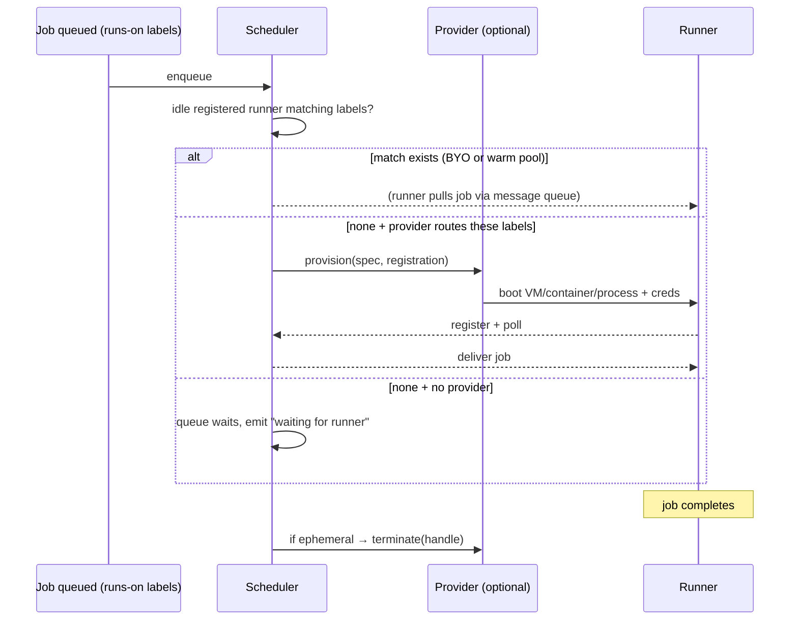

# aksh — GitHub Actions Control Plane Fidelity Gap &amp; Roadmap

**aksh** is a faithful Rust reimplementation of the GitHub Actions control plane

(`ChristopherHX/runner.server`) — a host-side service that the **official `actions/runner`**

**(`Runner.Listener`)** can register against, poll for jobs, execute, and report results to,

without GitHub-hosted minutes.

**aksh is not tied to any specific runner host.** It speaks the runner protocol and accepts

incoming runner connections; the runner itself handles execution. This means aksh works

equally well with:

- libkrun microVMs (what **Preloop** — the local CI product — uses)
- Docker / Podman containers
- Virtual machines (cloud or local)
- Bare processes on the same machine
- Remote runners on other servers

**Preloop** is the *product* that combines aksh (control plane) + a libkrun-based

ephemeral runner host for local CI. aksh is its control plane. But aksh is independently

usable: anyone can `cargo install aksh` and point their own runners at it.

Execution engine and runner host integrations live in **separate repos/crates**. This repo

is the control plane only.

Upstream reference commit: `992ccbbbf9afcde477c38c316e053b1af457ad40`

(overridable via `AKSH_UPSTREAM_RUNNER_SERVER_REF`).

---

## 0. Naming


| Term                | Meaning                                                                        |
| ------------------- | ------------------------------------------------------------------------------ |
| **aksh**            | This repo: the GitHub Actions control plane service (protocol, scheduler, API) |
| **Preloop**         | Local CI product: aksh + libkrun runner host for ephemeral microVMs            |
| **Runner.Provider** | Pluggable trait: creates/destroys runners (any substrate)                      |
| **Runner.Listener** | The unmodified official `actions/runner` binary                                |


---

## 1. TL;DR scorecard

The bar is: **the unmodified `Runner.Listener` binary connects and runs a job.**

Today it cannot. The current server speaks a bespoke `/api/v1/...` JSON protocol; the

official runner speaks the Azure DevOps (AzDO) `_apis/...` protocol with an encrypted

message queue, OAuth, and timeline/log callbacks. These are different languages.

Rough completeness against "100% faithful control plane": **~15–20%.**


| Layer                                            | State                                                     | Faithful?                                    |
| ------------------------------------------------ | --------------------------------------------------------- | -------------------------------------------- |
| Workflow YAML parse + typed model                | present                                                   | ⚠️ partial                                   |
| Matrix expansion                                 | present                                                   | ⚠️ diverges (order, naming, include/exclude) |
| Expression engine                                | present but **orphaned** (zero callers outside its crate) | ❌ unwired                                    |
| Trigger matching                                 | event-name only                                           | ⚠️ partial                                   |
| `needs` DAG scheduling                           | not in server                                             | ❌ missing                                    |
| `if` / contexts / outputs propagation            | modeled, never evaluated                                  | ❌ missing                                    |
| Secrets policy / masking on the wire             | `SecretString` good, never used on wire                   | ⚠️ type only                                 |
| **Runner session handshake (RSA/AES)**           | absent                                                    | ❌ missing                                    |
| **Encrypted message queue (`TaskAgentMessage`)** | bespoke plaintext                                         | ❌ missing                                    |
| `**AgentJobRequestMessage**`                     | structurally different                                    | ❌ missing                                    |
| **OAuth / `connectionData` / location services** | stubs                                                     | ❌ missing                                    |
| **Timeline / logs / web-console feed**           | absent                                                    | ❌ missing                                    |
| **Job/step completion events + annotations**     | single terminal status                                    | ❌ missing                                    |
| **Action download info**                         | absent                                                    | ❌ missing                                    |
| Cache v1 / Artifact v1 shapes                    | in-memory stubs                                           | ⚠️ partial                                   |
| Cache v2 / Artifact v2 (blob/twirp)              | absent                                                    | ❌ missing                                    |


---

## 2. Upstream surface we must emulate

The 23 controllers in `runner.server/src/Runner.Server/Controllers/` define the contract.

Grouped by the role they play for the official runner:

### 2.1 Runner lifecycle (mandatory for any job to run)

- `ConnectionDataController` — `GET _apis/connectionData`: AzDO `ConnectionData` +

  `LocationServiceData` GUID→location map. **First call the runner makes.**
- `RunnerRegistrationController` / `AgentController` — agent (runner) registration; the

  runner sends an **RSA public key**, server stores it for session-key wrapping.
- `AgentPoolsController` — pool discovery.
- `AgentSessionController` — `POST .../sessions`: returns `TaskAgentSession` with an

  **AES `encryptionKey`, RSA-wrapped** with the runner's pubkey. All later message bodies

  are AES-encrypted with this key.
- `MessageController` — `GET .../messages?sessionId&lastMessageId` long-poll returning

  `TaskAgentMessage{ messageId, messageType, iV, body }`; `DELETE .../messages/{id}` ack.

  **This is the 6,839-line heart**: it also runs the whole evaluation (triggers,

  expressions, matrix, needs, contexts) and builds the job. Upstream leans on GitHub's

  real `DistributedTask.ObjectTemplating`, `Expressions2`, and `Pipelines.ContextData`

  SDKs — that is the semantic bar.
- `AgentRequestController` — job request lease/renew/lock semantics.
- `AuthController` / `OidcController` — OAuth client-credentials token issuance; the

  runner attaches a bearer token to every subsequent call. `OidcController` mints job

  OIDC tokens (`id-token: write`).

### 2.2 Job reporting (mandatory for status/logs/annotations)

- `TimelineController` — `PATCH .../timelines/{id}/records`: per-job and per-step

  `TimelineRecord`s (state, result, start/finish, `**issues[]` = annotations**).
- `LogfilesController` — create/append log files per timeline record.
- `TimeLineWebConsoleLogController` — live console `feed` lines.
- `FinishJobController` — `JobCompleted` event with **job outputs** + final result.

  This is where `needs.<job>.outputs` originate.

### 2.3 Asset services

- `ActionDownloadInfoController` — resolves `uses:` → tarball download URLs (+ auth).

  Without it the runner cannot fetch actions.
- `CacheController` (v1 `_apis/artifactcache`) + `CacheControllerV2` (blob/twirp).
- `ArtifactController` (v1 pipelines) + `ArtifactControllerV2` (blob).
- `ArtifactCacheManagementController` — cache listing/eviction.

### 2.4 Support

- `VssControllerBase` / `ApiResponder` — AzDO envelope conventions (error shapes,

  `Content-Type`, API-version negotiation headers).
- `GitHubAppIntegrationBase`, `PipelineContext`, `CounterFunction`, `TaskController`.

---

## 3. What exists today (and where it diverges)

Paths are in this repo.

- `aksh-gha-parser/src/lib.rs`
  - ✅ Typed `Workflow`/`Job`/`Step`/`Trigger`/`RunsOn`/`Needs`/`Strategy`/`Matrix`.
  - ⚠️ `Trigger::matches` (`:72`) = event-name only; no `branches`/`tags`/`paths`/`types`.
  - ⚠️ `expand_matrix` (`:555`) builds `BTreeMap` → **re-sorts axis keys**, losing GitHub's
  
    declaration order; job id is `base[k=v,...]` (`:536`) vs GitHub `base (v1, v2)`.
  - ⚠️ `can_merge_include` (`:630`) compares *all* keys, not just original dimensions.
  - ⚠️ `Env::Expression` stuffs a sentinel key `__aksh_env_expression` (`:103`) instead
  
    of evaluating.
- `aksh-gha-expressions/src/lib.rs`
  - ✅ Pratt-ish parser + evaluator; `contains/startsWith/endsWith/format/join/fromJSON/toJSON`.
  - ❌ **Orphaned**: no crate calls it (`grep` for `eval_expression`/`eval_bool` outside the
  
    crate = 0 hits).
  - ❌ `success()/failure()/cancelled()` hardcoded `true/false/false` (`:205`); `hashFiles` = `""`.
  - ❌ No index/bracket access (`matrix['os']`), no `*` object-filter (`steps.*.outputs`),
  
    no `format` `{{`/`}}` escaping.
  - ⚠️ Empty object/array is falsey (`:81`); GitHub treats non-null object/array as truthy.
- `aksh-runner-server/src/lib.rs`
  - ✅ axum router, graceful shutdown via `CancellationToken`, NDJSON broadcast, cancel/rerun.
  - ❌ `/api/v1/...` is **bespoke**; `next_message` (`:471`) returns plaintext, FIFO, no
  
    long-poll, no `messageId`/ack.
  - ❌ `create_session` (`:447`) returns `{session_id, runner_id}` — **no key exchange**.
  - ❌ `complete_job` (`:495`) stores a single terminal status; **drops `outputs`**; no
  
    timeline/log/annotation ingestion.
  - ❌ `connection_data` (`:580`) minimal stub; `runner_pools` (`:588`) stub.
  - ⚠️ Cache/artifact handlers use in-memory `InnerState` maps; the file-backed
  
    `aksh-cache`/`aksh-artifacts` crates are `#[allow(dead_code)]` (`:142`).
  - ❌ Queues **every** job immediately (`:308`); `needs` never gates dispatch.
- `aksh-gha-protocol/src/lib.rs`
  - ✅ `SecretString` is correctly redaction-safe (`Debug`/`Display`/`Serialize` → `<redacted>`,
  
    `:91`–`:109`); newtype ids; NDJSON event enum.
  - ❌ DTOs are aksh-native, not AzDO wire types. `RunnerJobMessage` (`:235`) ≠
  
    `AgentJobRequestMessage`.
- `aksh-conformance/src/main.rs`
  - ⚠️ Only parses/counts fixtures + diffs two commands' stdout; `LibkrunPlan` is a
  
    placeholder (`:40`). **No** comparison of expanded jobs/contexts/logs vs upstream; **no**
  
    fuzz targets; one property test (expressions only).

---

## 4. Pluggable backends &amp; deployment modes

The official runner protocol already decouples execution from the control plane: the runner

*connects in* and pulls work; aksh never reaches *out* to execute anything. So there is

exactly **one plug point**: how a runner instance is created, given credentials, and torn

down. Everything else — sessions, messages, timeline, logs, cancel, rerun — is identical

regardless of where the runner lives.

### 4.1 The `RunnerProvider` trait

```rust
use async_trait::async_trait;

/// How aksh creates and destroys runner instances.
pub trait RunnerProvider: Send + Sync {
    /// Labels this provider can satisfy (for `runs-on` routing).
    fn labels(&self) -> &LabelMatcher;

    /// Start a runner that will phone home and self-register via the normal protocol.
    /// aksh only handles birth; the protocol does the rest.
    async fn provision(
        &self,
        spec: &RunnerSpec,
        registration: RunnerRegistration,
    ) -> Result<RunnerHandle, ProviderError>;

    /// Tear down (ephemeral cleanup / scale-down).
    async fn terminate(
        &self,
        handle: &RunnerHandle,
    ) -> Result<(), ProviderError>;

    /// Optional: current capacity for backpressure.
    async fn capacity(&self) -> Capacity {
        Capacity::unbounded()
    }
}
```

- `RunnerRegistration` = what the runner needs to call back: **aksh's URL** (reachable

  from *its* network namespace — the **provider's** responsibility), a **single-use scoped**

  **registration token**, labels, `ephemeral` flag, unique name.
- `RunnerSpec` = derived from the job: required labels + resource hints (`runs-on` can be

  an object for size/image).
- `RunnerHandle` = opaque provider id (pid / container id / vm id), correlated to the

  registered agent via the injected name+token.
- `LabelMatcher` = set-intersection matching: `runner.labels ⊇ job.labels`.

Each backend is an impl: `provision` = boot a container (`docker run`), a microVM

(libkrun), a cloud VM, a k8s pod, a `std::process::Command`, etc. **None of them touch**

**the protocol.**

### 4.2 The base case is BYO (no provider needed)

This is the critical design decision for generality:

**Make aksh fully work with zero providers.** Self-hosted runners just register and poll.

So aksh is usable without any provider crate at all — just point runners at it.



Label routing mirrors GitHub: a job's `runs-on` set must be ⊆ runner labels. No new

matching semantics.

### 4.3 Three more pluggable seams

All three are traits; default impls cover local use.

`**RunStore**` — run/job state persistence.


| Implementation              | Use case                                          |
| --------------------------- | ------------------------------------------------- |
| `InMemory` (default)        | Local: instant, no deps, state lost on restart    |
| `sqlx` (SQLite or Postgres) | Server: durable, idempotent restart, multi-tenant |


`**AuthProvider` / tenancy** — who can talk to aksh.


| Mode                              | Use case                                              |
| --------------------------------- | ----------------------------------------------------- |
| Loopback / dev token              | Local: single implicit tenant, no crypto              |
| OAuth + mTLS + per-tenant scoping | Server: namespaced tenants, per-tenant queues/secrets |


`**SecretStore**` — where secret values come from.


| Mode                         | Use case                                                   |
| ---------------------------- | ---------------------------------------------------------- |
| Submission payload (default) | Local: secrets come with the workflow JSON                 |
| Environment / vault          | Server: secrets pulled from AWS SM / HashiCorp Vault / env |


### 4.4 Local vs server = profiles, not two codebases

One binary. One control plane. Different trait impls selected by `aksh serve --profile`.


| Concern       | `--profile local` (default)                                     | `--profile server`                                    |
| ------------- | --------------------------------------------------------------- | ----------------------------------------------------- |
| Runner host   | in-process: process/container/libkrun, ephemeral, scale-to-zero | remote: k8s/Firecracker/cloud pools, **or** BYO fleet |
| Persistence   | `InMemory` `RunStore`                                           | `sqlx` `RunStore`                                     |
| Auth/tenancy  | loopback / dev token, single tenant                             | OAuth + mTLS, namespaced tenants                      |
| Networking    | `127.0.0.1`                                                     | routable base URL, token-scoped callbacks             |
| Lifecycle     | JIT ephemeral                                                   | pools + autoscale + fairness                          |
| Secret source | payload                                                         | vault / env / SM                                      |


### 4.5 Suggested crate layout

```
aksh/                              ← this repo (the control plane)
├── crates/
│   ├── aksh-server            # axum service; protocol-only; provider-agnostic
│   ├── aksh-orchestrator      # RunnerProvider/RunnerSpec traits + scheduler
│   ├── aksh-protocol          # AzDO wire DTOs, SecretString, NDJSON, crypto
│   ├── aksh-parser            # Workflow YAML parse + expression eval + matrix
│   ├── aksh-cache             # Cache store trait + file-backed impl
│   ├── aksh-artifacts         # Artifact store trait + file-backed impl
│   └── aksh-conformance       # Differential tests vs upstream runner.server

preloop-providers/              ← separate repo (runner hosts)
├── aksh-provider-process      # spawn (fastest, least isolation)
├── aksh-provider-container    # docker / podman
├── aksh-provider-libkrun      # microVM (Preloop's default)
└── aksh-provider-remote       # k8s / cloud VM / Firecracker / SSH

preloop/                        ← the product that ties it together
├── preloop-cli                # CLI that wraps aksh-server + a provider
└── preloop-vm-image           # libkrun runner VM image builder
```

Control plane depends only on **traits**, never on a concrete provider. Adding "huge VMs"

or a new cloud backend later = a new crate, zero control-plane edits. BYO mode =

`providers = []`.

### 4.6 Two gotchas to design in now

1. **Callback reachability.** The URL the runner uses to call back must resolve from inside

   its sandbox. Host-gateway IP for containers, guest-network IP for libkrun, service DNS /

   public URL for remote runners. This is why `control_plane_url` lives in

   `RunnerRegistration` and is the **provider's** job to fill — aksh never hardcodes an

   address for the runner to use.
2. **Scaling path.** For large deployments you'll eventually split into stateless aksh

   replicas behind an LB + separate orchestrator(s) + a durable `RunStore`. The trait

   boundaries make that a deployment change, not a rewrite. Design the seams now even though

   the first implementation is single-process.

---

## 5. Design principle: upstream truth + aksh projections

Keep faithfulness and your added advantages **without forking semantics**:

- Model the **AzDO/runner protocol as the source of truth** in `aksh-protocol`.
- Layer aksh extras as **read-model projections / sidecars**, never as replacements:
  - **NDJSON agent feed** = a projection *derived from* timeline records, not a parallel
  
    status path.
  - `**SecretString` redaction** = how `variables`/`maskHints` render in logs and any API.
  - **Native `/api/v1` REST** = an *additional* ergonomic surface for agents/tools, served
  
    **alongside** the runner-compatible `_apis/...` surface, both reading the same state.
- This keeps it general (anyone's official runner works) while retaining the local-first

  ergonomics already built.

---

## 6. Implementation plan (phased, each phase independently testable)

Ordering is by dependency: the runner cannot reach phase N+1 until phase N answers

correctly. Make **small commits per step** with the tradeoff notes called out.

### Phase A — AzDO wire DTOs + envelope conventions

**Goal:** typed, versioned, golden-tested wire models; no behavior yet.

Steps:

1. Add `aksh-protocol::azdo` module: `ConnectionData`, `LocationServiceData`,

   `TaskAgentSession`, `TaskAgent`, `TaskAgentMessage`, `AgentJobRequestMessage`,

   `TaskOrchestrationPlanReference`, `TimelineReference`, `TimelineRecord`, `Issue`,

   `VariableValue { value, is_secret }`, `MaskHint`, `ServiceEndpoint`,

   `PipelineContextData` (the AzDO context-data union: string/array/dict/bool/number).
2. Exact field names/casing (`camelCase`, GUIDs lowercased) to match upstream JSON.
3. `serde` round-trip + `#[serde(deny_unknown_fields)]` off (runner sends extras), but keep

   golden fixtures strict.

**Validate compatibility (Phase A):**

- Capture real wire JSON: run upstream `runner.server` + a runner once, record every

  request/response under `fixtures/wire/` (a `--record` flag on the conformance tool).
- Golden test: every captured upstream body deserializes into our DTO and **re-serializes**

  **byte-identically** (modulo documented field-order normalization).
- Property test: arbitrary DTO → serialize → deserialize is identity.

### Phase B — `connectionData`, location services, OAuth/auth

**Goal:** the runner gets past discovery + authenticates.

Steps:

1. Implement `GET _apis/connectionData` returning the full service-GUID location map

   (copy GUIDs from the captured fixture; they are stable).
2. `AuthController` equivalent: OAuth2 client-credentials `POST .../oauth2/token` → bearer.

   Issue/verify a local signing key; accept the runner's `.credentials` client auth.
3. Bearer middleware (tower layer) gating all `_apis/...` routes; map missing/invalid →

   AzDO 401 envelope.
4. `OidcController`: mint a local OIDC JWT for `id-token: write` jobs (configurable issuer).

**Validate (Phase B):**

- Point the **real `Runner.Listener config`** at aksh; it must register and store

  credentials without error (`./config.sh --url http://localhost:PORT --token X`).
- Golden: our `connectionData` response contains the same service-location set as the

  fixture (assert superset of the GUIDs the runner indexes).
- Negative: unauthenticated `_apis/...` → 401 with the AzDO error shape.

### Phase C — Registration + session key exchange (RSA/AES)

**Goal:** an encrypted session the runner trusts.

Steps:

1. `POST .../pools/{id}/agents`: parse runner RSA public key (XML/JWK form upstream uses),

   persist per-agent.
2. `POST .../pools/{id}/sessions`: generate a random AES key, **RSA-OAEP wrap** it with the

   runner's pubkey, return `TaskAgentSession { encryptionKey: { value: <wrapped>, ... } }`.
3. Keep the AES key server-side keyed by `sessionId`.
4. **Crypto isolation:** all RSA/AES lives in one reviewed module (`protocol::crypto`);

   `unsafe` stays forbidden; use `rsa`/`aes-gcm`/`cbc` crates. Document algorithm choices.
5. **Known FIPS gap:** upstream `actions/runner` uses RSA-OAEP-SHA1 by default but switches to

   RSA-OAEP-SHA256 when `UseFipsEncryption` is enabled. aksh currently implements the default

   SHA-1 OAEP path only; FIPS-mode runners require an explicit algorithm switch before they can

   decrypt `TaskAgentSession.encryptionKey`.


**Validate (Phase C):**

- The real runner's `Runner.Listener run` reaches the message-poll loop (it only does so

  after it can decrypt the session key) — assert via runner logs / a test harness.
- Unit: round-trip wrap/unwrap with a known test keypair vs an OpenSSL-generated reference

  (golden ciphertext is non-deterministic, so test *decrypt of upstream-captured* wrapped

  key with a fixed test private key).

### Phase D — Wire the evaluator: build a real `AgentJobRequestMessage`

**Goal:** one job, fully resolved, ready for the runner. (Still no `needs` graph yet —

single job.)

Steps:

1. Create `aksh-parser::eval` that **consumes `aksh-gha-expressions`** and produces

   resolved job material:
  - interpolate `${{ }}` in `env`, `with`, `run`, `runs-on`, matrix values;
  - build `contextData`: `github`, `env`, `vars`, `matrix`, `strategy`, `inputs`, `needs`
  
    (empty for single job), `secrets`;
  - compile `if` to a condition the runner evaluates (emit the **expression string** in the
  
    step/job `condition` field — the runner has its own evaluator; do **not** pre-collapse).
2. Materialize `variables`: env + system vars as `VariableValue`, secrets as

   `{ value, isSecret: true }`, and add `maskHints` for every secret value.
3. Replace `RunnerJobMessage` payload with `AgentJobRequestMessage`

   (`messageType = "PipelineAgentJobRequest"`); AES-encrypt the body, set `iV`, wrap in

   `TaskAgentMessage`.
4. `MessageController` queue: long-poll (await on a per-session channel up to ~50s),

   monotonically increasing `messageId`, redeliver until `DELETE` ack, `JobCancellation`

   message on cancel.

**Validate (Phase D):**

- The real runner **accepts and starts** the job: timeline records begin arriving (proves

  the message decrypted and parsed).
- Golden: for each `fixtures/upstream-workflows/*`, our `AgentJobRequestMessage` matches the

  upstream-emitted one field-by-field (normalize volatile ids/timestamps). This is the core

  conformance assertion.
- Property test (`proptest`): expression eval vs a table of GitHub-documented cases

  (truthiness, `==` case-insensitivity, numeric coercion, `format`, `fromJSON`).

### Phase E — Timeline, logs, web-console, completion, annotations

**Goal:** status, logs, and annotations flow back; `JobCompleted` carries outputs.

Steps:

1. `TimelineController PATCH records`: upsert `TimelineRecord`s; map state/result; collect

   `issue` entries → annotations. Project each change into an NDJSON event.
2. `LogfilesController` + `TimeLineWebConsoleLogController`: store logs, stream live feed;

   redact via `SecretString` masking using the job's `maskHints`.
3. `FinishJobController`: ingest `JobCompletedEvent` → final result + **job outputs**; persist.
4. NDJSON feed becomes a pure projection of timeline + completion state.

**Validate (Phase E):**

- End of a real-runner job: our run record shows correct per-step results, captured logs,

  and any `::error::`/`::warning::` annotations the runner emitted.
- Golden: timeline record sequence for a known workflow matches upstream's (state

  transitions + final results), volatile fields normalized.
- Masking test: a job with a secret in `env` never appears un-redacted in stored logs/feed.

### Phase F — `needs` DAG, outputs propagation, contexts across jobs

**Goal:** multi-job workflows behave like GitHub.

Steps:

1. Replace FIFO with a **dependency-gated scheduler**: a job becomes dispatchable only when

   all `needs` complete; compute its `if` against real job-status functions

   (`success()/failure()/cancelled()/always()`), which now reflect dependency results.
2. Thread `needs.<job>.outputs` + `needs.<job>.result` into the dependent job's `contextData`.
3. `fail-fast` / `max-parallel` honoring; skipped vs failed vs cancelled propagation per

   GitHub's `NeedsTaskResult` rules (see upstream `MessageController` enum).

**Validate (Phase F):**

- Real runner over a diamond `needs` graph + matrix: dispatch order and skip/fail

  propagation match upstream run.
- Golden: expanded job set + per-job `contextData.needs` matches upstream for

  `fixtures/.../case_insensitive_needs`, `node16_complex_reusable_workflows`, etc.
- Property test: random DAGs never dispatch a job before its dependencies; no cycles accepted.

### Phase G — Triggers, matrix fidelity, reusable workflows

**Goal:** front-end parsing matches GitHub exactly.

Steps:

1. Trigger matching: `branches`/`branches-ignore`/`tags`/`paths`/`paths-ignore` (globset),

   `types:` activity types, `workflow_dispatch` inputs, `schedule`.
2. Matrix: preserve declaration order (carry `IndexMap` end-to-end), GitHub job-name format

   `name (v1, v2)`, correct `include` (append vs merge on original dimensions only) and

   `exclude` precedence.
3. Reusable workflows: `secrets: inherit`, required secrets, `with:` inputs typing, output

   mapping; nested depth limit (upstream `MaxWorkflowDepth`).

**Validate (Phase G):**

- Golden expansion diff vs upstream for every in-scope fixture (this is what

  `aksh-conformance compare` should actually assert, not stdout-diff two arbitrary cmds).
- Fuzz (`cargo-fuzz`): `parse_workflow` never panics on arbitrary YAML; malformed triggers

  produce typed errors.

### Phase H — Action download, cache v2, artifact v2

**Goal:** the runner can fetch actions and use cache/artifacts end-to-end.

Steps:

1. `ActionDownloadInfoController`: resolve `uses: owner/repo@ref` and `./local` →

   download URLs (proxy to GitHub or serve local tarballs for vendored actions).
2. Cache v2 (`CacheControllerV2`) + Artifact v2 (`ArtifactControllerV2`) blob protocols;

   back them with `aksh-cache`/`aksh-artifacts` (retire the in-memory duplicates).
3. Wire the file-backed stores; remove `#[allow(dead_code)]`.

**Validate (Phase H):**

- Real `actions/checkout` + `actions/cache` + `actions/upload-artifact` run green against

  aksh.
- Golden: cache reserve/commit/lookup and artifact create/upload/list responses match

  upstream shapes.

---

## 7. Conformance harness (the spec's headline deliverable)

Build `aksh-conformance` into a real differential tester:

- `record` — drive upstream `runner.server` (+ optionally a runner) over each fixture,

  capturing wire traffic and final state to `fixtures/wire/<case>/`.
- `expand` — our parser/evaluator over each fixture → expanded jobs + `contextData`.
- `compare` — assert our expansion/messages/timeline/cache/artifact responses match the

  recorded upstream, with a documented **normalizer** for volatile fields (GUIDs,

  timestamps, ports, tokens).
- `replay` — feed recorded upstream `AgentJobRequestMessage`s to our DTOs and back.
- Test taxonomy required by the spec:
  - **Golden tests** — expansion, contexts, message bodies, timeline sequences.
  - **Property tests** — expression eval + matrix expansion invariants.
  - **Protocol-compat tests** — DTO round-trips vs captured wire JSON.
  - **Fuzz tests** — `parse_workflow` + expression lexer/parser (`cargo-fuzz`).
  - **Integration** — real `Runner.Listener` against aksh (later: inside a provider host).

Normalization policy must be explicit and reviewed, so "match" is meaningful, not lax.

---

## 8. End-to-end acceptance (definition of done)

A run is faithful when, with the **unmodified official `actions/runner`**:

1. `config.sh` registers the runner against aksh (Phases B–C).
2. A submitted workflow is parsed, triggered, matrix-expanded, and `needs`-scheduled

   matching upstream (Phases F–G).
3. The runner long-polls, receives an **encrypted `TaskAgentMessage`**, decrypts it, and

   starts the job (Phases C–D).
4. Steps run; timeline records, logs, live console, and annotations stream back; secrets are

   masked (Phase E).
5. `JobCompleted` delivers outputs; downstream `needs` jobs see `needs.<job>.outputs` and

   evaluate their `if` correctly (Phases E–F).
6. `actions/checkout`/`cache`/`upload-artifact` work via action-download + cache/artifact

   services (Phase H).
7. Cancellation mid-job delivers a `JobCancellation` message and the run/jobs settle to

   `cancelled`; rerun re-queues from a clean state.
8. `aksh-conformance compare` is **green** across all in-scope fixtures, with golden,

   property, protocol, and fuzz suites passing.
9. The NDJSON agent feed is a faithful projection of the same timeline/completion state —

   aksh's added value, layered on a faithful core.

### Provider integration (step 10)

Once 1–9 hold against a local `Runner.Listener`:

10. Repeat 1–9 with the listener running inside a provider host (container, libkrun, etc.)

    to close the integration loop. The `RunnerProvider` trait is validated by running the

    same golden fixtures through a real provider and confirming identical timeline/results.

---

## 9. Sequencing summary

```
A (DTOs) → B (connectionData/auth) → C (session crypto) → D (job message + evaluator wiring)
     → E (timeline/logs/completion) → F (needs DAG/outputs) → G (triggers/matrix/reusable)
     → H (action download/cache v2/artifact v2)
conformance harness grows alongside, asserting each phase against recorded upstream traffic.
```

Phases A–E are the critical path to "a real runner runs one job." F–H reach

"a real runner runs *any* in-scope workflow exactly like GitHub." Provider integration

(step 10) closes the loop for Preloop and every other host.