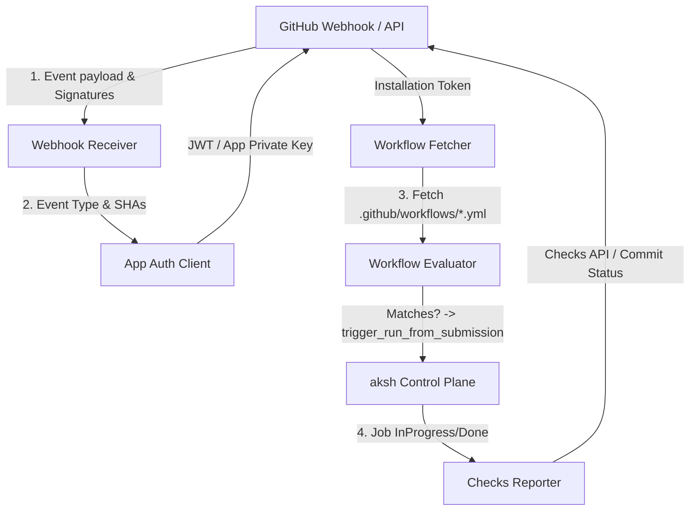

# GitHub App Webhook Integration Log & User Guide

This document records the design, build log, and interaction guide for the end-to-end GitHub App Webhook receiver and Checks API status reporting system in `aksh`.

---

## 1. Webhook Architecture Overview

The webhook system enables `aksh` to receive push and pull_request notifications directly from GitHub, fetch matching workflow files, and queue jobs for self-hosted runners. It also integrates with the GitHub Checks API to report status back to the repository.

### Data Flow diagram:



---

## 2. Configuration Parameters

The system is configured using the following environment variables:

| Variable | Description | Example |
|---|---|---|
| `AKSH_WEBHOOK_SECRET` | Secret key configured on the GitHub App to verify payload signatures. | `my-secure-webhook-secret` |
| `AKSH_LOCAL_WORKSPACE` | Path to a local clone of the repository to fetch workflows from offline. | `/path/to/my-repo` |
| `AKSH_GITHUB_TOKEN` | GitHub Personal Access Token or App Installation Token to fetch workflows and update check runs. | `ghp_...` or `ghs_...` |

---

## 3. Webhook signature verification (`X-Hub-Signature-256`)

`aksh` verifies that incoming webhooks are authentic:
- When `AKSH_WEBHOOK_SECRET` is set, `aksh` computes the HMAC-SHA256 signature of the raw request body and verifies it against the `x-hub-signature-256` header.
- If verification fails or the header is missing, the endpoint returns `401 Unauthorized`.
- If `AKSH_WEBHOOK_SECRET` is not configured, signature checking is skipped, enabling easier local testing.

---

## 4. Workflow Fetching Strategies

When a push or PR webhook is received, `aksh` retrieves the workflow definitions:
1. **Local Filesystem (Offline/Dev Mode)**:
   If `AKSH_LOCAL_WORKSPACE` is configured, `aksh` reads the `.github/workflows/` directory directly from that local path.
2. **GitHub API (Remote/Production Mode)**:
   If `AKSH_LOCAL_WORKSPACE` is not configured, but `AKSH_GITHUB_TOKEN` is set, `aksh` queries:
   `GET /repos/{owner}/{repo}/contents/.github/workflows?ref={git_ref}`
   And downloads files dynamically.
3. **Current Directory Fallback**:
   If neither is set, it defaults to looking in the local `.github/workflows/` directory of the current running workspace.

---

## 5. GitHub Checks API Reporting

The system maps the lifecycle of each job to a GitHub Check Run:
1. **Queued**: When a run is accepted, a check run is created via `POST /repos/{owner}/{repo}/check-runs` with status `queued`. The check run ID is recorded in `RunRecord.job_check_run_ids`.
2. **In Progress**: When the runner fetches and starts the job, the status is updated to `in_progress`.
3. **Completed**: When the runner finishes (or `aksh` reaps it due to timeout/lease expiration), the check run is updated to `completed` with the corresponding conclusion (`success`, `failure`, or `cancelled`).

If `AKSH_GITHUB_TOKEN` is not configured, these requests are simulated in-memory and logged to the console, allowing fully offline execution.

---

## 6. How Users Interact with it

### Step 1: Set up Webhook in GitHub
1. Go to your GitHub App or Repository settings.
2. Set the payload URL to `http://<your-aksh-url>/api/v1/github/webhooks`.
3. Set the content type to `application/json`.
4. Enter a secure Webhook Secret (e.g. `super-secret`).
5. Select the **Push** and **Pull Request** events.

### Step 2: Start `aksh-runner-server`
Run the server with the environment variables set:
```sh
export AKSH_WEBHOOK_SECRET="super-secret"
export AKSH_LOCAL_WORKSPACE="/Users/bnjoroge/runner-watcher"
export AKSH_GITHUB_TOKEN="ghp_optional_token_for_checks"

just serve
```

### Step 3: Trigger workflows
Push a commit or open a pull request. `aksh` will:
- Receive the webhook event.
- Fetch the workflows.
- Match filters (branches, tags, paths).
- Queue jobs for any registered runners matching `runs-on` labels.
- Create check runs on GitHub.

---

## 7. Automated One-Click App Registration (Manifest Flow)

To simplify local development and testing, `aksh` supports the official **GitHub App Manifest** flow:

1. **Open the Registration page**:
   Start `aksh-runner-server` and navigate to:
   `http://localhost:9090/api/v1/github/register`

2. **Click "Register App on GitHub"**:
   You will be redirected to GitHub to register the app under your personal account or organization with all required permissions and webhook events pre-configured.

3. **Callback Conversion**:
   After clicking "Create", GitHub redirects back to:
   `http://localhost:9090/api/v1/github/callback?code=...`
   
   `aksh` exchanges the temporary code for your new App ID, Webhook Secret, and Private Key PEM, displaying them directly on-screen and logging them to the terminal.

4. **Save and Restart**:
   Copy the displayed credentials into your local environment:
   ```sh
   export AKSH_WEBHOOK_SECRET="your-new-webhook-secret"
   export AKSH_GITHUB_APP_ID="your-new-app-id"
   ```
   And restart `aksh`!
