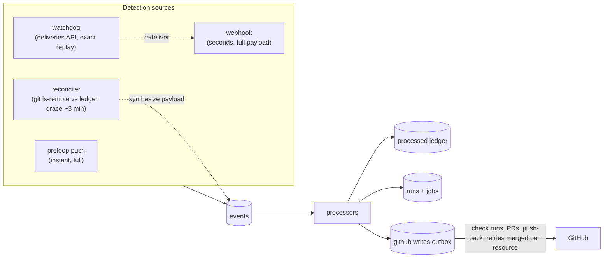

# GitHub resiliency

Status: **design — PR 0, no code yet.** Written against `public/main` @
`4831f828`. Line anchors are approximate once the code moves; file anchors are
relative to `crates/preloop-runner-server/src/` (so `control/lite/schema.sql`
means `src/control/lite/schema.sql`) unless they name another path.
Load-bearing anchors were re-checked against `public/main` @ `8bab45db`.

Related: [webhook-resilience.md](./webhook-resilience.md) (today's repair
layers), [github-app-webhook.md](./github-app-webhook.md) (intake and App
setup), [push.md](./push.md), [ci-gate-auto-pr.md](./ci-gate-auto-pr.md),
[architecture.md](./architecture.md) §State Model, [debug-sessions.md](./debug-sessions.md).

## 1. Goal

Make preloop's GitHub event intake, processing, and reporting survive an
**arbitrarily unreliable GitHub**, so users see no CI downtime: a push still
gets CI, checks still appear, and the PR still lands — even while GitHub's API,
its git servers, or its webhook delivery pipeline are failing.

Target production shape (assumed throughout):

- a hosted control plane on its own domain, behind a load balancer;
- **≥2 stateless engine replicas** sharing **HA Postgres**;
- the single-host dev deployment where the failures were *observed* is not the
  shape we design for; it must not be assumed anywhere below.

Non-goals (explicitly deferred): multi-region active-active ingest, an edge
relay/queue in front of the LB, replacing Postgres with a message bus (§8).

## 2. What GitHub actually guarantees

| Property | Reality |
|---|---|
| Webhook delivery | **At most once.** A non-2xx, a >10 s response, or an unreachable host is final; GitHub never retries by itself. Only the App's delivery history (3 days) can be redelivered, via UI or `POST /app/hook/deliveries/{id}/attempts`. |
| `githubstatus.com` | Can be green through a real partial failure (observed: 11 min of API 500s with status green). It is not a detection source. |
| API vs git vs webhooks | Independent failure domains: REST 500s while `git push` works; webhook delivery fine while `POST /git/blobs` 500s. |
| `refs/pull/N/merge` | **Mutable.** GitHub recomputes it when the base or head moves; the old merge commit becomes unreachable. `pull_request.merge_commit_sha` in a payload is a point-in-time value. |
| Rate limits | Per-installation REST budgets with primary limits and secondary (`retry-after`) throttles; `git` protocol is separate. |
| App auth | App JWT (10 min) → installation token (1 h). Minting is its own failure domain. |
| Event volume | Mostly self-inflicted: an App with `checks: write` is auto-subscribed to `check_run`/`check_suite` and receives an echo of **every check run it creates**. Load is dominated by those echoes (hundreds to ~1000 deliveries/h on a busy installation), not by user activity. |

## 3. Where the current design breaks

Observed in production during a GitHub API failure (app tokens, check-runs,
review-thread mutations and `POST /git/blobs` returned 500; REST ref writes
kept working).

### 3.1 Failure shapes

1. **Processing failures are lost forever.** The durable worker retries a
   transient failure 6 times in ~2 min, then dead-letters the row
   (`WEBHOOK_MAX_ATTEMPTS = 6`, ladder `[1,1,5,15,30]s` — `github.rs:1677`,
   `:1693-1699`; dead letter at `:2426-2430`, `:2607-2630`). Deliveries died
   that way (pushes, creates, deletes, an `issue_comment`) with errors like
   `failed to resolve webhook workflow ref SHA: GitHub returned 500` and
   `Failed to fetch workflows at event commit: 500`. The watchdog only repairs
   GUIDs **missing** from the local table; a row that exists and is `failed`
   counts as *present* (`webhook_watchdog.rs:364-375`), so it is never
   redelivered and its repair row is even resolved away. A `failed` row is
   only revived by a new GitHub delivery of the same GUID or an operator
   replay.
2. **The watchdog watermark crawls.** `poll_app`
   (`webhook_watchdog.rs:300-447`) credits a new watermark only when a pass
   either reaches the old watermark or exhausts the history
   (`reached_watermark || !has_more_pages`, `:408`), and the credit is the
   **pass-local** `newest_examined` (`:321`, `:351`). With `max_pages = 5`
   (`:49`, `:172-176`) a truncated pass credits nothing and persists only
   `scan_cursor` (`:425-434`); on completion the cursor resets to page 1 and
   the next poll re-walks from the top. Every walk is therefore a full crawl
   from the top whose length grows with the watermark depth. Observed: the
   watermark **10.5 h behind** the clock.
3. **Refused redeliveries wait on that crawl.** `repair_delivery`
   (`webhook_watchdog.rs:452-556`) is only reachable from the examined-item
   loop (`:383-387`), so a redelivery GitHub refused (500 → attempt 1 recorded)
   is retried only when a later pass re-examines the same GUID — i.e. while it
   is still newer than the watermark, older than the grace boundary, and past
   its per-GUID backoff. In the >`max_pages` case that is the crawl cadence;
   in the ≤`max_pages` case the watermark moves past the item and the open
   repair row (`webhook_repairs_pending`, stuck open) persists forever.
4. **Ingest returns 500 on a slow store.** `handle_github_webhook` commits the
   delivery row with an 8 s / 2-attempt budget and otherwise returns 500 —
   `Failed to commit webhook delivery row — returning 500; redelivery is
   manual` (`github.rs:1672-1673`, `:1740-1779`, `:1925-1931`). GitHub does not
   retry, so the event is lost.
5. **Stale PR merge commit (F2).** A `pull_request` payload's
   `merge_commit_sha` is recorded as the run's `sha` and `refs/pull/N/merge`
   as its `git_ref` (`events/pull_request.rs:57-63`, `:131-148`;
   `github.rs:3100`, `runs.rs:1149-1184`), is used to fetch workflow YAML
   (`github.rs:2897`), and is never re-resolved. The default
   `checkout_cache.mode = Off` (`config.rs:362-365`) makes the job fetch the
   *live* ref, so the tested tree can differ from the recorded commit — run
   `74cbd009` tested `Merge 3cc4746c into 992e3b81` while the PR head was
   `9ecba806`. Open PR #409 polls for a fresh merge SHA; §4.7 removes the
   dependency instead.

### 3.2 Root causes in code

| # | Root cause | Evidence |
|---|---|---|
| 1 | **No error taxonomy.** Failures travel as pre-formatted strings in `WebhookOutcome::{TransientError,PermanentErrors,Unreportable,DependencyUnavailable}`; nothing carries an HTTP status or retryable flag. | `github.rs:2071-2092`; string-sniffing as control flow at `github.rs:350-352`, `:587-610`, `:669-676` |
| 2 | **A fixed 2-minute retry budget** against an outage that lasts hours. The ladder is a constant, not derived from the error class. | `github.rs:1693-1699` |
| 3 | **GitHub I/O inside the retry unit.** A delivery does ref resolution, workflow fetch, changed-files lookup and token minting before runs exist; every one of them can fail and burns an attempt. | `github.rs:2861-2896`, `:1581-1662`, `:1540-1550` |
| 4 | **Transient and permanent collapse to one counter** (`attempts`), and the breaker only reclassifies *after* the fact. | `github.rs:2414-2433` |
| 5 | **No retry time column.** Retry-due time is overloaded onto `lease_until`; there is no `next_attempt_at`, so "wait 6 h" is expressed as a lease. | `control/lite/schema.sql:512-527`, `control/pg/schema.sql:614-629` |
| 6 | **Claim and effects are separate units.** The claim is one autocommit `UPDATE … FOR UPDATE SKIP LOCKED` (PG) / `BEGIN IMMEDIATE` fence (SQLite); run creation is a later, separate transaction; no ledger exists. | `control/pg/webhooks.rs:154-196`, `control/lite/webhooks.rs:117-157`, `control/pg/dispatch.rs:3936-4109` |
| 7 | **Cross-node wake is missing for this queue.** The worker wakes on a node-local `Notify` plus a 5 s poll; only the ingesting node signals it. Replicas see new rows only by polling. | `github.rs:2265-2273`, `state.rs:723`, `:1471`; contrast `control/wake.rs:23-116` (`LISTEN preloop_wake` / `preloop_events`) |
| 8 | **Ingest is not GitHub-free.** HMAC verification is followed by a live `app_covers_repository` API call before the row is committed — a GitHub failure at ingest is a 500 the same as a store failure. | `github.rs:1838-1871`; `github_app.rs:665-700` (raw `send()`, not breaker-observed) |
| 9 | **Token minting is invisible to the breaker.** A pure `/app/installations/*` outage burns attempts to the cap without ever parking. | `github_app.rs:806-885`, `:1021-1071`; callers `github.rs:1542-1550`, `:1414-1420` |
| 10 | **Check-run re-request traffic is queued in full.** Only `action == "rerequested"` does work; every other `check_run` delivery still occupies a queue row and an attempt. | `github.rs:1938-1941` |
| 11 | **A 4xx from run submission is treated as "no matching workflow"**, swallowing real client-side failures (e.g. PAT-scope refusal) as benign. | `github.rs:3225-3231`; `runs.rs:1529-1531` |

## 4. Design

### 4.1 Principle: compare against GitHub's current state

Webhooks are an *accelerator*, never the source of truth. Correctness comes
from a reconciler that compares **desired state** (what GitHub's refs and PRs
look like now) with **processed state** (a durable ledger of what preloop has
already turned into runs), and synthesizes whatever is missing.



Every source lands in the **same** queue with a canonical identity, so a
synthesized, pushed and webhook-delivered event for the same commit collapse
into one run (§4.6).

### 4.2 Sources and their contracts

| Source | Latency | Payload fidelity | Cost | When it is the primary detector |
|---|---|---|---|---|
| `push` (native `preloop push`) | instant | full (we own the commit) | none | local/submit-driven flows |
| `webhook` | seconds | full | GitHub delivery history | normal operation |
| `reconciler` (`git ls-remote`) | grace + scan interval (~3 min) | rebuilt from git + API | one `ls-remote` per repo; REST only for PR metadata | webhooks lost, edge down, App misconfigured |
| `watchdog` (deliveries API) | poll interval (5 min) | **exact** replay | 1 REST page per 100 deliveries | edge failure, phantom ack |
| `schedule` | cron | synthesized | none | cron workflows (unchanged) |

The reconciler is the correctness net; the watchdog remains the *fidelity*
net — it can replay a payload byte-for-byte, which a synthesized event cannot
(e.g. `issue_comment`, `check_run` re-requests). Neither replaces the other.

### 4.3 Ingest never fails because of us

Invariant: **a verified delivery is answered 202 if and only if preloop has
taken durable custody of it** — Postgres *or* local spool.

```
POST /api/v1/github/webhooks
  1. HMAC verify (existing; mandatory, no GitHub call)
  2. persist raw row: PG, ≤2 s budget
       ok        → 202
       timeout/err → fsync spool file → 202
       spool fails → 500 (truthful; the only remaining failure)
  3. zero GitHub calls on this path
```

Changes from today:

- **Drop the synchronous `app_covers_repository` call.** The App↔repository
  binding is a real security control (an App secret must not inject events for
  repositories it does not cover), but it does not have to be synchronous.
  Cache positive bindings per `(app_id, repository)` in the control store with
  a TTL, and verify on cache miss **inside the processor** — where a mismatch
  is a permanent, non-retryable rejection rather than a 403 on the ack path.
  Ingest stays HMAC + persist.
- **Local spool** at `<state_dir>/spool/events/<event_id>.json`: write, `fsync`
  file, `fsync` directory, rename into place. A boot/periodic importer reads
  the spool and inserts into `events` idempotently (same identity rules,
  §4.6), then unlinks. Spool depth > 0 is an alert (`events_spool_depth`).
  Durability boundary: the spool survives a process restart on the same host,
  **not** host loss — that is the reconciler's job.
- **Retain the GUID-presence contract, per delivery.** Every verified delivery
  gets a `delivery_guid`-keyed **receipt** row (`event_deliveries`, §4.4) even
  when it is filtered (e.g. a `check_run` created echo) *and* even when it
  collapses into an event that another source already queued. The event then
  carries the terminal `ignored`/`done`/`failed` state with a reason. The
  watchdog's "no local row ⇒ missing" join (`webhook_watchdog.rs:354-375`)
  depends on this; a filtered-but-absent delivery would otherwise be
  redelivered forever.

### 4.4 The `events` table

Generalize `webhook_deliveries` into a source-agnostic queue. One table, one
claim path, one retry policy; the raw payload stays in the row (30-day
retention, as today) so local replay needs no GitHub.

```sql
events (
  event_id        uuid primary key,
  source          text not null,        -- push | webhook | reconciler | watchdog | schedule
  kind            text not null,        -- push | pull_request | issue_comment | check_run | ...
  dedupe_key      text not null,        -- canonical identity, see §4.6
  delivery_guid   text,                 -- the delivery that created this row, others are receipts
  installation_id bigint,
  repository      text not null,
  git_ref         text,
  sha             text,
  payload         jsonb not null,       -- faithful github.event shape
  state           text not null,        -- pending | processing | done | failed | ignored
  error_class     text,                 -- transient | rate_limited | outage | permanent | input
  attempts        int  not null default 0,
  available_at    timestamptz not null default now(),
  priority        smallint not null default 100,
  lease_until     timestamptz,
  lease_token     uuid,
  last_error      text,
  received_at     timestamptz not null default now(),
  processed_at    timestamptz,
  unique (kind, dedupe_key)
)
```

- `available_at` replaces the `lease_until`-as-retry-time overload
  (`control/lite/schema.sql:512-527`).
- Claim: `UPDATE … FROM (SELECT … WHERE state IN ('pending','processing') AND
  available_at <= now() ORDER BY priority, available_at, received_at
  LIMIT n FOR UPDATE SKIP LOCKED) RETURNING …` — the shape already proven in
  `control/pg/webhooks.rs:154-196`. SQLite keeps the `BEGIN IMMEDIATE` fence.
- Priority: interactive re-requests (20) > push/pull_request (50) > everything
  else (100). A starvation guard promotes any pending row older than 15 min
  to the front.
- Wake-ups: publish on the existing `preloop_wake` channel at commit
  (`control/wake.rs:23-116`) so a row written by replica A wakes replica B;
  keep the 5 s poll fallback. `LISTEN/NOTIFY` is already available through the
  existing PG client — no new dependency.
- Migrations: main's convention is `control/{lite,pg}/schema.sql` +
  `SCHEMA_VERSION` bump (lite `4`, pg `5` at `control/lite/mod.rs:52`,
  `control/pg/mod.rs:43`) with `docs/control-schema.sql` byte-identical to the
  PG schema (enforced at `control/tests.rs:7532-7549`). PR #370 has landed
  (embedded refinery is on main); PR #372 (still open) is the migration cutover
  that replaces the `schema.sql` convention with refinery migrations.
  Deliverable 1 is written for main's convention and rebased onto #372's if it
  lands first.

**Delivery receipts.** The queue row is per *fact*; a delivery is per *attempt
to tell us about it*. Collapsing deliveries into one `events` row (a GitHub
redelivery, a webhook arriving after a synthesized event) would otherwise
destroy the GUID the watchdog joins on, so receipts are their own table:

```sql
event_deliveries (
  delivery_guid text primary key,     -- x-github-delivery
  event_id      uuid not null references events(event_id),
  app_id        text not null,
  received_at   timestamptz not null default now(),
  state         text not null,        -- received | done | ignored (the event holds done/failed)
  reason        text                  -- filter or duplicate reason, for the operator
)
```

Every verified delivery inserts its own receipt — including the ones that add
no queue row. Two deliveries for the same fact have two distinct GUIDs and
both receipts exist, so the watchdog never sees a "missing" GUID it would
redeliver until the attempt cap turns into a permanent false finding. Presence
means "a receipt exists"; the **event's** state decides what happens next
(`done`/`ignored` nothing, `failed` requeued from the retained payload —
§4.9 item 2), and the reason records why a delivery that changed nothing was
dropped. Retention matches the event's (30 days).

**Exactly-once effects, honestly.** Claiming the event and creating runs
cannot literally be one transaction — processing performs GitHub reads in
between, and holding a DB transaction across network I/O is a deadlock
generator. Instead:

```
claim (autocommit, lease_token)                       ← 1 statement
process: read-only GitHub calls, no writes
commit:  ONE transaction
           submit_run(s)        (idempotent on (event_id, workflow_path))
           ledger upsert        (§4.6)
           outbox rows          (check runs, PR writes)
           event → done         (fenced on lease_token)
           receipts → done      (done | ignored, same fence)
```

Retry after a crash is safe because `runs` keeps its unique index on
`(event_id, workflow_path)` (`control/pg/schema.sql:144-145`) and the fenced
transition makes a stale worker unable to finalize. That is the same
idempotency the webhook path already relies on (`control/lite/submit.rs:20-22`,
`control/pg/dispatch.rs:3948-3952`); the ledger and outbox simply join the
transaction. Lease loss before that commit writes nothing at all — runs,
ledger, outbox rows, receipts and the event transition are one fenced unit —
and anything already committed belongs to the outbox sender, so a reclaim can
neither double-run nor double-write GitHub.

`runs.webhook_delivery_id` becomes `runs.event_id` (same uniqueness). The
watchdog join reads `event_deliveries.delivery_guid` for presence and then the
event's `state` — a `failed` event is repaired from the retained payload, not
by asking GitHub again (§4.9 item 2).

### 4.5 Retry by error class

Replace `WebhookOutcome`'s string payloads with a typed class carried from the
call site:

| Class | Examples | Policy |
|---|---|---|
| `Transient` | 5xx, connection reset, DNS, git fetch failure | exponential backoff with jitter: `1s, 5s, 30s, 2m, 10m, 30m, 2h, 6h` then cap 6h, ±20% jitter |
| `RateLimited` | 429, `403` + `x-ratelimit-remaining: 0`, secondary limit | wait `retry-after` (clamped 5 s–1 h); does not consume the transient budget |
| `Outage` | breaker open | park with `available_at = breaker.retry_after`; **never** counts as an attempt (the current `park_webhook_delivery` refund already models this — `control/lite/webhooks.rs:391-419`) |
| `Permanent` | 404 on a deleted resource, 422, workflow YAML that does not parse | dead-letter immediately; report failure check runs where a run exists |
| `Input` | malformed payload, unknown event, missing `repository` | terminal `ignored` with a reason; no retry, no alarm |

Budget: webhook-sourced events retry for up to **72 h** (GitHub's redelivery
window), synthesized events until they are superseded (a newer head for the
same ref) or 7 days, whichever is first. Because the raw payload is retained
30 days locally, a transient outage never needs GitHub to replay anything.

Dead letters keep a standing `events_dead_letter` condition and an operator
replay endpoint (today's `POST /api/v1/webhooks/deliveries/{id}/replay`,
generalized) — a dead letter is a finding, never a silent drop.

Classification also fixes two specific bugs from §3.2: token-mint failures
become `Outage`/`Transient` through the breaker (wrap the mint calls in
`send_observed`), and a 4xx from run submission is classified as `Permanent`
(with its real error surfaced) instead of "workflow not triggered"
(`github.rs:3225-3231`).

### 4.6 Identity and dedupe

Three layers, each with a different job:

| Layer | Key | Purpose |
|---|---|---|
| Delivery | `delivery_guid` (PK) | one receipt row per delivery (§4.4); absorbs GitHub redeliveries of the same payload |
| Event | `(kind, dedupe_key)` unique | collapse webhook / pushed / synthesized events for the same GitHub fact |
| Run | `(event_id, workflow_path)` unique | a replayed event never creates a second run for the same workflow |

Canonical keys:

| Kind | `dedupe_key` | Notes |
|---|---|---|
| `push` | `repository + "\0" + ref + "\0" + head_sha` | `after` for webhooks; ledger head for synthesized; the pushed commit for native `preloop push` |
| `pull_request` | `repository + "\0" + pr_number + "\0" + head_sha + "\0" + base_sha + "\0" + action` | the tested fact is the pair: `action` keeps `types: [opened]` from being satisfied by a `synchronize`, and `base_sha` keeps a base-only move (§4.8) from collapsing into the event that already ran for the old base |
| `check_run` / `check_suite` | delivery GUID | re-requests are per-delivery; never synthesized |
| `issue_comment`, `issues`, `release`, … | delivery GUID | watchlist replay only (they cannot be rebuilt faithfully) |
| `workflow_dispatch` / `repository_dispatch` | `repository + "\0" + event + "\0" + payload digest` | dedupe a double-submitted dispatch |
| `schedule` | `repository + "\0" + workflow + "\0" + cron bucket` | unchanged semantics |

Cross-source collapse is therefore exact where a canonical key exists, and
GUID-scoped where it does not. Three consequences worth stating:

- **Grace is latency, not correctness.** A real webhook that lands after its
  synthesized twin finds the event by canonical key, adds its receipt and
  nothing else — the race is decided by the unique index, never by timing.
- **A `failed` event is revived only by a genuine re-delivery** (same GUID) or
  by a reconciler synthesis after the grace period — a plain duplicate is a
  no-op. That matches today's `ON CONFLICT … WHERE state = 'failed'`
  (`control/lite/webhooks.rs:83-107`) and extends it to synthesized events.
- **The processed-heads ledger** is what lets the reconciler decide:

```sql
processed_heads (
  repository  text not null,
  git_ref     text not null,
  sha         text not null,
  kind        text not null,       -- push | pull_request
  base_sha    text not null default '',  -- PR base tip that was tested; '' for push
  merge_sha   text,                -- locally computed merge commit that was tested (§4.7)
  run_ids     uuid[] not null default '{}',
  processed_at timestamptz not null default now(),
  primary key (repository, git_ref, sha, kind, base_sha)
)
```

Ledger rows are written in the same transaction as the run(s) they caused.
Retention is independent of run archival (a run may be archived at 90 days;
the ledger keeps 180) so a post-archival reconcile does not re-fire old heads.
For `kind = pull_request` the row records the base tip along with the head,
because the tested commit is a function of both (§4.7): a head that is already
in the ledger under a different base is *not* processed, and a base-only move
writes its own row.

**`preloop push` is a first-class source.** A native submission writes a
`source = push` event with the canonical push key; when GitHub later delivers
the webhook for the same commit it collapses into the existing event and run.
The existing `already_published` check (`github_push.rs:96-108`) remains the
safety net for the *dirty-tree* case (published commit ≠ submitted sha), and
the tested-tree check remains the invariant: the tree that was tested is the
tree that lands.

### 4.7 Less GitHub dependency while processing

Processing should need GitHub only for things git cannot answer. Resolution
order becomes:

| Input | Order | Today |
|---|---|---|
| Event SHA | payload → **local mirror** → REST `commits/{ref}` | payload → local workspace → REST (`github.rs:1524-1589`) |
| Workflow YAML at a SHA | **local mirror** → REST contents → git protocol | local workspace → REST contents (`github.rs:1318-1500`) |
| PR changed files (`paths:` filters) | **local mirror diff** (`git diff --name-only base..head`) → REST | REST only (`github.rs:1581-1662`) |
| PR merge commit | **computed locally** with `git merge-tree` → REST `pulls/{n}` (recorded as `merge_source`) | payload `merge_commit_sha`, never re-resolved |
| Installation tokens (server-side reads) | cached per `(app, repo, scope-set)`, refreshed at half-life | minted per call (`github_app.rs:806-885`) |

The **local mirror** is new: one bare repo per `(installation, repository)`
under `<state_dir>/mirrors/`, updated by the reconciler's fetch (§4.8) with
`+refs/heads/*`, `+refs/tags/*`, and the PR heads of open PRs. It is *not* the
existing run-scoped checkout cache (`snapshots.rs:738-895`, depth-1, default
off) — workflow fetch and changed-files need real history, and the mirror is
what makes processing work while the REST API is down. It is also the only
place a locally computed merge commit exists, so it is the checkout source for
those runs.

**PR merge (fixes F2).** For a `pull_request` event:

1. resolve `base.sha` and `head.sha` in the mirror;
2. `git merge-tree --write-tree base head` (Git ≥ 2.38) → tree, then
   `git commit-tree` with a fixed committer identity and the committer date
   pinned to `head`'s commit date, so the same pair always yields the same
   merge commit SHA;
3. `github.sha` = that merge commit, `github.ref` = `refs/pull/N/merge`
   (unchanged wire shape), `status_check_sha` = head (unchanged);
4. on conflict, do **not** fabricate: GitHub's `refs/pull/N/merge` does not
   exist for conflicted PRs either, and the run fails the same way it does
   today. Record `merge_conflict` on the run for visibility;
5. **the job checks out from preloop, never from the live ref.** A merge we
   computed exists only in the mirror, and GitHub's `refs/pull/N/merge` is a
   different commit object even for an identical tree, so a job that fetched
   the ref by name would either fail or test a tree other than the recorded
   SHA. The merge is materialized into the run's checkout source (the snapshot
   the job already fetches — `redirect_primary_checkout`, `runs.rs:2540`;
   `snapshots.rs:738-895`) with `github.ref` kept as the wire-compatible
   `refs/pull/N/merge` name. `checkout_cache.mode = Off` must therefore not
   reach this path: an unredirected job fetches the live mutable ref, which is
   the F2 mismatch again. Invariant: a run's `sha` must resolve in the checkout
   source the job actually uses, and a job that cannot resolve it fails loudly
   instead of testing a different tree.

This removes the stale-merge class of bug rather than polling around it
(coordinate with open PR #409, which polls for a fresh merge SHA — this
replaces that mechanism). The REST fallback (mirror cannot answer) records
`merge_source = github`; that SHA comes from the mutable ref, so the
resolve-before-test check in step 5 is what keeps the tested tree equal to the
recorded commit — the local path is the one that removes the dependency.

**Token caching scope.** The current no-cache rule exists for *job* tokens:
their scope follows the job's `permissions:` block and revocation must bite
immediately (`github_app.rs:237-242`). The cache proposed here is only for the
**server's own read tokens** (`contents: read`, identical scope every time),
keyed by `(app_id, repository, scope-set)`, refreshed at half of the 1 h
lifetime, with single-flight minting. Job tokens stay per-job, uncached.
Every mint still goes through `send_observed` so mint outages trip the breaker.

### 4.8 Detection: the reconciler

Per installed repository, one `git ls-remote` (no REST rate-limit cost):

```
refs/heads/*        → compare tip against processed_heads(kind=push)
refs/tags/*         → same (tag pushes trigger workflows)
refs/pull/*/head    → compare the (head, base tip) pair against
                      processed_heads(kind=pull_request, base_sha)
```

A PR's base can move while `refs/pull/N/head` stands still, and a base-branch
push delivers no `pull_request` event (GitHub recomputes the merge ref without
announcing it); the merge we test is a function of both ends (§4.7), so
comparing heads alone would leave an open PR running against a stale merge
whenever the PR's own webhook is lost. The base tips are in this same
`ls-remote` output, so the pair costs no extra call.

Algorithm, per repo, in one pass:

1. If the fact is already in the ledger — for a PR, the head *and* the base
   tip it was tested with — → nothing to do.
2. If not, and the last event for that ref is younger than the **grace**
   period (default 3 min) → skip; the webhook is probably still in flight.
3. Else synthesize:
   - **branch/tag push**: payload rebuilt fully from git — `after` = tip,
     `before` = the ledger's last processed head for the ref (for a never-seen
     ref, the merge-base with the default-branch tip, so the batch is the
     branch's added commits rather than the tip alone), `commits[]` rebuilt
     over `before..after` from `git log` (the adapter's `[skip ci]` test reads
     every commit in the batch), `head_commit` from `git cat-file`, changed
     files from the mirror diff (for `paths:` filters), and
     `repository.default_branch` from the local repository record — the
     adapter falls back to `main`, which would silently change trust tier and
     skip semantics for any other default branch. No API needed.
   - **pull request**: needs PR metadata (number is in the ref, but base ref,
     draft state and fork status are not). **Fail closed**: fetch the PR from
     REST; while the API is down, record the head movement as *seen, not
     processed* — the `reconciler_deferred` gauge plus a backoff, never a
     `processed_heads` row — and synthesize on the first pass after the API
     returns. Only a ledger row written with its run decides processing, so a
     deferral can neither suppress the repair later nor read as a processed
     head.
   - Action inference for PR synthesis: no processed head for the PR at all →
     `opened`; a previously processed head exists → `synchronize` (which is
     also what a base-only move synthesizes, D4). The new event supersedes the
     previous live run for that head, so the check runs keep describing one
     tested merge. That keeps `types: [opened]` workflows working when the
     `opened` delivery was lost.
4. Write the synthesized event into `events` with `source = reconciler` and
   the canonical key, then let the normal processor run it.

Leader election: the reconciler holds a lease row (`source_leases`), renewed
per pass; only the leader runs `ls-remote`/fetch. The watchdog takes a lease
the same way — two replicas redelivering the same GUID is a duplicate
`POST /attempts` and wasted redelivery budget.

Metrics: `reconciler_synthesized_total{kind}` — **any sustained value > 0
means webhooks are failing and should page.** This is the single most
important new signal, because it converts "silent CI dark" into an alarm.

### 4.9 Watchdog fixes (backstop)

Deliverable 6, orthogonal to open PR #408 (which changes the first-poll
baseline):

1. **Keep the page cursor and the credit separate; never credit across an
   unexamined gap.** Persist `(scan_cursor, crawl_top)` after every page: the
   cursor says where to resume, `crawl_top` is the newest item examined by the
   *chain* that started at page 1, carried across passes. The watermark still
   advances only when the walk proves contiguity (it reached the previous
   watermark, or history is exhausted — `webhook_watchdog.rs:407-408`), and it
   advances to `crawl_top` instead of today's pass-local `newest_examined`
   (`:321`, `:351`), which is what makes a resumed crawl re-walk from the top.
   Racing the watermark forward per page is worse than slow: the watermark
   means "everything newer than this is accounted for", so a mid-walk credit
   marks the range between the credit and the resume cursor as accounted for
   while it was never examined, and those deliveries are then skipped forever.
   Advancing less than the examined range costs a re-walk; advancing more
   loses events.
2. **`failed` rows are not "present".** Split the presence check into
   `state = 'failed'` → repair *locally* (requeue from the retained payload;
   the payload is in the row), versus no receipt at all → request redelivery
   from GitHub. A locally-held payload must never be spent on a redelivery
   request.
3. **Refused redeliveries retry on their own schedule.** Sweep open
   `webhook_redeliveries` rows independently of the history walk, with the
   existing backoff ladder (`webhook_watchdog.rs:184-194`); the crawl is not a
   retry clock.
4. **Repair rows resolve or expire loudly.** Resolve when the delivery lands
   *or* when the GUID is credited/expired; a cap hit stays open as a finding
   (as today) but the condition must not be permanently un-resolvable
   (§3.1 shape 3).
5. **Page budget adapts**: when a pass is still truncated at `max_pages`,
   raise the page budget for the next pass (bounded), so catch-up after an
   outage is not throttled to 500 items per 5 minutes. With item 1 that raise
   is what shortens the walk; it never licenses crediting past what the walk
   covered contiguously.

### 4.10 GitHub writes: outbox + repair

`check_run_updates` already implements the right shape: desired state
coalesced per `(run_id, job_id)` with a version gate, one leased sender,
per-installation rate budgets and breakers, and `external_id`-based
idempotency on GitHub (`control/pg/check_runs.rs:36-225`, `github.rs:492-660`).
Extend the same pattern to every other GitHub write:

| Write | Coalescing key | Notes |
|---|---|---|
| check run create/update | `(run_id, job_id)` | exists |
| PR create/update (auto-PR, push-back) | `(repository, head_ref)` | keep only the latest desired state (draft flag, title) |
| review-thread replies / comment updates | `(thread_id, reply_id)` | not yet used by preloop, reserved |
| push-back push | `(repository, ref)` | see decision D2 |

**Repair sweep.** Rows acked long ago can still be wrong on GitHub (a check
run deleted, a PR edit lost to a 5xx GitHub returned after applying it).
A periodic sweep re-reads GitHub state for resources whose last ack is older
than a threshold (check runs via `GET /repos/{r}/commits/{sha}/check-runs`
matched by `external_id`) and re-enqueues a full desired-state write when
GitHub disagrees. preloop's own status/UI stay the source of truth during an
outage; the sweep converges GitHub back to them.

### 4.11 Measurements

| Metric | Definition | Alert |
|---|---|---|
| `push_to_run_created_seconds` (p50/p99, by source) | `runs.created_at - events.received_at` | p99 > 60 s |
| `event_source_lag_seconds{source}` | now − newest processed event per source | webhook lag > 5 min |
| `reconciler_synthesized_total{kind}` | synthesized events | **any sustained > 0 pages** |
| `reconciler_deferred_total` | PR heads seen but not processable (API down) | > 0 for 10 min |
| `events_queue_depth`, `events_oldest_pending_seconds` | queue health | oldest > 15 min |
| `events_dead_letter_total` | terminal failures | any |
| `events_spool_depth` | unimported spool files | > 0 for 5 min |
| `github_writes_oldest_pending_seconds` | outbox health | > 30 min |
| `check_run_repairs_total` | sweep re-writes | informational |
| `webhook_watchdog_lag_seconds` | newest history item vs watermark | > 15 min |

Existing OTel infrastructure (`preloop-observability`) carries these; the
status snapshot gains conditions `events_dead_letter`, `events_spool_backlog`,
`reconciler_active`, alongside today's `webhook_*` conditions
(`bootstrap.rs:793-928`).

## 5. Failure matrix

| Failure | Detection | Behavior while failing | Recovery | User sees |
|---|---|---|---|---|
| **GitHub REST API 5xx** | breaker; per-call class | ingest unaffected (no API call); processing parks (`Outage`), no attempt burned; check-run writes defer | breaker half-open probe; backoff drain by priority | CI runs late, not absent; checks delayed |
| **GitHub API rate-limited (429 / secondary)** | `retry-after`, `x-ratelimit-*` | wait exact `retry-after`; priority drain; per-installation budgets on writes | automatic | delayed checks; no lost runs |
| **GitHub git down** (`ls-remote`/fetch fails) | fetch error class | mirror serves already-fetched commits (workflow YAML, diffs, merge); new commits defer; jobs already dispatched check out from engine snapshots | next pass re-fetches | new pushes queue up; in-flight jobs unaffected |
| **Webhooks not delivered** (edge unavailable, App misconfigured) | reconciler synthesis; App health monitor | reconciler synthesizes push events (full fidelity) and PR events after the API returns | automatic within grace + scan interval | CI starts ~3 min late instead of never |
| **Webhook payload lost beyond GitHub's 3-day history** | watchdog cap hit (standing finding) | locally retained payload (30 days) replays; beyond that, reconciler re-derives from git | operator replay or reconcile | worst case: run re-created (never silently dropped) |
| **Our store slow (>2 s)** | ingest budget | spool + 202; import when PG recovers | automatic | none |
| **Our store down** | spool depth, import errors | spool + 202; processing paused (claim fails) | boot/periodic import; dedupe by identity | none while the spool holds; reconciler covers beyond |
| **Postgres failover** | connection errors | leases expire; another replica reclaims; spool covers the gap | automatic (lease TTL 60 s) | up to ~1 min delay |
| **Replica dies** | lease expiry | other replicas reclaim events; reconciler/watchdog lease moves | automatic | none |
| **Replica dies with unimported spool** | `events_spool_depth` on the dead host is invisible | — | reconciler re-derives the facts from git; exact-payload-only events (`issue_comment`) are lost until the watchdog replays them | rare; detection is the watchdog |
| **Token minting down** | breaker observes mint calls | events park as `Outage` instead of burning attempts | automatic | none |
| **Check-run write lost / check deleted on GitHub** | repair sweep | preloop UI is source of truth; desired state retained | sweep re-writes | checks converge |
| **Stale/moving `refs/pull/N/merge`** | n/a (removed) | merge computed locally from pinned base+head and checked out from the run snapshot, never the live ref (§4.7) | new base tip ⇒ new run (§4.8) | CI tests the intended merge |
| **Clock skew between replicas** | `available_at`/grace comparisons | grace windows widen by the skew; leases unaffected (DB time is authoritative) | use DB `now()` for all queue times | none |

## 6. Rollout

One PR per deliverable, each off `main`, **never merged by the agent**.
Regression tests that fail before and pass after; `CHANGELOG.md`
`[Unreleased]`; no new dependencies (Postgres `LISTEN/NOTIFY` is already
reachable through the existing client).

| PR | Deliverable | Cutover shape |
|---|---|---|
| **0** | This document | none |
| **1** | `events` table + delivery receipts, error classes, `available_at`, priority, `LISTEN/NOTIFY` wake, ingest spool, ingest without GitHub calls | Generalize `webhook_deliveries` into `events` + `event_deliveries` in place; delete the old columns/paths in the same PR (no shim). Shadow-compare counts in tests, not production. |
| **2** | Processed-heads ledger (PR rows carry the tested base tip), `preloop push` as an event source, cross-source dedupe, `runs.event_id` | Ledger written in the run transaction; `already_published` stays for the dirty-tree case. |
| **3** | `ls-remote` reconciler, mirror fetch, leader lease, synthesized push events; PR synthesis fail-closed; base-tip comparison | Feature flag `PRELOOP_RECONCILER` (default off until 2 is in), then on; `reconciler_synthesized_total` becomes the page. |
| **4** | Local merge commit (`merge-tree`) replacing payload merge SHA, served to jobs from the run snapshot instead of the live ref | Coordinate with PR #409 — that PR's polling is superseded; land whichever is cleaner and close the other. |
| **5** | GitHub-write outbox generalization + check-state repair sweep | Extends `check_run_updates`' proven pattern; no behavior change while healthy. |
| **6** | Watchdog fixes (§4.9) | Orthogonal to PR #408 (first-poll baseline); keep changes in the cursor/credit and repair-sweep functions, not the poll bootstrap. |

Ordering constraints: 1 → 2 (ledger needs `events`), 2 → 3 (reconciler needs
dedupe), 4 independent, 5 independent, 6 independent.

Verification per PR: unit tests + the PG scratch cluster
(`PRELOOP_TEST_POSTGRES_URL`), plus a failure-injection smoke run against a
stub GitHub that returns 500/429 for the changed path (the repo already has
stub-server test infrastructure). Build and test on the project's supported
build hosts only.

## 7. Decisions and open questions

| # | Decision | Recommendation | Status |
|---|---|---|---|
| D1 | Synthesized PR events while the API is down | **Fail closed** (defer; ledger records the head as seen) | brief recommends; confirm |
| D2 | Who performs the push-back push? | Keep the **CLI** as pusher (user identity, no permission escalation; the App manifest grants `contents: read` only — `github.rs:3308-3313`). The outbox records the publish *intent* and owns PR/check writes; `preloop push <run_id>` remains the replay. Server-side push would need `contents: write` and an engine-held commit — possible later, off by default | needs confirmation |
| D3 | Issue-comment/review polling | Add a per-repo `on:` registry (the trigger summary is already parsed at intake and discarded, `runs.rs:984-999`) so polling runs only for repos whose workflows subscribe; poll only while webhook lag for the App is elevated | proposed |
| D4 | Reconciler PR action inference | `opened` when the PR has no processed head; `synchronize` otherwise | proposed |
| D5 | Dead-letter budget | 72 h for webhook-sourced, supersede-or-7-days for synthesized | proposed |
| D6 | `events` retention | 30 days (matches today's payload retention; receipts expire with their event), ledger 180 days, independent of run archival | proposed |
| D7 | Conflict PRs | Do not fabricate a merge; behave as GitHub does (`refs/pull/N/merge` absent) and mark the run | proposed |

## 8. Alternatives considered

- **NATS JetStream / Kafka for the queue.** Rejected for now. The load is
  tiny (≤ a few events/s), Postgres already provides the needed primitive
  (`FOR UPDATE SKIP LOCKED`, proven at `control/pg/webhooks.rs:154-196`), and
  `LISTEN/NOTIFY` is already wired (`control/wake.rs`). A bus earns its place
  for multi-region active-active ingest, many independent consumers, or
  surviving Postgres-write outages longer than a local disk spool can cover —
  none of which is required today. Revisit if the reconciler and spool prove
  insufficient.
- **Edge ingest** (Cloudflare Worker verifying HMAC, storing to Queue/R2,
  engines pulling). Deferred. With the reconciler in place a lost webhook
  costs latency, not correctness; the worker adds a second failure domain and
  another place secrets live.
- **Active-active engines with independent in-memory state.** Rejected: the
  control database is already authoritative (`architecture.md` §State Model);
  the design keeps node-local state to live logs, reservations and debug
  sessions.
- **Polling GitHub for everything** (no webhooks). Rejected: rate-limit cost
  and latency; `ls-remote` gives the ref-diff cheaply, which is all the
  reconciler needs.

## 9. Non-goals

- Multi-region active-active ingest, edge relay (deferred, §8).
- Changing the `_apis/` runner protocol or `github.event` payload shapes —
  fidelity is non-negotiable; synthesized payloads must be shaped like
  GitHub's.
- Making `refs/pull/N/merge` immutable (impossible; we compute instead).
- Job-level resiliency beyond checkout-from-snapshot (already works).
