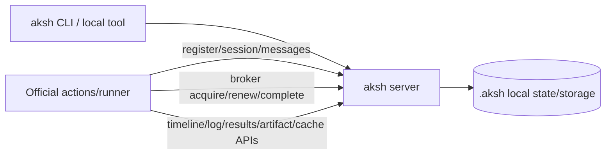
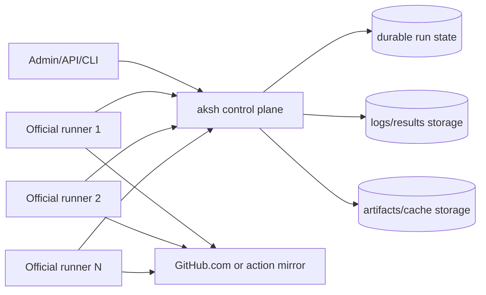

# Local CI vs self-hosted aksh

aksh should optimize for **official-runner behavioral compatibility**, not byte-for-byte cloning of GitHub's hosted infrastructure. The official `actions/runner` must be able to register, receive jobs, execute workflows, report logs/results, and complete runs correctly. GitHub's internal deployment IDs, Azure hostnames, and exact token bytes are not the product goal unless the runner depends on them.

This document separates two deployment targets:

1. **Local CI** — aksh and the runner usually run on one developer machine or a tightly controlled loopback/private setup.
2. **Self-hosted aksh** — aksh is deployed as a reachable service for one or more external official runners owned by users/teams.

Both modes speak the same runner protocol, but the production requirements differ.

---

## Compatibility principle

aksh may return **aksh-hosted protocol-compatible responses** instead of exact GitHub-hosted responses.

That is acceptable when the response preserves the runner-observed contract:

- endpoint path and method the runner calls,
- status code that controls runner branching,
- JSON/protobuf field names and casing for fields the runner reads,
- authentication and token semantics,
- service URLs that are reachable from the runner,
- upload/download behavior for logs, artifacts, and cache,
- job lease/acquire/renew/complete lifecycle,
- timeline/result/conclusion semantics,
- cancellation and retry behavior.

It is not necessary to replicate:

- GitHub deployment IDs,
- GitHub scale-unit IDs,
- GitHub internal `pipelines...` hostnames,
- exact token bytes,
- exact volatile timestamps,
- exact `activityId`, `x-tfs-processid`, or `x-vss-*` headers,
- the full hosted service catalog when the runner does not use it,
- Azure Blob Storage specifically, as long as aksh provides equivalent signed URL semantics.

The target is:

> Local or self-hosted responses that are shaped and behaved like the official runner expects, backed by real aksh services.

---

## Local CI mode

Local CI is the fast developer loop. aksh may use local defaults, in-memory state, and loopback URLs when the runner is also local.

### Typical topology



### Acceptable local shortcuts

For local CI, these are acceptable if documented and covered by E2E tests:

- loopback URLs such as `http://127.0.0.1:9090`, when the runner is on the same host;
- in-memory run state;
- file-backed logs/artifacts/cache under `.aksh/`;
- local bearer/session tokens instead of GitHub-issued JWTs;
- local signed URLs instead of Azure Blob signed URLs;
- smaller `connectionData` containing only runner-used service locations;
- simplified admin/registration flow when it still drives the runner down the supported protocol path.

### Local CI requirements

Local CI still must be real enough to run workflows. The following must be correct.

#### Runner lifecycle

- Official runner can register.
- Runner identity and public key are stored.
- Session creation succeeds.
- Message polling works.
- Message ack/delete works where required.
- One active job per session is respected unless intentionally changed.
- Runner can reconnect or be restarted without poisoning the queue.

#### Job execution

- aksh can queue a workflow run.
- Runner receives an `AgentJobRequestMessage`/broker job reference.
- Runner executes steps.
- aksh receives timeline/log/result updates.
- Job completion updates run status.
- Failure, success, skipped, and canceled conclusions match GitHub Actions semantics where they affect workflow behavior.

#### Scheduler semantics

- `needs` dependency gating works.
- Job outputs propagate.
- `if` conditions evaluate in the correct context.
- Matrix expansion preserves GitHub-like order and naming.
- `fail-fast` and `max-parallel` behave correctly.
- Cancellation messages reach the appropriate session.

#### Logs and results

- Runner can request job/step log URLs.
- Returned URLs are usable by the runner.
- Logs are stored locally.
- Logs are retrievable for inspection.
- Step/job timeline records are accepted, including current runner fields such as background-step metadata.

#### Actions, artifacts, and cache

- Action download info is sufficient for common `uses:` actions in supported workflows.
- Artifacts can be uploaded/downloaded if advertised as supported.
- Cache v1 works if advertised as supported.
- Cache v2/blob-Twirp may remain explicitly unsupported/deferred, but failures should be clear and documented.

### Local CI E2E acceptance tests

Local CI should be validated with real official-runner workflows, not only replay comparisons.

Minimum scenarios:

1. **Basic success**

   ```yaml
   on: push
   jobs:
     test:
       runs-on: self-hosted
       steps:
         - run: echo hello
         - run: exit 0
   ```

   Acceptance:

   - runner registers,
   - job executes,
   - logs arrive,
   - job and run finish success,
   - runner remains healthy for another job.

2. **Failure semantics**

   ```yaml
   on: push
   jobs:
     test:
       runs-on: self-hosted
       steps:
         - run: echo before
         - run: exit 42
         - run: echo after
   ```

   Acceptance:

   - failure conclusion is recorded,
   - default `success()` behavior skips/executes later steps consistently with GitHub Actions,
   - final run status is failure,
   - failure logs are available.

3. **Matrix + fail-fast**

   Acceptance:

   - matrix jobs expand with expected names,
   - failed shard cancels pending/in-progress siblings when `fail-fast: true`,
   - cancellation messages are delivered to the right runner session.

4. **`needs` + outputs**

   Acceptance:

   - dependent job waits,
   - outputs from upstream job are visible in `needs.*.outputs`,
   - downstream expressions evaluate correctly.

5. **Logs/results**

   Acceptance:

   - noisy multi-step job uploads logs without runner errors,
   - aksh stores per-step/per-job logs,
   - log URLs are usable.

6. **Common action download**

   Acceptance:

   - at least one common JavaScript action resolves and runs, e.g. `actions/checkout@v4` if repository checkout is in scope.

---

## Self-hosted aksh mode

Self-hosted aksh means aksh is a service that users deploy and point their own official runners at. The runner may be on another machine, VM, Kubernetes pod, or bare-metal host.

Local-only assumptions are not acceptable in this mode.

### Typical topology



### Self-hosted non-negotiables

#### Externally reachable service URLs

Every URL returned to the runner must be reachable from that runner.

Bad unless runner is on the same host:

```text
http://127.0.0.1:9090/broker/1/
```

Good for self-hosted deployments:

```text
https://aksh.example.com/broker/1/
```

or private network deployments:

```text
http://aksh.internal:9090/broker/1/
```

aksh needs configuration for:

```toml
[server]
public_url = "https://aksh.example.com"

[broker]
public_url = "https://aksh.example.com/broker"

[results]
public_url = "https://aksh.example.com/results"

[artifacts]
public_url = "https://aksh.example.com/artifacts"

[cache]
public_url = "https://aksh.example.com/cache"
```

It also needs correct behavior behind reverse proxies:

- TLS termination,
- forwarded host/proto handling,
- public URL generation,
- optional private runner-network URLs.

#### Real registration and runner credentials

Self-hosted aksh needs a real registration flow:

- admin creates a registration token;
- token is scoped to pool/org/repository as appropriate;
- token expires;
- runner registers with public key material;
- aksh stores runner identity, labels, and public key;
- aksh issues runner/session credentials;
- runner can reconnect after restart;
- runner can be removed/replaced;
- registration tokens can be revoked.

The token does not need to be GitHub's JWT, but it must be a real aksh token with the same runner-observed shape/semantics.

#### Durable state

Self-hosted aksh should not rely on process memory for important state.

Durable or recoverable state should include:

- registered runners,
- runner sessions,
- queued/in-progress/completed runs,
- job request IDs and broker leases,
- timeline records,
- logs/results metadata,
- artifacts/cache metadata,
- registration/session tokens or their revocation state.

#### Multi-runner scheduling

Self-hosted aksh must handle multiple runners safely:

- pools,
- labels,
- online/offline runner state,
- stale session cleanup,
- job assignment by labels,
- one job per active runner session unless explicitly supporting more,
- broker lease renewal and timeout,
- cancellation delivery to the correct session,
- no cross-session message leakage.

#### Auth and transport security

Self-hosted aksh needs production auth controls:

- TLS support or documented reverse-proxy TLS setup;
- admin API authentication;
- scoped registration tokens;
- runner-scoped session/bearer tokens;
- broker/result/artifact/cache authorization;
- signed URLs for log/artifact/cache transfers;
- token expiry and revocation;
- no hardcoded replay/system tokens in production;
- secrets masking and careful storage.

#### Results/log storage

For self-hosted aksh, Twirp log URL endpoints should return **aksh-hosted signed URLs**, not plain local placeholders.

A valid response can still look runner-compatible while pointing to aksh:

```json
{
  "blob_storage_type": "BLOB_STORAGE_TYPE_AZURE",
  "logs_url": "https://aksh.example.com/results/blob/job/abc123?expires=...&sig=...",
  "soft_size_limit": "1048576"
}
```

Even if the field says Azure for runner compatibility, aksh may back it with local disk, S3, MinIO, or another store. What matters is runner-observed behavior:

- URL can be used with the HTTP method the runner uses;
- upload/download succeeds;
- signatures are validated;
- expiry works;
- size limits are enforced;
- logs are durable and retrievable.

#### Artifacts and cache

Self-hosted users expect normal workflow features.

Artifact minimum:

- create artifact,
- upload artifact content,
- list artifacts,
- download artifacts,
- enforce retention/limits.

Cache minimum, if advertised:

- reserve cache,
- upload chunks,
- commit cache,
- lookup by key/version/scope,
- download cache,
- eviction/retention policy.

If cache v2/blob-Twirp is deferred, the limitation must be explicit:

> aksh supports only the documented cache protocol subset. Cache v2/blob-Twirp is not implemented yet.

#### Action download behavior

Self-hosted aksh must define how `uses:` actions are resolved.

Two valid models:

1. **Runner downloads actions from GitHub/codeload**
   - simpler;
   - requires network access;
   - good initial behavior for public actions;
   - private action auth must be handled carefully.

2. **aksh proxies or mirrors action tarballs**
   - better for offline/enterprise/self-hosted deployments;
   - allows caching and reproducibility;
   - more implementation work.

Whichever model is chosen, `ActionDownloadInfo` must return runner-compatible data.

### Self-hosted E2E acceptance tests

Self-hosted aksh should be validated with runners not sharing loopback with the server.

Minimum scenarios:

1. Runner on a separate host registers using public aksh URL.
2. Basic success workflow completes.
3. Failure workflow produces correct conclusion and logs.
4. Matrix/fail-fast workflow cancels correctly.
5. `needs`/outputs workflow propagates outputs.
6. Long-running job renews broker lease and completes.
7. Runner restart/reconnect does not corrupt queued/in-progress jobs.
8. Cancellation reaches the correct runner session.
9. Logs/results upload through aksh-hosted signed URLs.
10. Artifact upload/download works if artifact support is advertised.
11. Cache flow works if cache support is advertised.
12. `actions/checkout@v4` or another common action resolves and runs.
13. Multiple runners with different labels receive only matching jobs.
14. Expired/revoked registration tokens fail safely.
15. Public URLs in every runner-facing response are reachable from the runner host.

---

## What must be exact vs equivalent

| Surface | Local CI requirement | Self-hosted requirement | GitHub byte-exact required? |
| --- | --- | --- | --- |
| `connectionData` | Contains every local service the runner uses | Contains every runner-used service with externally reachable aksh URLs | No |
| Registration | Local registration works; runner identity stored | Scoped expiring registration tokens; runner identity/labels/public key durable | No |
| OAuth/session tokens | Accepted by aksh; runner-compatible field shape | Scoped, expiring, revocable aksh-issued tokens | No |
| DistributedTask sessions/messages | Runner can poll and receive jobs | Multi-runner safe sessions; no cross-session leakage | Field/behavior exact where runner reads it |
| Broker acquire/renew/complete | Job lease lifecycle works | Durable leases, renewal, timeout, cancellation | Field/behavior exact where runner reads it |
| Timeline records | Accept runner updates | Persist/query timeline; accept current runner fields | Field names/casing exact |
| Twirp log URLs | Local URL usable by local runner | Signed externally reachable aksh URL backed by real storage | No Azure dependency required |
| Artifacts | Work if advertised | Durable upload/list/download/retention | No |
| Cache | Work if advertised; cache v2 may be deferred | Durable cache protocol subset with documented v2 limitation | No |
| Action downloads | Common actions resolve | GitHub/codeload or aksh mirror model documented and working | No |
| Headers/metadata | Ignore unused hosted headers | Ignore unused hosted headers | No |

---

## Recommended docs language

Use this framing in product and fidelity docs:

> aksh targets official-runner behavioral compatibility. It may return aksh-hosted equivalents for GitHub-hosted URLs, tokens, and storage locations, provided those equivalents preserve the runner-observed protocol contract and are backed by real local/self-hosted implementations.

Avoid implying that local equivalents are final if they are only placeholders. Use precise terms:

- **aksh-hosted compatible implementation** — acceptable target; backed by real behavior.
- **local-only shortcut** — acceptable for local CI; not self-host ready.
- **placeholder/stub** — not product-complete; only acceptable when the runner does not depend on it or the limitation is explicit.
- **GitHub-hosted byte parity** — useful for conformance research, not required unless the runner depends on the exact body.

---

## Current implication for aksh

The latest runner-watch work proves route/status compatibility for the captured current-service idle flow. That is meaningful progress, but self-hosted readiness needs broader behavioral E2E coverage:

- real official runner workflow execution,
- externally reachable URLs,
- real log/result storage behind signed URLs,
- durable runner/job state,
- production-grade auth,
- artifacts/cache/action download behavior according to the supported feature set.

The next self-hosted milestone should therefore be described as:

> Run official runners against an aksh server reachable over a configured public/private URL and complete representative workflows end-to-end, with logs/results/artifacts stored by aksh-owned services.
