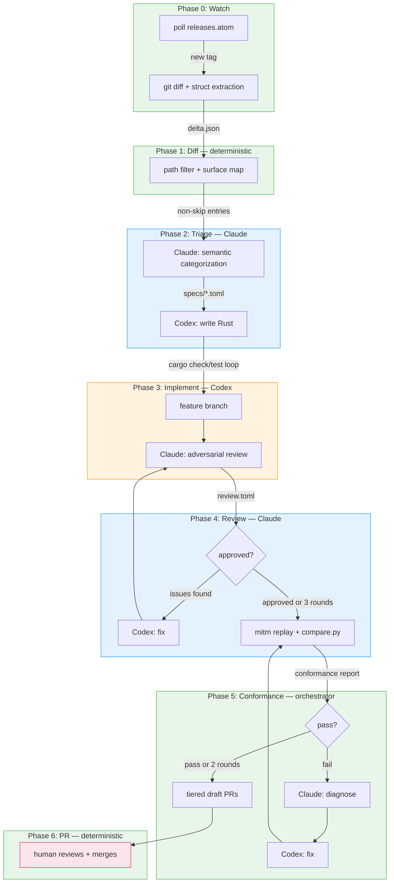

# runner-watch — automated protocol sync for aksh

## Problem

aksh must stay compatible with the official `actions/runner` binary. Upstream releases

~weekly. Each release may change the protocol: new DTO fields, new endpoints, new feature

flags, new crypto. Today this is tracked manually via hand-written analysis in

`fidelity-gap.md §1a`. That analysis took hours and is already stale (aksh targets v2.335.0;

GitHub enforces v2.329.0+ since March 2026).

runner-watch automates the full sync cycle: detect new releases, extract protocol changes,

generate implementation specs, write Rust code, review it, run conformance tests, and open

draft PRs — with no human intervention until the final PR review.

## Design principles

1. **Deterministic where possible, AI where necessary.** Git diff, path filtering, struct

  extraction, conformance replay, and PR creation are all mechanical. AI handles protocol

   semantics (what does this change mean?) and code generation (write the Rust).
2. **Two-agent adversarial pattern.** Claude fills semantic specs and reviews code. Codex

  implements Rust. Different training distributions catch different blind spots.
3. **Neither agent grades their own homework.** The conformance gate runs recorded mitm

  replay bytes that neither agent can modify. The orchestrator owns the golden capture.
4. **Everything is inspectable.** Every phase produces an artifact (JSON, TOML, markdown)

  that a human can read. No black boxes.
5. **Draft PRs, never auto-merge.** Even nits. C#-to-Rust translation is non-mechanical.

## Agent assignment


| Phase          | Agent            | Rationale                                         |
| -------------- | ---------------- | ------------------------------------------------- |
| 0. Watch       | deterministic    | HTTP poll, no thinking needed                     |
| 1. Diff        | deterministic    | git diff + grep, no semantics                     |
| 2. Triage      | **Claude**       | protocol semantics, prose writing, categorization |
| 3. Implement   | **Codex**        | writes Rust, iterates on compiler/test errors     |
| 4. Review      | **Claude**       | reads code + spec, finds mismatches, adversarial  |
| 5. Conformance | **orchestrator** | neither agent touches golden bytes                |
| 6. PR          | deterministic    | `gh pr create` with structured body               |


## Pipeline overview

```mermaid
new runner tag (deterministic)
  │
  ▼
delta.json (deterministic: git diff + path filter + struct/route/flag extraction)
  │
  ▼
specs/*.toml (Claude: fills semantics per delta entry — what, why, category, wire example)
  │
  ▼
Rust code (Codex: implements from spec + existing source, loops cargo check/test)
  │
  ▼
Code review (Claude: reads diff, checks spec conformance, checks wire shapes,
  │            runs cargo test independently)
  │
  ▼
If issues: Claude writes review comments → Codex fixes → re-review (max 3 rounds)
  │
  ▼
Conformance replay (orchestrator: mitm replay against aksh, _compare.py diff)
  │
  ▼
draft PR (body = spec + replay evidence + review log)
```



## Phase 0: Watch

**Agent:** deterministic

**Trigger:** cron (daily) or manual `runner-watch watch`

**Input:** `https://github.com/actions/runner/releases.atom` (no auth needed)

**Output:** `.runner-watch/state.json` updated with new tag

Poll the releases atom feed. Compare against last known tag in state.json. If new tag

found, emit `runner_version` and proceed. Otherwise exit 0.

## Phase 1: Diff

**Agent:** deterministic

**Input:** old tag, new tag

**Output:** `.runner-watch/delta.json`

Shallow clone both tags into `.runner-watch/repos/`. Structural diff of four directories:

- `Runner.Listener/` — connection, session, messages
- `Runner.Worker/` — execution model, steps
- `Runner.Common/` — shared types, crypto, config
- `Runner.Sdk/` — DTOs, wire format, feature flags

For each changed file, extract:

- New/removed/renamed struct fields (grep for field declarations, diff structs)
- New route registrations in Controller files
- New feature flag enums in `ConfigurationStore.cs`
- New env vars / env var readers
- New message types (classes ending in `Message`/`Ref`)

Output format (`delta.json`):

```json
[
  {
    "file": "Runner.Worker/ExecutionContext.cs",
    "struct": "TimelineRecord",
    "change_type": "field_added",
    "fields": ["isBackground", "backgroundControlType", "backgroundControlStepIds", "parallelGroupId"],
    "snippet": "...(surrounding C# context)..."
  }
]
```

### Validation

The acceptance test for Phase 1: run it against v2.322.0→v2.335.1 and verify the output

covers all entries in the hand-made `fidelity-gap.md §1a.4` priority table.

## Phase 2: Triage

**Agent:** Claude (for semantic entries)

**Input:** `delta.json`, aksh source files, upstream source snippets, `docs/fidelity-gap.md`

**Output:** `specs/v{N}/*.toml` (one file per change)

### Deterministic pre-filter (no AI)

For each entry in `delta.json`:

1. **Path filter:** skip entries in `.github/`, `Test/`, `Misc/`, `dev/`, dependency files,

  CI config, README changes
2. **Surface map:** map C# struct/file → aksh file via `aksh-surface.toml` (static mapping

  table). If the entry touches a mapped aksh surface → keep. If purely runner-internal

   (Worker execution logic, CLI args, dotnet SDK bumps) → tag `skip` without AI.
3. **Feature flag detection:** extract flag name from enum if present.
4. **Env var detection:** extract env var name if present.

### AI triage (Claude)

For non-skip entries, invoke Claude with:

- The delta entry (file, struct, change type, fields, snippet)
- Upstream source context (surrounding C# code)
- aksh target file snippet (from surface map)
- Relevant excerpts from `docs/fidelity-gap.md`

Prompt Claude to answer in TOML:

1. What does this change do? (one sentence)
2. What does the runner actually send on the wire? (example JSON)
3. Does the runner fail or warn if the server ignores these fields?
4. Is this behind a feature flag? Which one?
5. Category: blocker, concern, feature, nit, skip
6. What's the implementation approach for aksh?

### Spec format

Each spec is a self-contained TOML file. Example (`specs/v2.336.0/request-ack.toml`):

```toml
change_id = "request-ack"
upstream_version = "v2.336.0"
category = "concern"
tags = ["protocol", "endpoint"]

[description]
what = "Runner sends explicit acknowledgment after receiving a job message"
why = "Broker uses ack to confirm the runner accepted the request"
runner_behavior = """
  After decrypting a TaskAgentMessage with messageType "RunnerJobRequest",
  the runner calls POST /_apis/v1/AgentRequest/{poolId}/{requestId}
  with body {"requestId": "...", "poolId": 1}.
"""
failure_mode = "warning-only — runner logs 'Failed to acknowledge' and continues"

[feature_flag]
name = "UseBrokerFlow"
where = "connectionData response"
default = false

[wire]
request = """
POST /_apis/v1/AgentRequest/{poolId}/{requestId}?api-version=6.0
Content-Type: application/json

{"requestId": "...", "poolId": 1}
"""
expected_response = "200 or 204, empty body"

[aksh_targets]
files = [
    { crate = "aksh-runner-server", path = "src/lib.rs", area = "router + AgentRequest handler" },
]

[implementation]
approach = "Add POST handler for /:org/_apis/v1/AgentRequest/:pool_id/:request_id that accepts and 204s."
test = "Unit test: POST to the endpoint returns 204."
```

### Category taxonomy


| Category   | Definition                                    | PR tier                     |
| ---------- | --------------------------------------------- | --------------------------- |
| `blocker`  | Runner won't connect/start job without this   | PR 1 (blockers + security)  |
| `concern`  | Runner works but degrades (warnings, retries) | PR 2 (concerns + features)  |
| `feature`  | New capability, runner works without it       | PR 2                        |
| `nit`      | Cosmetic, internal, naming change             | PR 3                        |
| `skip`     | Not relevant to control plane                 | filtered out, no PR         |
| `security` | Crypto, key exchange, auth changes            | PR 1, always human-reviewed |


The `security` tag is additive: a change can be `blocker` + `security` or `concern` +

`security`. Security-tagged changes always land in PR 1.

### Validation

Run triage on the v2.322.0→v2.335.1 diff. Compare the generated specs against the

hand-made `§1a.4` priority table. Categories and priorities should match.

## Phase 3: Implement

**Agent:** Codex

**Input:** specs (priority-ordered), aksh source files

**Output:** feature branch with one commit per spec

For each spec, in priority order (blocker → concern → feature → nit):

1. Invoke Codex with the spec TOML, relevant aksh source files (from `aksh_targets`),

  and existing patterns (serde attribute conventions, handler shape, test patterns).
2. Codex writes Rust code following existing patterns exactly.
3. Codex runs `cargo check`. If errors, feeds them back and retries.
4. Codex runs `cargo test --workspace`. If failures, feeds them back and retries.
5. On success, commits to the feature branch.

Bounded: max 10 iterations per spec. If still failing, tag the spec `implementation_failed`

and proceed to the next. The orchestrator records which specs succeeded and which didn't.

### Invocation

Codex is invoked as a subprocess, not a chat session:

```
codex exec "<prompt with spec + source + instructions>"
```

Each invocation is stateless. The orchestrator passes all context as the prompt. Codex

does not remember anything across calls.

### Patterns Codex must follow

The orchestrator's prompt includes a patterns section extracted from existing aksh code:

- Serde: `#[serde(rename = "camelCase", skip_serializing_if = "Option::is_none")]`

  for optional fields
- DTOs: `Option<T>` for nullable wire fields, `Vec<T>` for arrays,

  `BTreeMap<String, T>` for string-keyed maps
- Handlers: axum extractors (`State`, `Path`, `Query`, `Json`), return

  `axum::response::Response` or `Json<Value>`
- Tests: `#[tokio::test]`, in-module test functions, `serde_json::json!` for assertions

## Phase 4: Review

**Agent:** Claude (adversarial)

**Input:** spec TOML, code diff, aksh source files

**Output:** `review.toml` (issues or approval)

Claude reads the spec (what was requested) and the diff (what Codex wrote). Checks:

1. **Spec conformance:** Does the code implement exactly what the spec describes?

  Wire shapes, field names, endpoint paths.
2. **Pattern compliance:** Does it follow existing aksh patterns? Serde attributes,

  handler structure, error handling.
3. **Edge cases:** Missing null checks, wrong defaults, missing `skip_serializing_if`,

  incorrect `Option` vs non-optional.
4. **Security:** Crypto changes reviewed carefully. Auth fields not leaked in logs.
5. **Cargo test:** Claude runs `cargo test --workspace` independently to verify.

Output format (`review.toml`):

```toml
[[issues]]
severity = "must_fix"
file = "crates/aksh-gha-protocol/src/azdo.rs"
line = 402
description = "is_background field missing skip_serializing_if = Option::is_none"
fix = "Add #[serde(skip_serializing_if = \"Option::is_none\")]"

[[issues]]
severity = "suggestion"
file = "crates/aksh-runner-server/src/lib.rs"
line = 1420
description = "Consider returning 204 No Content instead of 200 for ack endpoint"
fix = "Change to StatusCode::NO_CONTENT"
```

If no issues:

```toml
verdict = "approved"
notes = "All spec requirements met, patterns followed, tests pass."
```

### Review loop

```
Round 1:
  Claude reads spec + diff → review.toml
  If approved → proceed to Phase 5
  If issues → feed review.toml to Codex

Round 2:
  Codex reads review.toml → fixes code → commits
  Claude re-reads spec + updated diff → review.toml
  If approved → proceed
  If issues → feed to Codex

Round 3:
  Same as round 2
  If still issues → tag PR "needs_human", proceed anyway
  (Human sees the review log and decides)
```

Max 3 review rounds. If still failing after round 3, the PR is tagged `needs_human` and

the review log is included in the PR body so the human can see what went wrong.

## Phase 5: Conformance

**Agent:** orchestrator (neither AI agent)

**Input:** feature branch, golden mitm capture

**Output:** conformance report (pass/fail + evidence)

This is the critical gate. Neither Claude nor Codex can modify the golden capture or the

comparison script. The orchestrator owns both.

### Steps

1. `cargo test --workspace` (final verification)
2. Start aksh server on localhost
3. `mitmdump --server-replay .runner-watch/golden/v{N}/flows.mitm` — replay recorded

  official requests against aksh
4. `_compare.py` — diff aksh responses against recorded official responses using the

  existing normalizer (GUID replacement, path normalization, volatile field stripping)
5. Report: which endpoints match, which diverge, with JSON diffs

### Gate

All recorded endpoints must return expected responses. The comparison uses the same

`_compare.py` normalizer from `experiments/mitm/bin/_compare.py`, with path normalization

that handles both official (`/{session}/_apis/...`) and aksh (`/_apis/...`) prefixes.

### Failure handling

If conformance fails:

1. Orchestrator writes `conformance-fail.toml`:
  ```toml
   [[failures]]
   endpoint = "POST /_apis/v1/AgentRequest/{poolId}/{requestId}"
   expected_status = 204
   actual_status = 404
   diff = "..."
  ```
2. Feed to Claude (diagnosis): "Why does aksh return 404 for this endpoint?"
3. Claude writes a diagnosis + suggested fix
4. Feed to Codex (fix)
5. Orchestrator re-runs conformance

Max 2 conformance rounds. If still failing, tag PR `conformance_partial` and include

evidence. Human decides.

### Golden capture management

The golden capture (`flows.mitm`) is recorded once per runner version bump using the

existing mitm-proxy infrastructure:

```
runner-watch record-golden --runner v2.336.0 --target official
```

This runs `experiments/mitm/bin/record.sh --backend official --scenario 01-register-and-idle`

(and other scenarios) with a real GitHub repo and registration token. The capture is stored

in `.runner-watch/golden/v{N}/`.

Golden captures are refreshed only when bumping the runner version. They are committed to

the repo (the `.mitm` files contain only HTTP metadata, no secrets — the capture addon

redacts auth headers).

## Phase 6: PR

**Agent:** deterministic

**Input:** reviewed branch, specs, conformance report, review log

**Output:** tiered draft PRs on GitHub

### Tiered PRs


| Tier | Contents            | Label                                |
| ---- | ------------------- | ------------------------------------ |
| PR 1 | blockers + security | `protocol-sync`, `priority:critical` |
| PR 2 | concerns + features | `protocol-sync`, `priority:high`     |
| PR 3 | nits                | `protocol-sync`, `priority:low`      |


Empty tiers are skipped. If all changes are blockers, only PR 1 is created.

### PR body

Each PR body is self-contained:

```markdown
## Runner sync: actions/runner v2.335.0 → v2.336.0

### Changes (blocker tier)
| ID | Category | Description | Spec |
|---|---|---|---|
| request-ack | blocker | New ack endpoint required | specs/v2.336.0/request-ack.toml |

### Conformance
✅ All 12 recorded endpoints match official responses
[Full report](.runner-watch/conformance-report.md)

### Review log
Round 1: 2 issues found (missing null check, wrong serde attr)
Round 2: approved
[Full log](.runner-watch/review.toml)

### Upstream references
- actions/runner#4012 "Acknowledge runner request"
- actions/runner#4015 "V2 admin flow"
```

### Auto-updates

The PR also updates:

- `versions.toml` — bumps `runner_version`
- `README.md` — updates the verified runner version claim
- `docs/fidelity-gap.md` — adds new rows to the scorecard, updates the upstream reference

All PRs are **draft**. Nothing auto-merges.

## The orchestrator

A Rust binary (`runner-watch`) that owns the state machine. It does not reason — it

sequences.

### Invocation

```sh
runner-watch run --from v2.322.0 --to v2.335.1
runner-watch watch                    # poll for new tags, exit if none
runner-watch record-golden --runner v2.336.0 --target official
```

### State machine

```
Watching → Diffing → Triaging → Implementing → Reviewing → Conforming → PRing
```

Each state transition:

1. Reads the previous phase's output artifact
2. Invokes the right agent (or runs deterministically)
3. Writes the next phase's output artifact
4. Persists state to `.runner-watch/state.json` (resume on crash)

### Agent invocation

Agents are invoked as subprocesses, not chat sessions:

- Claude: `claude -p "<prompt>" --output-format json`
- Codex: `codex exec "<prompt>"`

Each call is stateless. The orchestrator passes all context (spec, source, errors, prior

review comments) as the prompt argument. No agent remembers anything across calls.

### Configuration

`.runner-watch/config.toml`:

```toml
[general]
runner_repo = "actions/runner"
aksh_worktree = "../rust-runner-server"    # path to aksh main worktree
golden_dir = ".runner-watch/golden"
max_review_rounds = 3
max_conformance_rounds = 2
max_implement_iterations = 10

[agents]
triage = "claude"          # fills semantic specs
implement = "codex"        # writes Rust code
review = "claude"          # adversarial code review

[surface_map]
path = "aksh-surface.toml" # C# struct → aksh file mapping

[tracked_dirs]
# Which upstream dirs to diff
dirs = [
    "src/Runner.Listener",
    "src/Runner.Worker",
    "src/Runner.Common",
    "src/Runner.Sdk",
]

[skip_paths]
# Paths to skip in the diff (never protocol-relevant)
patterns = [
    "src/Test/**",
    "src/Misc/**",
    ".github/**",
    "*.md",
    "*.yml",
    "dev/**",
]
```

## File structure

```
.runner-watch/
├── config.toml              # orchestrator config
├── state.json               # last known runner version, phase state
├── repos/                   # shallow clones of actions/runner (old + new tags)
├── golden/
│   └── v{N}/
│       ├── 01-register-and-idle/
│       │   ├── flows.mitm   # recorded mitmproxy stream
│       │   └── flows.jsonl  # parsed flows for comparison
│       ├── 02-trivial-job/
│       └── 03-cancellation/
├── delta.json               # Phase 1 output
├── specs/
│   └── v{N}/
│       ├── request-ack.toml
│       ├── background-steps.toml
│       └── ...
├── review.toml              # Phase 4 output (per round)
├── conformance-report.md    # Phase 5 output
└── conformance-fail.toml    # Phase 5 failure details (if any)

docs/
├── runner-watch-plan.md     # this file
└── aksh-surface.toml        # C# struct → aksh file mapping
```

## Build order

### Phase A: Discovery core (deterministic, no AI, highest value)

1. `watch` — poll releases atom feed
2. `diff` — structural source diff of the four tracked dirs, output `delta.json`
3. Validate: reproduce the `§1a.4` priority table from v2.322.0→v2.335.1

### Phase B: Triage (first AI integration)

4. `aksh-surface.toml` — static mapping table (C# struct → aksh file)
5. Deterministic pre-filter (path filter, surface map, skip detection)
6. Claude integration for semantic triage
7. Spec generation → `specs/v{N}/*.toml`
8. Validate: generated specs match hand-made `§1a` analysis

### Phase C: Conformance harness (do this before codegen)

9. Generalize capture key to `(target, runner_version)` in record.sh
10. Add `mitmdump --server-replay` mode to the orchestrator
11. `_compare.py` integration for replay-vs-official diff
12. Record golden capture for v2.329.0+ (manual, requires GitHub token)

### Phase D: Implement + Review (the AI code loop)

13. Codex integration for Rust code generation
14. Claude integration for adversarial review
15. Review loop (max 3 rounds)
16. Conformance loop (max 2 rounds)

### Phase E: PR + end-to-end

17. Tiered draft PR creation via `gh pr create`
18. Auto-update `versions.toml`, `README.md`, `fidelity-gap.md`
19. End-to-end run: `runner-watch run --from v2.322.0 --to v2.335.1`

## Gotchas

1. **Live capture is a baseline refresh, not a per-release gate.** The runner contacts

  `api.github.com` and `pipelinesghub…` even when pointed at another control plane

   (discovered in mitm live capture report, finding #6). Registration tokens are

   per-repo, per-session. Use recorded replay for the gate; capture live only when

   bumping runner version.
2. **Source diff discovers, wire diff validates.** Feature-flag-gated behavior is

  invisible on the wire until the control plane advertises the capability. Source diff

   catches those (it found the §1a.4 table). Wire replay validates that implemented

   changes actually work. Different tools for different jobs.
3. **Spec before code, not diff-to-code.** `aksh-gha-protocol` already has structural

  divergences from C# (`EndpointAuthorization` is a direct field, `TaskResources.repositories`

   is `Vec` not `BTreeMap`). An AI translating C# diffs directly will fight existing

   conventions. The spec is the guard rail.
4. **Conformance baseline drifts with runner version.** Bumping runner version invalidates

  the golden capture. The tool must re-record the golden when it bumps, or the gate

   tests against dead bytes.
5. **Neither agent can modify the golden capture.** This is the single most important

  constraint. The orchestrator owns the golden bytes and `_compare.py`. The implementing

   agent can iterate on `cargo test` freely, but the conformance replay is read-only

   with respect to the test data.
6. **C#-to-Rust translation is non-mechanical.** Nullable reference types, `Task[[ORCA_RAW_HTML_INLINE:%3CT%3E]]`,

  Newtonsoft attrs → `Option`, `async fn`, serde. Even "nit" renames can shift wire

   field names. Nothing auto-merges.
7. **Two upstreams, two roles.** `actions/runner` = the contract (what the runner sends

  and requires). `ChristopherHX/runner.server` = the reference implementation (how

   someone else built the server). Watch `actions/runner` for obligations; use

   `runner.server` diffs only as implementation hints.

## Known upstream defects (actions/runner)

These are bugs in the official `actions/runner` binary that we work around in aksh

rather than fixing upstream (issue creation is restricted on the repo).

### Port stripped from HTTP URLs (ConfigurationManager.cs)

**File:** `Runner.Listener/Configuration/ConfigurationManager.cs`  
**Root cause:** Token-fetch URL constructions use `gitHubUrlBuilder.Host` which

drops non-default ports. `UriBuilder.Host` returns only the hostname, discarding

`:port` for any port that isn't the scheme default.

```
Line 754: $"...://{gitHubUrlBuilder.Host}/api/v3/..."   ← port dropped
Line 772: $"...://{gitHubUrlBuilder.Host}/api/v3/..."   ← port dropped
Line 750: $"...://api.{gitHubUrlBuilder.Host}/..."       ← port dropped
Line 768: $"...://api.{gitHubUrlBuilder.Host}/..."       ← port dropped
```

Compare with `GetTenantCredential` (lines 835, 840) which correctly uses

`gitHubUrlBuilder.ToString()` — preserving the port. The worker side

(`JobExtension.cs:204-208`) also handles ports explicitly with `IsDefaultPort`.

**Impact:** `--url http://example.com:9090` results in the runner dialing

`example.com:80` for token-fetch endpoints. HTTPS paths preserve the port.

**Fix (6 lines in C#):**

```csharp
var port = gitHubUrlBuilder.Uri.IsDefaultPort ? "" : $":{gitHubUrlBuilder.Port}";
githubApiUrl = $"{gitHubUrlBuilder.Scheme}://{gitHubUrlBuilder.Host}{port}/api/v3/...";
```

**aksh workaround (see `scripts/e2e-setup.sh`):** macOS `pfctl` port 80→9090

redirect, Linux `iptables` redirect, or `setcap cap_net_bind_service` on aksh.

Alternate: use HTTPS (runner preserves the port for HTTPS URLs).