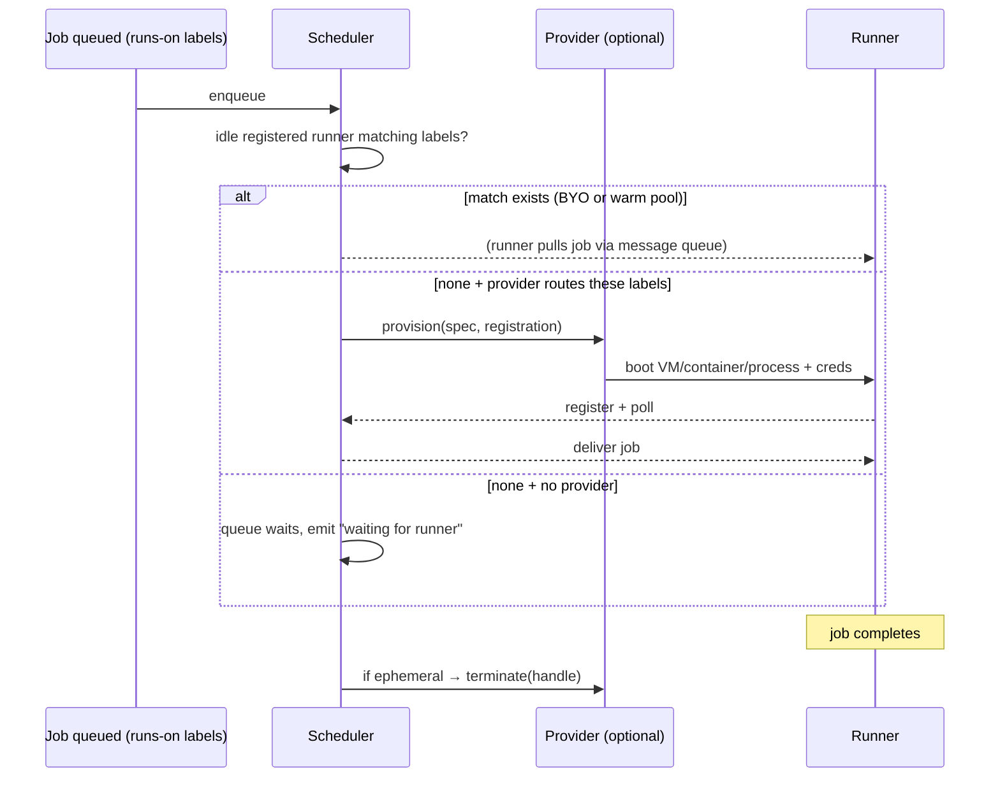

# Runtime Scheduling & Runner Pool Management

How a submitted workflow becomes a running job, and how the ephemeral runner
pool that executes it is managed. This is the internal companion to the
scheduling/pooling claims in `docs/fidelity-gap.md` (§4 `RunnerProvider`),
`docs/internal/preloop-performance-engineering.md` (warm-pool campaign), and
`docs/conformance.md` (property-test layer).

## 1. Runtime scheduling: job → runner

### 1.1 The path from submission to queue

1. `preloop run`/submit → workflow YAML parsed by `aksh-gha-parser` into a
   typed model.
2. Trigger matching (branches/tags/paths/types/schedule/workflow_dispatch),
   then matrix expansion (IndexMap order preserved, GitHub name format).
3. **Concurrency groups** evaluated first (`concurrency.rs`): queue modes
   (`single` / `max`), `cancel-in-progress`, FIFO ordering, scope-aware
   expression eval, reusable-workflow `EmbeddedConcurrency`.
4. Job DAG built from `needs`; the **dependency-gated scheduler** makes a job
   dispatchable only when every `needs` job is complete, computing its `if`
   against real job-status functions (`success()`/`failure()`/`always()`/
   `cancelled()`), and threads outputs from completed jobs into dependents.
   Runnable jobs sit in a FIFO `VecDeque`.
5. `fail-fast` / `max-parallel` matrix strategy enforced at dispatch
   (`distributed_task.rs::apply_matrix_fail_fast`); a failed matrix leg with
   `fail-fast: true` cancels the remaining legs.

Scheduler invariants are pinned by **91 property tests** in
`aksh-runner-server` (proptest): queue modes, `cancel-in-progress`, lease
expiry, stale-runner reaping, assignment binding, matrix/concurrency
interactions (`concurrency_properties.rs`), plus a TLA+ spec of the
scheduling/gate logic (`experiments/specula-20260804/`).

### 1.2 Dispatch: matching a job to a runner

Label routing mirrors GitHub — a job's `runs-on` set must be **⊆** the runner's
labels; no new matching semantics. Runner groups are enforced in the scheduler
via `job_matches_runner_group()` (name, ID, default-group matching).

Key properties:

- **BYO is the base case** — aksh is fully usable with zero providers.
  Self-hosted runners just register and poll; the scheduler only provisions
  when no idle registered runner matches the labels.
- **Delivery** is pull-based: the runner polls the broker message queue
  (`broker.rs`) via its session (`connection.rs`); delivery, renewal
  (`lockedUntil` PATCH), and completion go over the wire protocol.
- **Leases**: jobs are bound to a runner session with lease expiry and
  stale-runner reaping; assignment binding is property-tested.
- **Ephemeral runners**: exit-on-ack with session invalidation
  (`RunnerSessionInvalid`); when a job was provisioned, the scheduler calls
  `terminate(handle)` on completion.

### 1.3 The provider seam

`RunnerProvider` (in `preloop-orchestrator`) is a pluggable trait:
creates/destroys runners on any substrate — SmolVM microVM (primary),
Docker/Podman, process, macOS VM (tart), Windows VM (QEMU). `RunnerSpec`
carries the labels, base-image selection, and credentials needed to boot a
runner. The provider is only consulted when the idle pool can't satisfy a
job's labels — the scheduler is otherwise provider-agnostic.

## 2. Runner pool & VM management

### 2.1 Architecture

`preloop-orchestrator` implements the SmolVM-backed ephemeral runner pool:

- **Golden VM + fork**: a digest-pinned golden VM image (with a baked
  `/etc/preloop-bake.json` describing what the fork contains) is forked per
  runner — a fork inherits the golden's state, including its virtiofs mounts.
  Machines are **pre-provisioned**, so provisioning sits off the critical path
  of any job. Fork + configure of the warm pool ≈ **0.7 s**.
- **Warm pool**: pre-registered idle runners poll for work. Measured idle RSS
  per freshly-forked, polling runner: **131 MB** (~390 MB after a job runs).
- **Readiness**: a fork is ready when `docker info` succeeds (not `pgrep
  dockerd`) — a forked VM can wake with stale process state.
- **Labels**: the pool advertises its runner labels to the scheduler and
  reads the `runs-on` labels of the job at the front of the dispatch queue
  (refreshed after each claim) to select the correct base-image golden before
  provisioning.
- **Privilege model**: provisioning stays root; only the runner process drops
  privileges. One-time provision tokens can be registered per provisioning
  event and injected into the runner (control-plane auth).
- **Debugging**: a pool can debug failed jobs without a mounted control
  socket; `preloop debug` suspends job timeouts while paused.

### 2.2 Pool sizing and replenishment

- Pool size is **not pinned by the benchmark harness** — the engine decides
  (`warm_runners` is reported, not forced). Historical sizing: fixed 2 →
  host-capacity (`host_runner_pool_size` = `clamp(by_cpu, 8)`) → up to twice
  the CPU budget, bounded (`warm_runners` 2 → 4, −536 ms).
- **Replenishment**: the default policy — build a replacement only once the
  pool is empty — underprovisions when a workflow fans out wider than the
  pool; slots can instead preemptively size against the front-of-queue job's
  needs. Runs are gated on a replenished pool so a cold pool doesn't skew
  measurements.
- **On-demand mode**: `PRELOOP_RUNNER_POOL_SIZE=0` (or the equivalent
  `preloop serve` flag, `preloop-cli/src/main.rs`) disables the standing pool
  and provisions runners on demand as jobs arrive.
- **Failure posture**: a pool without a working container engine still runs
  every job — the container-engine check is never fatal to scheduling.

### 2.3 Operational notes

- Fork stability is sensitive to what the golden carries: inherited virtiofs
  mounts from the golden caused fork stalls/timeouts (see
  `preloop-performance-engineering.md` for the APT-index-mount and
  virtiofs-mount regressions, `645e8a18`, and the fork-timeout history).
- Cold-boot (VM boot + apt install on first run) is the #1 perf target;
  the packed-machine / socket-handoff approach is documented in
  `docs/internal/smolvm-packed-socket-handoff.md`.
- smolvm control-socket staleness on fork is tracked in
  `docs/internal/smolvm-control-socket-staleness-issue.md`.

## 3. Debugging guide

### 3.1 See what the scheduler decided

- `preloop plan <workflow>` — print the expanded job DAG (matrix, `needs`,
  dependency closure) **without executing**. First stop for "why did this job
  run / not run".
- `preloop status` — active and recent runs; `preloop logs` — run logs.
- **"waiting for runner"** in server logs means the job is queued with no idle
  runner whose labels match its `runs-on` and no provider that routes those
  labels. Check the job's labels against the pool's advertised labels
  (`RunnerPoolConfig.labels`) — a job whose `runs-on` set is not ⊆ runner
  labels will sit in the queue forever.
- `warm_runners` in benchmark/harness output shows how many idle runners the
  engine actually kept warm; if jobs queue despite `warm_runners > 0`, suspect
  label mismatch or concurrency-group serialization, not the pool size.
- Structured stream: `aksh-runner-client events <run_id>` — NDJSON events for
  the run (`/api/v1/runs/{id}/events.ndjson`), useful for agent-driven
  debugging and for seeing exactly when dispatch happened.
- Scheduler invariants (queue modes, lease expiry, stale-runner reaping,
  assignment binding) are pinned by 91 proptests + a TLA+ spec — a
  scheduling bug that reproduces in a test-sized scenario belongs there
  (`concurrency_properties.rs`, `experiments/specula-20260804/`), not in a
  workaround.

### 3.2 Debug a failed job in place

- `preloop debug <session>` — attach to a job paused at a failed step:
  interactive guest shell, host↔VM source sync (`--sync` / `--export`), step
  rewind (`--from <step>` / `--from-start`), workspace-debris revert
  (`--revert <none|untracked|all>`), and the DAP debugger (breakpoints,
  stepping, variable inspection, REPL DSL over WebSocket/TCP — `aksh-dap`).
  The server suspends job timeouts while paused.
- Full semantics (state machine, retry ladder, change detection, source-sync
  contract, lease/lifetime) are in `docs/debug-sessions.md` — read it before
  relying on `--revert` or VM-side edits.
- `preloop shell <run_id>` — open a shell in a preserved VM without a debug
  session; the pool can also debug failed jobs without a mounted control
  socket.

### 3.3 Pool / VM troubleshooting

- **Jobs queue but nothing provisions**: confirm the provider actually routes
  the job's labels (see §1.2 flow); with `PRELOOP_RUNNER_POOL_SIZE=0` there
  is no standing pool, so first-job latency includes full provisioning.
- **Fork stalls/timeouts**: the golden's inherited virtiofs mounts are a known
  cause (`preloop-performance-engineering.md`, commits `645e8a18` and the
  fork-timeout history). Rebuild the golden with fewer/cleaner mounts.
- **Corrupt pack cache**: clear `~/Library/Caches/smolvm/vms/*/pack` and
  rebuild — stale packs produce opaque boot/fork failures.
- **Network in jobs failing unexpectedly**: `SMOLVM_EGRESS_FLOOR=strict`
  enforces egress control — a job legitimately needing outbound access will
  fail at the network layer, not in the workflow.
- **Container engine check**: pool readiness is `docker info` (not `pgrep
  dockerd`) because a forked VM can wake with stale process state; a pool
  without a working container engine still runs every job (non-fatal).
- **Disk full blocks VM creation** — on macOS, `df /` shows the sealed
  snapshot; check `df -h /System/Volumes/Data`.
